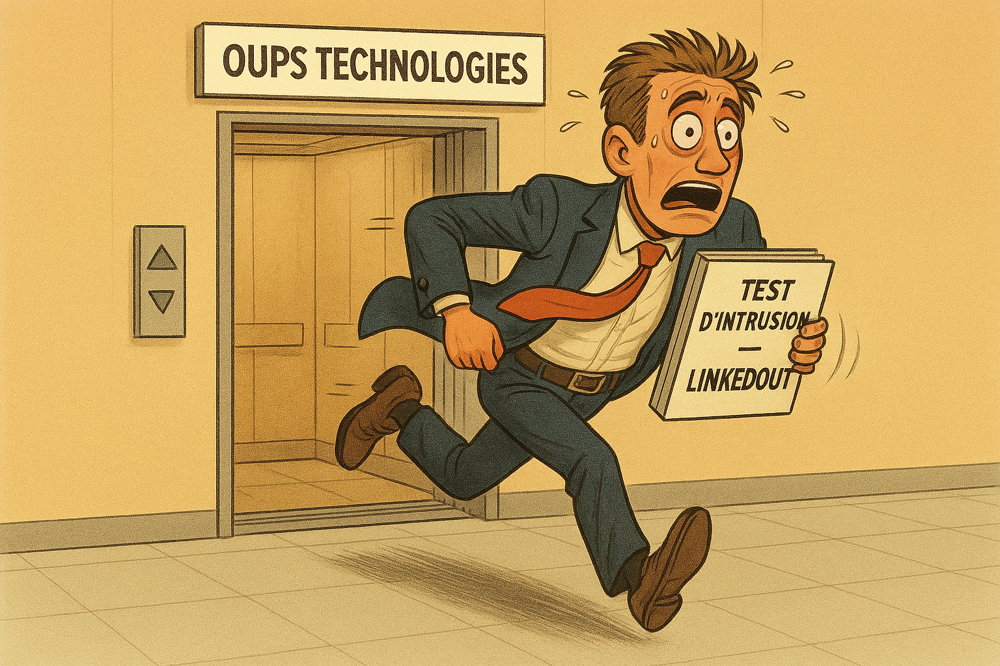

# Épreuve finale

## Un dernier Oups!
Votre stage chez Oups Technologies tire déjà à sa fin. Au-delà des beaux moments passés en compagnie de collègues appréciés (mention spéciale à Gilles Sansoucis qui a appris à ses dépens l'importance de HTTPS), vous retenez surtout l'impact positif que vous avez eu sur les pratiques de sécurité de l'entreprise. C'est donc avec un mélange de nostalgie mais surtout de fierté du devoir accompli que vous vous apprêtez à quitter le bureau pour une dernière fois, non sans apporter avec vous votre trophée remporté pour la *Meilleure modélisation STRIDE - 2026*.

Alors que vous franchissez le seuil de la porte, le vice-président des technologies de l'infomation de la compagnie sort de l'ascenseur en implorant votre nom. Haletant, il vous rattrape enfin, un épais document entre les mains. Il s'agit d'un rapport de test d'intrusion qui a été commandé par l'entreprise pour son plus récent produit appelé *LinkedOut* : un réseau social permettant de remettre sa démission publiquement et où les gens nous félicitent d'avoir quitté notre emploi.

Le rapport fait mention de plusieurs vulnérabilités différentes permettant à un attaquant d'obtenir l'accès au système en tant qu'administrateur, que ce soit en lui volant ses identifiants ou en contournant l'authentification.

Le dirigeant vous supplie de sauver Oups Technologies une dernière fois avant de retourner à vos études. Saurez-vous relever le défi ?

---

## Modalités
- L'examen est d'une durée de 3h
- Toute documentation est **permise**
- L'accès à internet et à tous vos outils est également **permis**
- La communication entre personnes (étudiants ou autres) est **interdite**
- La caméra web doit demeurer **allumée** en tout temps pendant l'examen
- Les réponses doivent être écrites **dans vos mots**. Un copier-coller évident d'un site web ou d'une réponse d'IA générative sera pénalisé.

---

## Directives

- Le dépôt contenant l'énoncé de l'examen et le matériel requis est disponible ici : [lien]
- La machine virtuelle requise pour l'examen est disponible ici : [Télécharger la machine virtuelle](https://cmaisonneuveqcca-my.sharepoint.com/:u:/r/personal/ophenix_cmaisonneuve_qc_ca/Documents/Cours/420-950-MA%20-%20Cybers%C3%A9curit%C3%A9/Mat%C3%A9riel%20de%20cours/420-950-MA-ExamenFinal.ova?csf=1&web=1&e=aM0jxY)
   - Nom d'utilisateur : employe
   - Mot de passe : employe

---

## Remise
- La remise s'effectue sur [Léa](https://cmaisonneuve-lea.omnivox.ca/) dans la section *Travaux - Énoncé et remise* (Épreuve finale).
- Vous devez remettre un seul fichier .zip contenant :
   - Le fichier `docs/examen.md` contenant vos réponses aux questions
   - Les captures d'écran demandées
