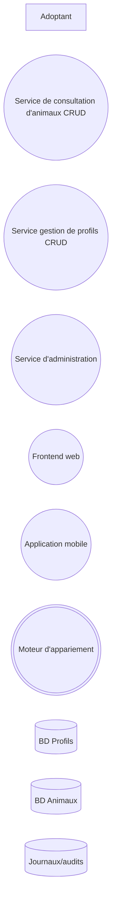

# Exercice : Nos amos les animis

## 1. Inventaire des composantes
1. Identifiez les **entités externes** dans le système.
1. Identifiez les **stockages de données** dans le système.
1. Identifiez les **processus** dans le système

## 2. Création du DFD de contexte (niveau 0)
1. En utilisant les symboles appropriés, représentez les éléments identifiés à la questions précédente dans un DFD de contexte.
1. Identifiez les **flux de données** entre les différentes composantes, et ajoutez-les sur le DFD.
1. Ajoutez, au besoin, des **frontières de confiance** aux endroits où l'on passe d'un environnement plus sécurisé à un environnement moins sécurisé (ou vice-versa).

## 3. Création du DFD de niveau 1
1. Pour chaque processus complexe identifié, créez un DFD de niveau 1.
1. Décomposez le processus complexe en un ou plusieurs **processus simple(s)**
1. Représentez, sur le DFD de niveau 1, les autres entités (entités externes, stockages de données, processus) avec lesquels les processus interagissent.
1. Ajoutez les **flux de données** et les **frontières de confiance**, au besoin.

## 4. Modélisation de la menace STRIDE
Pour chaque élément présent dans vos DFD :
1. Identifiez les menaces potentielles (référez-vous à la matrice dans les notes de cours)
1. Identifiez, parmi les menaces potentielles, les menaces réelles (c'est-à-dire celles qui sont réellement applicables dans le contexte de l'application)
1. Pour chaque menace réelle, énoncez un scénario d'attaque concret réalisant cette menace.

## 5. Analyse du risque
Pour chaque menace réelle identifiée à l'étape précédente :
1. Évaluez la **probabilité** qu'une attaque se réalise (1 = très faible, 5 = très probable)
1. Évaluez l'**impact** qu'aurait une attaque si elle se réalisait (1 = très peu d'impact, 5 = impact énorme)
1. Déterminez un seuil acceptable qui caractérise un risque faible pour des valeurs entre 1 et 25.
1. Calculez la cote de risque pour chaque menace dans votre système.

## 6. Mise en place de contre-mesures
Pour chaque menace ayant une cote de risque supérieure au seuil déterminé :
1. Proposez au moins une contre-mesure.
1. Expliquez comment cette contre-mesure permettrait de mitiger ou d'empêcher une attaque visant la menace identifiée.

