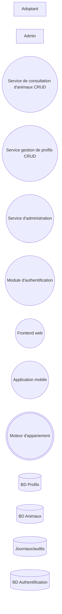
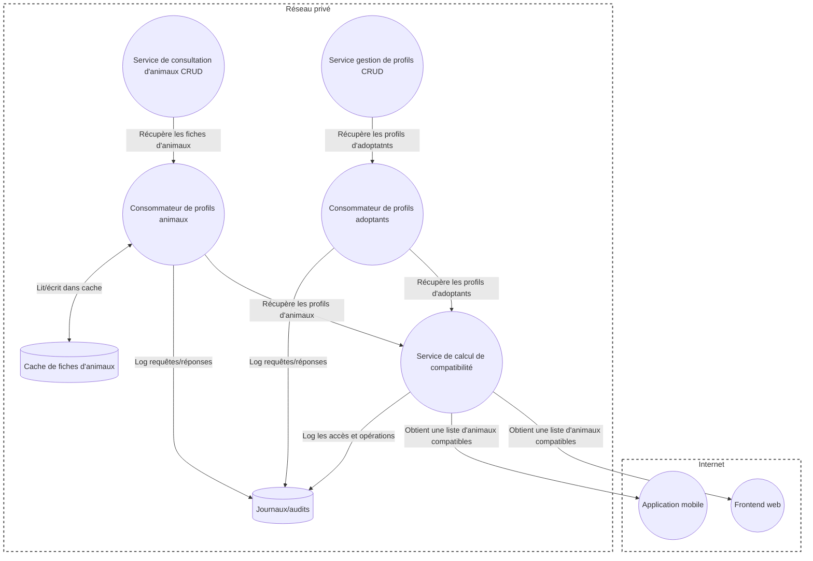

# Exercice : Nos amos les animis

## 1. Inventaire des composantes
1. Identifiez les **entités externes** dans le système.
1. Identifiez les **stockages de données** dans le système.
1. Identifiez les **processus** dans le système

<details markdown="1">
<summary markdown="span">**Voir diagramme**</summary>

</details>

<details markdown="1">
<summary markdown="span">**Voir code Mermaid**</summary>
```
flowchart LR
    Adoptant[Adoptant]
    Administrateur[Admin]
    ModuleConsultation((Service de consultation d'animaux CRUD))
    ModuleAdoptant((Service gestion de profils CRUD))
    ModuleAdmin((Service d'administration))
    ModuleAuth((Module d'authentification))
    Web((Frontend web))
    Mobile((Application mobile))
    ModuleAppariement(((Moteur d'appariement)))
    BdProfils[(BD Profils)]
    BdAnimaux[(BD Animaux)]
    Logs[(Journaux/audits)]
    BDAuth[(BD Authentification)]
```
</details>

## 2. Création du DFD de contexte (niveau 0)
1. En utilisant les symboles appropriés, représentez les éléments identifiés à la questions précédente dans un DFD de contexte.
1. Identifiez les **flux de données** entre les différentes composantes, et ajoutez-les sur le DFD.
1. Ajoutez, au besoin, des **frontières de confiance** aux endroits où l'on passe d'un environnement plus sécurisé à un environnement moins sécurisé (ou vice-versa).

<details markdown="1">
<summary markdown="span">**Voir diagramme**</summary>

</details>

<details markdown="1">
<summary markdown="span">**Voir code Mermaid**</summary>
```
flowchart TD
    subgraph internet["Internet"]
        Adoptant[Adoptant]
        Administrateur[Admin]
        Web((Frontend web))
        Mobile((Application mobile))
    end

    subgraph local["Réseau privé"]
        ModuleConsultation((Service de consultation d'animaux CRUD))
        ModuleAdoptant((Service gestion de profils CRUD))
        ModuleAdmin((Service d'administration))
        ModuleAuth((Module d'authentification))
        ModuleAppariement(((Moteur d'appariement)))
        BdProfils[(BD Profils)]
        BdAnimaux[(BD Animaux)]
        Logs[(Journaux/audits)]
        BdAuth[(BD Authentification)]
    end

    Adoptant <--> | Consulte profils animaux / Met à jour son profil / Liste les animaux compatibles | Web
    Adoptant <--> | Consulte profils animaux / Met à jour son profil | Mobile
    Administrateur --> | Met à jour fiches animaux | Web


    ModuleConsultation --> | Lit les fiches d'animaux | Web
    Web <--> | Consulte / met à jour la fiche d'adoptant | ModuleAdoptant
    Web <--> | Envoie identifiants / reçoit auth ou no-auth | ModuleAuth
    Web --> | Met à jour les fiches animaux | ModuleAdmin

    ModuleAppariement --> | Obtient une liste d'animaux compatibles | Web
    ModuleAppariement --> | Obtient une liste d'animaux compatibles | Mobile

    ModuleConsultation --> | Lit les fiches d'animaux | Web
    Mobile <--> | Consulte / met à jour la fiche d'adoptant | ModuleAdoptant
    Mobile <--> | Envoie identifiants / reçoit auth ou no-auth | ModuleAuth

    ModuleConsultation --> | Récupère les fiches d'animaux | ModuleAppariement
    ModuleAdoptant --> | Récupère les profils d'adoptatnts | ModuleAppariement

    ModuleAdoptant <--> | Lit et écrit les profils | BdProfils
    BdAnimaux --> | Lit les profils animaux | ModuleConsultation
    
    ModuleAdmin --> | Écrit les profils animaux | BdAnimaux

    BdAuth --> | Récupère les identifiants | ModuleAuth

    ModuleAdmin --> | Log accès/changements | Logs
    ModuleAdoptant --> | Log accès/changements | Logs
    ModuleConsultation --> | Log accès | Logs
    ModuleAppariement --> | Log les opérations | Logs

    style internet fill:none,stroke-dasharray: 5 5, stroke-width:2px, stroke:#444
    style local fill:none,stroke-dasharray: 5 5, stroke-width:2px, stroke:#444
```
</details>


## 3. Création du DFD de niveau 1
1. Pour chaque processus complexe identifié, créez un DFD de niveau 1.
1. Décomposez le processus complexe en un ou plusieurs **processus simple(s)**
1. Représentez, sur le DFD de niveau 1, les autres entités (entités externes, stockages de données, processus) avec lesquels les processus interagissent.
1. Ajoutez les **flux de données** et les **frontières de confiance**, au besoin.

<details markdown="1">
<summary markdown="span">**Voir diagramme**</summary>

</details>

<details markdown="1">
<summary markdown="span">**Voir code Mermaid**</summary>
```
flowchart TD
    subgraph internet["Internet"]
        Web((Frontend web))
        Mobile((Application mobile))
    end

    subgraph local["Réseau privé"]
        ClientProfils((Consommateur de profils adoptants))
        ClientAnimaux((Consommateur de profils animaux))
        ServiceCompatibilite((Service de calcul de compatibilité))
        ModuleConsultation((Service de consultation d'animaux CRUD))
        ModuleAdoptant((Service gestion de profils CRUD))
        Logs[(Journaux/audits)]
        CacheAnimaux[(Cache de fiches d'animaux)]
    end

    ServiceCompatibilite --> | Obtient une liste d'animaux compatibles | Web
    ServiceCompatibilite --> | Obtient une liste d'animaux compatibles | Mobile
    ModuleConsultation --> | Récupère les fiches d'animaux | ClientAnimaux
    ModuleAdoptant --> | Récupère les profils d'adoptatnts | ClientProfils

    ClientAnimaux --> | Récupère les profils d'animaux | ServiceCompatibilite
    ClientProfils --> | Récupère les profils d'adoptants | ServiceCompatibilite

    ClientProfils --> | Log requêtes/réponses | Logs
    ClientAnimaux --> | Log requêtes/réponses | Logs
    ServiceCompatibilite --> | Log les accès et opérations | Logs
    ClientAnimaux <--> | Lit/écrit dans cache | CacheAnimaux

    style internet fill:none,stroke-dasharray: 5 5, stroke-width:2px, stroke:#444
    style local fill:none,stroke-dasharray: 5 5, stroke-width:2px, stroke:#444
```
</details>

{: .highlight}
> Dans l'exemple ci-haut, une cache a été ajoutée au consommateur de profils animaux pour démontrer que la décomposition d'un processus complexe peut parfois faire apparaître de nouveaux éléments qui n'étaient pas visibles sur le DFD du niveau supérieur. Ce nouvel élément devra donc être modélisé comme les autres dans la suite de la méthode STRIDE.

## 4. Modélisation de la menace STRIDE
Pour chaque élément présent dans vos DFD :
1. Identifiez les menaces potentielles (référez-vous à la matrice dans les notes de cours)
1. Identifiez, parmi les menaces potentielles, les menaces réelles (c'est-à-dire celles qui sont réellement applicables dans le contexte de l'application)
1. Pour chaque menace réelle, énoncez un scénario d'attaque concret réalisant cette menace.

<details markdown="1">
<summary markdown="span">**Voir le corrigé**</summary>

**Entité externe : Adoptant**

| Menace | Potentiel ? | Réel ? | Scénario |
|--------|--------------|------------|-------|
| Spoofing | Oui | Oui | Un attaquant peut tenter de se connecter en tant qu'un autre utilisateur afin de modifier son profil |
| Tampering | Non | Non | N/A |
| Repudiation | Oui | Oui | Une personne pourrait tenter de nier avoir adopté un chien pour se défaire de ses responsabilités |
| Information Disclosure | Non | Non | N/A |
| Denial of Service | Non | Non | N/A |
| Elevation of Privilege |Non| Non | N/A |

**Flux de données : Application Web -> Service de gestion de profils : consultation / mise à jour du profil d'adoptant**

| Menace | Potentiel ? | Réel ? | Scénario |
|--------|--------------|------------|-------|
| Spoofing | Non | Non | N/A |
| Tampering | Oui | Oui | Un attaquant pourrait tenter d'intercepter les données en transit et ainsi de remplacer la photo de profil d'un adoptant par le visage de Donald Trump |
| Repudiation | Non | Non | N/A |
| Information Disclosure | Oui | Oui | Un attaquant pourrait "sniffer" le trafic et ainsi obtenir l'adresse personnelle d'un adoptant |
| Denial of Service | Oui | Oui | Un attaquant pourrait tenter de surcharger le réseau en envoyant des requêtes bas-niveau très fréquentes (ping, paquets SYN, etc) |
| Elevation of Privilege |Non| Non | N/A |

**Stockage : Logs**

| Menace | Potentiel ? | Réel ? | Scénario |
|--------|--------------|------------|-------|
| Spoofing | Non | Non | N/A |
| Tampering | Oui | Oui | S'il découvre le format des logs et une corrélation avec le formulaire de saisie, un attaquant pourrait tenter de falsifier les logs (par exemple y inscrire qu'un animal a été adopté alors qu'il ne l'est pas |
| Repudiation | Oui | Oui | Identique à "tampering" : un attaquant pourrait falsifier les logs et associer une action à un autre utilisateur |
| Information Disclosure | Oui | Oui | Si un attaquant obtient l'accès aux logs et que des identifiants (nom d'utilisateur / mot de passe) sont loggés en clair directement dans les logs |
| Denial of Service | Oui | Oui | Un attaquant génère tellement de requêtes que des logs sans mécanisme de rotation finissent par remplir le disque -> déni de service assuré |
| Elevation of Privilege |Non| Non | N/A |

**Processus : Service de consultation d'animaux**

| Menace | Potentiel ? | Réel ? | Scénario |
|--------|--------------|------------|-------|
| Spoofing | Oui | Oui | Un attaquant pourrait tenter d'injecter du code malicieux imitant le service de consultation d'animaux et répondant de fausses informations au module d'appariement |
| Tampering | Oui | Oui | Une attaque par injection (JSON, XML, script) pourrait modifier le comportement du service ce consultation d'animaux |
| Repudiation | Oui | Oui | Si un processus n'a pas de logs d'audit (*audit logs*) ou d'identifiants de transactions, il sera pratiquement impossible de savoir qu'une action a été faite par ce processus (sur un stockage, par exemple) |
| Information Disclosure | Oui | Oui | Un processus peut, lorsqu'une erreur se produit, retourner une *stack trace*, ce qui fournit de l'information privilégiée sur sa structure interne à un attaquant |
| Denial of Service | Oui | Oui | Un attaquant peut surcharger ce service en simulant une quantité énorme de requêtes de visionnement de fiches d'animaux |
| Elevation of Privilege | Oui | Oui | Un attaquant pourrait consulter des fiches d'animaux auxquelles il n'a normalement pas accès (hors de sa région, animaux déjà en processus d'adoption, fiche encore en brouillon, etc) |

</details>

## 5. Analyse du risque
Pour chaque menace réelle identifiée à l'étape précédente :
1. Évaluez la **probabilité** qu'une attaque se réalise (1 = très faible, 5 = très probable)
1. Évaluez l'**impact** qu'aurait une attaque si elle se réalisait (1 = très peu d'impact, 5 = impact énorme)
1. Déterminez un seuil acceptable qui caractérise un risque faible pour des valeurs entre 1 et 25.
1. Calculez la cote de risque pour chaque menace dans votre système.

<details markdown="1">
<summary markdown="span">**Voir le corrigé**</summary>

**Entité externe : Adoptant**

| Menace | Probabilité (1 - 5) | Impact (1 - 5) | Cote de risque | Explication|
|--------|---------------------|----------------|----------------|------------|
| Spoofing : modification d'un profil autre | 5 | 5 | 25 | Tout "hacker" essaiera de se logger comme un autre utilisateur; perte de confiance en les services 
| Repudiation : nier avoir adopté un animal | 3 | 3 | 9 | Processus admnistratif pour "dé-adopter" le chien; pertes d'opportunités d'adoption pour l'animal

**Flux de données : Application Web -> Service de gestion de profils : consultation / mise à jour du profil d'adoptant**

| Menace | Probabilité (1 - 5) | Impact (1 - 5) | Cote de risque | Explication|
|--------|---------------------|----------------|----------------|------------|
| Tampering : modification du profil | 5 | 5 | 25 | Les "hackers" essaieront toujours de modifier des données en transit si elles sont en "clair"; perte de confiance en les services |
| Information Disclosure : fuite d'informations personnelles | 5 | 5 | 25 | Si l'information passe en clair, on doit assumer qu'elle a été interceptée : adresse, particularités privées, modes de paiement pour certains frais ? |
| Denial of Service : indisponibilité de la consultation | 4 | 2 | 8 | Les adoptants ne peuvent pas mettre leur profil à jour temporairement |

**Stockage : Logs**

| Menace | Probabilité (1 - 5) | Impact (1 - 5) | Cote de risque | Explication|
|--------|---------------------|----------------|----------------|------------|
| Tampering : falsification de logs | 3 | 3 | 9 | Si un attaquant parvient à falsifier des logs, il peut devenir difficile de faire un "troubleshooting" ou un analyse de la cause racine correcte | 
| Repudiation : dissimulation des traces dans les logs | 4 | 4 | 16 | Similaire à la ligne précédente, mais combinée à une attaque à camoufler, donc plus grave |
| Information Disclosure : identifiants loggés en clair | 1 | 5 | 5 | Peu probable que les logs deviennent disponibles à un attaquant, mais catastrophique si cela arrive et qu'ils contiennent de l'information privilégiée |
| Denial of Service : remplissage du disque | 5 | 4 | 20 | Extrêmement facile à réaliser si les logs ne sont pas protégés, peut mettre le système à genoux au complet |

**Processus : Service de consultation d'animaux**

| Menace | Probabilité (1 - 5) | Impact (1 - 5) | Cote de risque | Explication|
|--------|---------------------|----------------|----------------|------------|
| Spoofing : injection de code arbitraire/malicieux | 2 | 3 | 6 | Attaque assez difficile à réaliser, pourrait causer un mauvais *match* entre un adoptant et un animal |
| Tampering | 2 | 3 | 6 | Similaire à la ligne précédente |
| Repudiation | 3 | 3 | 9 | L'absence de logs d'audit ou d'autres mécanismes du genre pourrait permettre de camoufler une attaque modifiant les fiches des animaux consultés |
| Information Disclosure | 5 | 1 | 5 | L'information manipulée par ce service n'est pas du *PII*, donc beaucoup moins sensible |
| Denial of Service | 5 | 4 | 20 | Attaque très facile à réaliser si non protégé; peut rendre impossible l'adoption d'animaux, leur causant un tort significatif |
| Elevation of Privilege | 5 | 1 | 5 | Attaque potentiellement très facile à réaliser, mais ayant très peu d'impact étant donné que les fiches des animaux ne sont pas vraiment confidentielles |

{: .remarque}
> Il est utile de bien définir les critères qui font varier la probabilité et l'impact. Par exemple, pour attribuer l'impact dans le tableau ci-haut, les critères suivants ont été utilisés :
> - **5 (impact énorme)** : L'attaquant obtient l'accès a des informations personnelles et identifiables (*PII*); l'attaquant cause un grand tort à une personne ou un animal
> - **4** : L'attaquant peut effectuer une attaque affectant l'ensemble du système ou camoufler une attaque de cette ampleur; l'attaquant cause un tort significatif à une personne ou un animal
> - **3** : L'attaquant peut effectuer une attaque touchant quelques sous-systèmes ou camoufler une attaque de cette ampleur; l'attaquant cause un tort mineur à un utilisateur ou un animal
> - **2** : L'attaquant peut effectuer une attaque touchant un sous-système non-critique ou camoufler une attaque de cette ampleur; l'attaquant cause un désagrément à un utilisateur ou un animal
> - **1** : L'attaquant a théoriquement réussi une attaque, mais elle n'a pas d'impact significatir; l'attaquant n'a aucun impact sur un utilisateur ou un animal

</details>


## 6. Mise en place de contre-mesures
Pour chaque menace ayant une cote de risque supérieure au seuil déterminé :
1. Proposez au moins une contre-mesure.
1. Expliquez comment cette contre-mesure permettrait de mitiger ou d'empêcher une attaque visant la menace identifiée.


<details markdown="1">
<summary markdown="span">**Voir le corrigé**</summary>

**Entité externe : Adoptant**

| Menace | Attaque | Risque | Contre-mesure | Explication |
|--------|--------------|---|---------------|-------------|
| Spoofing | Un attaquant peut tenter de se connecter en tant qu'un autre utilisateur afin de modifier son profil | 25 | Utilisation d'authentification multi-facteurs (MFA) | Une authentification forte rend très improbable le vol de mot de passe ou autre technique d'usurpation |
| Repudiation | Une personne pourrait tenter de nier avoir adopté un chien pour se défaire de ses responsabilités | 9 | Utilisation d'authentification multi-facteurs (MFA) | Une authentification forte (combinée à des logs d'audit fiables) lie de façon quasi-certaine les actions à leurs auteurs |

**Flux de données : Application Web -> Service de gestion de profils : consultation / mise à jour du profil d'adoptant**

| Menace | Attaque | Risque | Contre-mesure | Explication |
|--------|--------------|---|---------------|-------------|
| Tampering | Un attaquant pourrait tenter d'intercepter les données en transit et ainsi de remplacer la photo de profil d'un adoptant par le visage de Donald Trump | 25 | Utilisation de HTTPS | HTTPS (TLS) inclut automatiquement un *message authentication code* (MAC), qui vérifie l'intégrité et l'authenticité des données échangées |
| Information Disclosure | Un attaquant pourrait "sniffer" le trafic et ainsi obtenir l'adresse personnelle d'un adoptant | 25 | Utilisation de HTTPS | HTTPS chiffre les données, les rendant illisibles pour une personne qui "sniffe" le trafic |
| Denial of Service | Un attaquant pourrait tenter de surcharger le réseau en envoyant des requêtes bas-niveau très fréquentes (ping, paquets SYN, etc) | 8 | Mise en place de limites de requêtes graduelles (*rate limiting*) par origine dans le pare-feu ou les différents équipements réseau | Un blocage des paquets dès leur arrivée les empêchera de surcharger le réseau.

**Stockage : Logs**

| Menace | Attaque | Risque | Contre-mesure | Explication |
|--------|--------------|---|---------------|-------------|
| Tampering | S'il découvre le format des logs et une corrélation avec le formulaire de saisie, un attaquant pourrait tenter de falsifier les logs (par exemple y inscrire qu'un animal a été adopté alors qu'il ne l'est pas | 9 | Validation / nettoyage des entrées avant de les insérer dans les logs | En validant/nettoyant/standardisant le format des logs, on diminue grandement la possibilité qu'un utilisateur se serve d'un champ de formulaire pour imiter le format des logs. |
| Repudiation | Identique à "tampering" : un attaquant pourrait falsifier les logs et associer une action à un autre utilisateur | 16 | Voir ligne ci-dessus | Voir ligne ci-dessus |
| Information Disclosure | Si un attaquant obtient l'accès aux logs et que des identifiants (nom d'utilisateur / mot de passe) sont loggés en clair directement dans les logs | 5 | Obfusquer / masquer tout champ critique (*PII*) avant l'écriture dans les logs | Même si un attaquant réussit à voir les logs, s'ils ne contiennent aucune information utilisable, l'application sera mieux protégée. |
| Denial of Service | Un attaquant génère tellement de requêtes que des logs sans mécanisme de rotation finissent par remplir le disque -> déni de service assuré | 20 | Mise en place d'un système de rotation automatique des logs | La rotation s'assurera que chaque fichier de logs ne dépasse jamais une certaine taille. |

**Processus : Service de consultation d'animaux**

| Menace | Attaque | Risque | Contre-mesure | Explication |
|--------|--------------|---|---------------|-------------|
| Spoofing | Un attaquant pourrait tenter d'injecter du code malicieux imitant le service de consultation d'animaux et répondant de fausses informations au module d'appariement | 6 | Signature du code source à chaque nouveau build, et vérification au déploiement / démarrage, ce qui empêche le déploiement/démarrage de code arbitraire. |
| Tampering | Une attaque par injection (JSON, XML, script) pourrait modifier le comportement du service ce consultation d'animaux | 6 | Validation / nettoyage des entrées + utilisation de frameworks qui empêchent par défaut l'injection (par exemple, prepared statements pour le SQL) | Si on nettoie les entrées correctement, il devient très difficile de réussir une attaque par injection.
| Repudiation | Si un processus n'a pas de logs d'audit (*audit logs*) ou d'identifiants de transactions, il sera pratiquement impossible de savoir qu'une action a été faite par ce processus (sur un stockage, par exemple) | 9 | Audit logs avec format standardisé et protections suffisantes sur le disque | Si les audit logs sont facilement lisibles / reconnaissables (format standard) et bien protégés, il sera très difficile de camoufler les actions. |
| Information Disclosure | Un processus peut, lorsqu'une erreur se produit, retourner une *stack trace*, ce qui fournit de l'information privilégiée sur sa structure interne à un attaquant | 5 | Ne jamais retourner de *stack trace* en production; privilégier les messages d'erreur laconiques et standardisés | On ne devrait donner à l'utilisateur que l'information dont il a réellement besoin; toute information supplémentaire aide potentiellement un attaquant. |
| Denial of Service | Un attaquant peut surcharger ce service en simulant une quantité énorme de requêtes de visionnement de fiches d'animaux | 20 | Mise en place de *timeout* relativement court sur les requêtes de façon à ne jamais laisser le processeur s'emballer; mettre aussi en place du *rate-limiting* sur le réseau | Avec les *timeout* et le *rate-limiting*, il devient beaucoup plus difficile de surcharger le processus: moins de requêtes se rendent, et celles qui se rendent ne peuvent pas surcharger le serveur. |
| Elevation of Privilege | Un attaquant pourrait consulter des fiches d'animaux auxquelles il n'a normalement pas accès (hors de sa région, animaux déjà en processus d'adoption, fiche encore en brouillon, etc) | 5 | Utiliser un *framework* qui gère l'autorisation au lieu de tenter de le faire à la main | Les *frameworks* qui gèrent automatiquement l'autorisation dans le code nous assurent qu'on n'oublie pas une validation manuelle lorsque du nouveau code est ajouté. |

</details>
