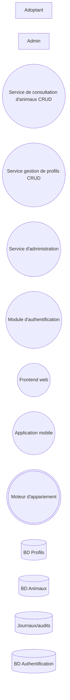
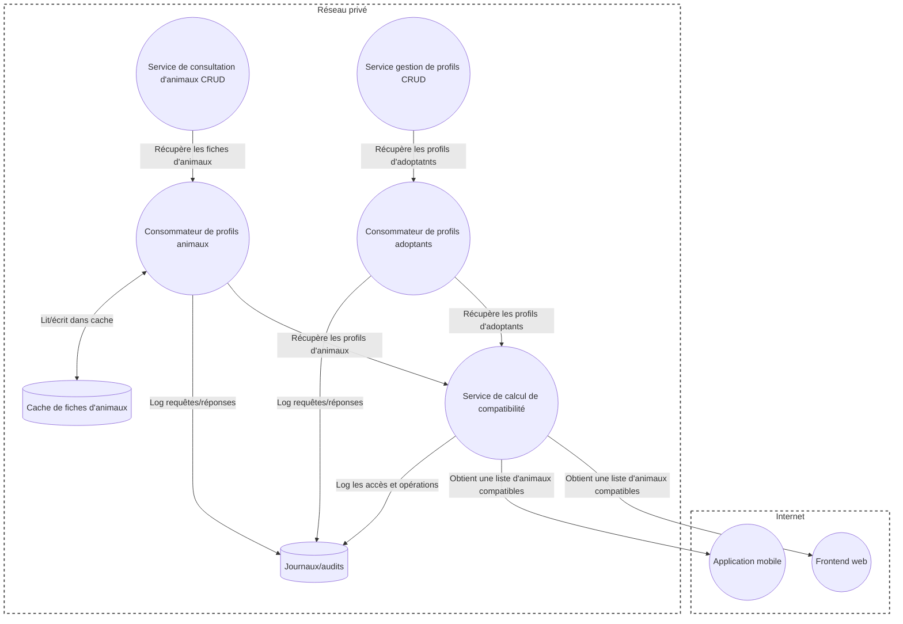

# Exercice : Nos amos les animis

## 1. Inventaire des composantes
1. Identifiez les **entités externes** dans le système.
1. Identifiez les **stockages de données** dans le système.
1. Identifiez les **processus** dans le système

<details markdown="1">
<summary markdown="span">**Voir diagramme**</summary>

</details>

<details markdown="1">
<summary markdown="span">**Voir code Mermaid**</summary>
```
flowchart LR
    Adoptant[Adoptant]
    Administrateur[Admin]
    ModuleConsultation((Service de consultation d'animaux CRUD))
    ModuleAdoptant((Service gestion de profils CRUD))
    ModuleAdmin((Service d'administration))
    ModuleAuth((Module d'authentification))
    Web((Frontend web))
    Mobile((Application mobile))
    ModuleAppariement(((Moteur d'appariement)))
    BdProfils[(BD Profils)]
    BdAnimaux[(BD Animaux)]
    Logs[(Journaux/audits)]
    BDAuth[(BD Authentification)]
```
</details>

## 2. Création du DFD de contexte (niveau 0)
1. En utilisant les symboles appropriés, représentez les éléments identifiés à la questions précédente dans un DFD de contexte.
1. Identifiez les **flux de données** entre les différentes composantes, et ajoutez-les sur le DFD.
1. Ajoutez, au besoin, des **frontières de confiance** aux endroits où l'on passe d'un environnement plus sécurisé à un environnement moins sécurisé (ou vice-versa).

<details markdown="1">
<summary markdown="span">**Voir diagramme**</summary>

</details>

<details markdown="1">
<summary markdown="span">**Voir code Mermaid**</summary>
```
flowchart TD
    subgraph internet["Internet"]
        Adoptant[Adoptant]
        Administrateur[Admin]
        Web((Frontend web))
        Mobile((Application mobile))
    end

    subgraph local["Réseau privé"]
        ModuleConsultation((Service de consultation d'animaux CRUD))
        ModuleAdoptant((Service gestion de profils CRUD))
        ModuleAdmin((Service d'administration))
        ModuleAuth((Module d'authentification))
        ModuleAppariement(((Moteur d'appariement)))
        BdProfils[(BD Profils)]
        BdAnimaux[(BD Animaux)]
        Logs[(Journaux/audits)]
        BdAuth[(BD Authentification)]
    end

    Adoptant <--> | Consulte profils animaux / Met à jour son profil / Liste les animaux compatibles | Web
    Adoptant <--> | Consulte profils animaux / Met à jour son profil | Mobile
    Administrateur --> | Met à jour fiches animaux | Web


    ModuleConsultation --> | Lit les fiches d'animaux | Web
    Web <--> | Consulte / met à jour la fiche d'adoptant | ModuleAdoptant
    Web <--> | Envoie identifiants / reçoit auth ou no-auth | ModuleAuth
    Web --> | Met à jour les fiches animaux | ModuleAdmin

    ModuleAppariement --> | Obtient une liste d'animaux compatibles | Web
    ModuleAppariement --> | Obtient une liste d'animaux compatibles | Mobile

    ModuleConsultation --> | Lit les fiches d'animaux | Web
    Mobile <--> | Consulte / met à jour la fiche d'adoptant | ModuleAdoptant
    Mobile <--> | Envoie identifiants / reçoit auth ou no-auth | ModuleAuth

    ModuleConsultation --> | Récupère les fiches d'animaux | ModuleAppariement
    ModuleAdoptant --> | Récupère les profils d'adoptatnts | ModuleAppariement

    ModuleAdoptant <--> | Lit et écrit les profils | BdProfils
    BdAnimaux --> | Lit les profils animaux | ModuleConsultation
    
    ModuleAdmin --> | Écrit les profils animaux | BdAnimaux

    BdAuth --> | Récupère les identifiants | ModuleAuth

    ModuleAdmin --> | Log accès/changements | Logs
    ModuleAdoptant --> | Log accès/changements | Logs
    ModuleConsultation --> | Log accès | Logs
    ModuleAppariement --> | Log les opérations | Logs

    style internet fill:none,stroke-dasharray: 5 5, stroke-width:2px, stroke:#444
    style local fill:none,stroke-dasharray: 5 5, stroke-width:2px, stroke:#444
```
</details>


## 3. Création du DFD de niveau 1
1. Pour chaque processus complexe identifié, créez un DFD de niveau 1.
1. Décomposez le processus complexe en un ou plusieurs **processus simple(s)**
1. Représentez, sur le DFD de niveau 1, les autres entités (entités externes, stockages de données, processus) avec lesquels les processus interagissent.
1. Ajoutez les **flux de données** et les **frontières de confiance**, au besoin.

<details markdown="1">
<summary markdown="span">**Voir diagramme**</summary>

</details>

<details markdown="1">
<summary markdown="span">**Voir code Mermaid**</summary>
```
flowchart TD
    subgraph internet["Internet"]
        Web((Frontend web))
        Mobile((Application mobile))
    end

    subgraph local["Réseau privé"]
        ClientProfils((Consommateur de profils adoptants))
        ClientAnimaux((Consommateur de profils animaux))
        ServiceCompatibilite((Service de calcul de compatibilité))
        ModuleConsultation((Service de consultation d'animaux CRUD))
        ModuleAdoptant((Service gestion de profils CRUD))
        Logs[(Journaux/audits)]
        CacheAnimaux[(Cache de fiches d'animaux)]
    end

    ServiceCompatibilite --> | Obtient une liste d'animaux compatibles | Web
    ServiceCompatibilite --> | Obtient une liste d'animaux compatibles | Mobile
    ModuleConsultation --> | Récupère les fiches d'animaux | ClientAnimaux
    ModuleAdoptant --> | Récupère les profils d'adoptatnts | ClientProfils

    ClientAnimaux --> | Récupère les profils d'animaux | ServiceCompatibilite
    ClientProfils --> | Récupère les profils d'adoptants | ServiceCompatibilite

    ClientProfils --> | Log requêtes/réponses | Logs
    ClientAnimaux --> | Log requêtes/réponses | Logs
    ServiceCompatibilite --> | Log les accès et opérations | Logs
    ClientAnimaux <--> | Lit/écrit dans cache | CacheAnimaux

    style internet fill:none,stroke-dasharray: 5 5, stroke-width:2px, stroke:#444
    style local fill:none,stroke-dasharray: 5 5, stroke-width:2px, stroke:#444
```
</details>

{: .highlight}
> Dans l'exemple ci-haut, une cache a été ajoutée au consommateur de profils animaux pour démontrer que la décomposition d'un processus complexe peut parfois faire apparaître de nouveaux éléments qui n'étaient pas visibles sur le DFD du niveau supérieur. Ce nouvel élément devra donc être modélisé comme les autres dans la suite de la méthode STRIDE.

## 4. Modélisation de la menace STRIDE
Pour chaque élément présent dans vos DFD :
1. Identifiez les menaces potentielles (référez-vous à la matrice dans les notes de cours)
1. Identifiez, parmi les menaces potentielles, les menaces réelles (c'est-à-dire celles qui sont réellement applicables dans le contexte de l'application)
1. Pour chaque menace réelle, énoncez un scénario d'attaque concret réalisant cette menace.

## 5. Analyse du risque
Pour chaque menace réelle identifiée à l'étape précédente :
1. Évaluez la **probabilité** qu'une attaque se réalise (1 = très faible, 5 = très probable)
1. Évaluez l'**impact** qu'aurait une attaque si elle se réalisait (1 = très peu d'impact, 5 = impact énorme)
1. Déterminez un seuil acceptable qui caractérise un risque faible pour des valeurs entre 1 et 25.
1. Calculez la cote de risque pour chaque menace dans votre système.

## 6. Mise en place de contre-mesures
Pour chaque menace ayant une cote de risque supérieure au seuil déterminé :
1. Proposez au moins une contre-mesure.
1. Expliquez comment cette contre-mesure permettrait de mitiger ou d'empêcher une attaque visant la menace identifiée.


