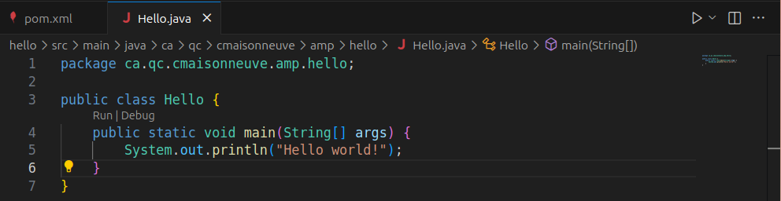
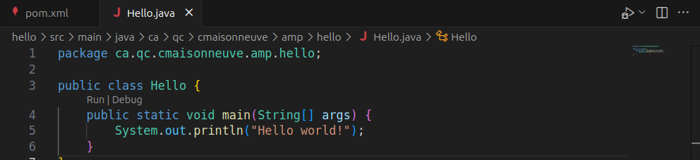

# Exercice : Familiarisation avec Java sous Visual Studio Code

---

## 1. Exécuter la classe `Hello`

1. Ouvrir le fichier `Hello.java` dans l'éditeur.
2. Cliquer sur le bouton **Run** (triangle ▶️) situé en haut à droite de l'éditeur.
3. Alternativement, faire un clic droit dans le fichier et choisir **Run Java**.
4. Alternativement, appuyer sur **Ctrl-F5**



> Cela compile et exécute la méthode `main` sans entrer dans le mode Debug.

---

## 2. Exécuter la classe `Hello` en mode Debug

1. Ouvrir le fichier `Hello.java`.
2. Cliquer sur le bouton **Debug** (icône d'insecte 🐞) en haut à droite.
3. Ou faire un clic droit dans le fichier et choisir **Debug Java**.
4. Alternativement, appuyer sur **F5**
5. Utiliser des points d'arrêt (breakpoints) pour inspecter le code.



> Le mode Debug permet d'exécuter le code étape par étape et d'inspecter les variables.

---

## 3. Exporter le projet en fichier `.jar`

1. Ouvrir la **palette de commandes** avec `Ctrl+Shift+P` (Windows/Linux) ou `Cmd+Shift+P` (macOS).
2. Taper : `Java: Export Jar` et sélectionner la commande.
3. Choisir le projet à exporter.
4. Sélectionner la classe contenant la méthode `main` (`Hello`).
5. Choisir un dossier de destination pour le fichier `.jar`.

> Visual Studio Code génère un fichier `.jar` exécutable dans le dossier choisi.

---

## 4. Exécuter le fichier `.jar` depuis le terminal

1. Ouvrir un terminal dans Visual Studio Code ou dans ton système.
2. Naviguer jusqu’au dossier contenant le fichier `.jar`.
3. Exécuter la commande suivante :

```bash
java -jar Hello.jar
```

---