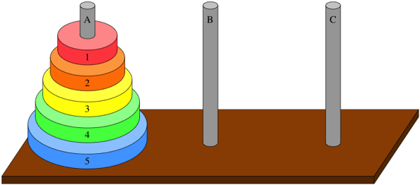
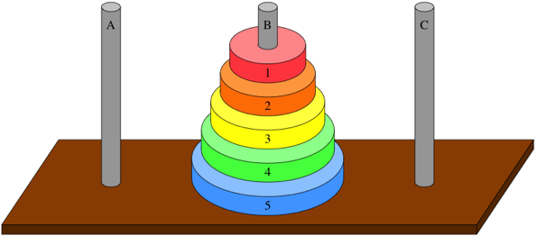

# Exercice : Notation Grand O

## Les algorithmes mystère!

Votre mission, si toutefois vous l'acceptez, consiste à démasquer quatre (4) algorithmes mystère et à identifier correctement:
- L'algorithme de complexité **O(1)**
- L'algorithme de complexité **O(log n)**
- L'algorithme de complexité **O(n)**
- L'algorithme de complexité **O(n<sup>2</sup>)**

## Objectifs

- Inspecter et exécuter différents algorithmes.
- Afficher les temps d'exécution en fonction de la taille de l'entrée dans un graphique.
- Analyser les graphiques afin d'identifier correctement la complexité de chaque algorithme.

## Contexte

On vous fournit 4 algorithmes à identifier, ainsi qu'une classe `Main` dans laquelle quelques méthodes utilitaires sont déjà incluses:
- `void afficherGraphique(int[] tailleEntree, long[] tempsExecution)` : Affiche un graphique avec la taille de l'entrée en X et le temps d'exécution en Y.
- `void rechaufferJVM(Algorithme algo)` : Permet d'exécuter l'algorithme inspecté quelques milliers de fois afin d'optimiser la JVM *avant* de recueillir les temps d'exécution. Ceci permet d'obtenir des mesures plus précises.

## Étapes

### 1. Clonez le dépôt de l'exercice

```bash
git clone git@github.com:ophenix-420-930-ma-24636/algorithmes-mystere.git
```
ou
```bash
git clone https://github.com/ophenix-420-930-ma-24636/algorithmes-mystere.git
```

### 2. Étudiez la méthode `main()` de la classe `Main`. 

Retrouvez le commentaire suivant:
```java
// TODO implémenter de la logique de récupération des temps d'exécution ici...
```
- Quel code devrez-vous ajouter pour recueillir différents temps d'exécution en fonction d'une taille d'entrée variable?


### 3. Ajoutez le code manquant pour recueillir les points à ajouter sur le graphique.

Le code doit:
- Lancer un algorithme (A, B, C ou D) avec chaque élément du tableau `int[] tailleEntrees`.
- Recueillir le temps d'exécution pour chaque exécution.


### 4. Affichez un graphique pour chaque algorithme
- Appeler la méthode `afficherGraphique(int[] tailleEntree, long[] tempsExecution)`


### 5. Améliorez les résultats

Il est possible que vous remarquiez des anomalies dans vos graphiques, rendant l'identification plus difficile. Comment pourriez-vous modifier votre code pour:
- Recueillir un temps d'exécution moyen pour chaque taille d'entrée?
- Recueillir un temps d'exécution **pire cas** (maximal) pour chaque taille d'entrée?

En exécutant l'algorithme plusieurs fois pour chaque taille d'entrée, et en recueillant le temps moyen ou le temps maximal, les données obtenues seront plus précises.

{: .highlight}
>Les anomalies observées peuvent être dues à plusieurs facteurs, notamment:
>- Des optimisations *just in time* du compilateur Java
>- Le facteur chance: il est possible qu'un algorithme de recherche tombe rapidement sur la valeur cherchée. Il tombe ainsi plus près du *meilleur cas* plutôt que du *pire cas*.

### 6. Identifiez chaque algorithme

#### Complexité O(1)
- Quel algorithme a une complexité O(1) ?
- Quelles opérations contribuent à cette complexité ?

#### Complexité O(log n)
- Quel algorithme a une complexité O(log n) ?
- Quelles opérations contribuent à cette complexité ?

#### Complexité O(n)
- Quel algorithme a une complexité O(n) ?
- Quelles opérations contribuent à cette complexité ?

#### Complexité O(n<sup>2</sup>)
- Quel algorithme a une complexité O(n<sup>2</sup>) ?
- Quelles opérations contribuent à cette complexité ?

### 7. Bonus: Ajout d'un nouvel algorithme

Ajoutez maintenant un nouvel algorithme qui implémentera lui aussi l'interface `Algorithme`. Cet algorithme sera une implémentation du jeu classique de la **Tour de Hanoï**.

#### Problème de la Tour de Hanoï

1. Il y a **trois tours** : `source`, `auxiliaire`, `destination`.
2. Il y a **n disques**, identifiés par des entiers : `1` (le plus petit) à `n` (le plus grand).
3. On ne peut déplacer **qu’un seul disque à la fois**.
4. Un disque ne peut être placé **que sur un disque plus grand** ou sur une tour vide.

##### État initial


##### But du jeu


#### Liens utiles
- [Jeu interactif de la tour de Hanoï](https://www.mathsisfun.com/games/towerofhanoi.html)
- [Explications des règles](https://www.youtube.com/watch?v=_bWLwz_PquI&t=35s) (en anglais)
- [Comment résoudre le jeu](https://www.youtube.com/watch?v=JqQFf775wZU)

---

#### Instructions pour l'algorithme

1. La méthode `executer(int tailleTableau)` prendra en paramètre le nombre de disques à utiliser pour la partie.
2. Elle appellera ensuite une fonction récursive `private void hanoi(int n, String source, String destination, String auxiliaire)` :
   - `n` est le **nombre total de disques**.
   - `source`, `destination`, `auxiliaire` sont les trois tiges du jeu (elles peuvent prendre le nom que vous souhaitez, comme **A**, **B** et **C** dans les diagrammes ci-haut).
   - La fonction doit déplacer les disques du plus grand au plus petit, en respectant les règles.
2. La fonction doit afficher chaque mouvement sous la forme :
   ```
   Déplacer le disque [numéro] de [source] vers [destination]
   ```

#### Complexité de l'algorithme
- Quelle est, selon vous, la complexité Grand O de cet algorithme?
- Avez-vous dû modifier les tailles d'entrées dans la fonction `main()` ? Pourquoi ?