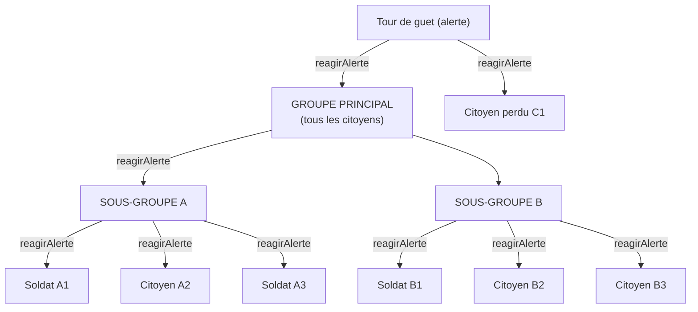

# Exercice : L'attaque des zombies!

Nous sommes en 2034. Un mystérieux virus a complètement ravagé la planète et transformé la quasi-totalité de l'humanité en zombies. Les humains du monde entier ayant résisté à l'infection ont convergé vers la dernière forteresse connue : la grande forteresse de La Prairie, Québec, Canada


## Étapes préparatoires

### 1. Clonez le dépôt de l'exercice

```bash
git clone git@github.com:ophenix-420-930-ma-24636/patrons-attaque-zombies.git
```
ou
```bash
git clone https://github.com/ophenix-420-930-ma-24636/patrons-attaque-zombies.git
```

### 2. Lancez le projet Java
```bash
mvn clean package
java -jar target/attaque-zombies-1.0-SNAPSHOT.jar [--drones <nombre de drones>] [--soldats <nombre de soldats>] [--citoyens <nombre de citoyens>]
```
ou directement à partir de votre IDE.

Il s'agit du code qui simule la situation apocalyptique décrite ci-haut ainsi que les contextes des questions 1 et 2.

## Question 1 : La tour de guet

La forteresse désire mettre en place une tour de guet qui permettra de détecter les hordes de zombies à l'avance afin d'optimiser la préparation à une attaque. Lorsqu'une horde de zombies est détectée, on désire qu'une alerte puisse être envoyée afin de commencer les préparatifs. Spéficiquement, on désire que :

- Les drones décollent pour aller surveiller et disperser la horde.
- Le pont levis se lève.
- Les citoyens se mettent à l'abri.
- Les soldats montent aux barricades.

On veut éviter les intermédiaires; autrement dit, on veut que les drones, le pont levis, les citoyens et les soldats soient alertés directement par la tour de guet.

### 1.1. Analysez le scénario décrit
- Quelle entité est responsable d'envoyer l'alerte ?
- Quelle(s) entité(s) doivent recevoir l'alerte et réagir à celle-ci ?
- Identifiez le patron de conception qui permet de répondre à ce type de problème.
   - ***Indice** : il s'agit d'un patron de conception à l'étude dans le cadre du cours*

### 1.2. Complétez le code de `TourDeGuet`
- Observez la méthode vide `lancerAlerte()` dans la classe `TourDeGuet`.
   - Que doit faire cette méthode ?
- Quelle(s) méthode(s) additionnelle(s) devez-vous ajouter à `TourDeGuet` pour permettre l'implémentation du patron de conception choisi ?
- Ajoutez et implémentez cette / ces méthode(s).

### 1.3. Ajustez les classes `PontLevis`, `Drone` et `Survivant`/`Soldat`/`Citoyen`
- Est-il important pour la tour de guet de connaître le type concret de chaque entité recevant l'alerte ?
   - Si oui, pourquoi ?
   - Sinon, comment pouvez-vous abstraire le type concret des différents destinataires pour la tour de guet?
   - Si votre réponse implique un ajout ou une modification au code, implémentez votre changement maintenant.
- Quelle(s) méthode(s) devrez-vous ajouter à chacune des classes destinataires pour implémenter le patron choisi ?
   - Pour chacune des classes, cette méthode doit-elle effectuer la même action ? Pourquoi ?
      - *Autrement dit, lorsqu'une horde de zombies arrive, est-ce qu'un `Drone` réagit de la même façon qu'un `Soldat` ?
   - Implémentez la ou les méthodes additionnelles dans chacune des classes selon le comportement désiré.


### 1.4. Testez le lancement d'une alerte
- Finalisez l'implémentation de votre patron de conception en ajoutant tout code manquant à la classe `Forteresse`
- En utilisant l'interface interactive, simulez une attaque de zombies.
   - Faites varier le nombre de drones et de survivants et observez le comportement.
   - *Vous pouvez essayer certains cas limites, par exemple s'il n'y a aucun drone, aucun soldat ou aucun citoyen.*


## Question 2 : L'organisation des survivants

Votre tour de guet fonctionne bien et permet à la forteresse de réagir rapidement en cas d’attaque de zombies. Cependant, alerter chaque survivant individuellement crée un manque de coordination. Les sages du village proposent donc d’organiser la forteresse en groupes hiérarchiques : lorsqu’une alerte est envoyée au groupe principal, elle doit se propager automatiquement vers chaque sous‑groupe, puis vers chaque membre individuel (qu’il s’agisse d’un soldat ou d’un simple citoyen). Si, pour une raison quelconque, le survivant n'est pas avec son groupe, on veut quand même conserver la possibilité de l'alerter individuellement. Autrement dit, on doit pouvoir alerter aussi bien un groupe qu'un individu, sans logique additionnelle pour la tour de guet.

Le schéma ci-dessous illustre un exemple d'organisation souhaitée :



### 2.1. Analysez le scénario décrit
- Comment peut-on faire en sorte que, du point de vue de la tour de guet, un individu ou un groupe se comportent de la même façon ?
- Comment peut-on s'assurer que lorsque le groupe principal reçoit l'alerte, elle se propage aux sous-groupes, jusqu'aux individus ?
- Identifiez le patron de conception qui permet de répondre à ce type de problème.
   - ***Indice** : il s'agit d'un patron de conception à l'étude dans le cadre du cours*

### 2.2. Ajouter la notion de groupe de survivants
- Quelle nouvelle classe devrez-vous créer pour représenter un groupe de survivants ?
- Existe-t-il une interface que vous pouvez réutiliser pour mettre en place le patron de conception identifié ?
   - Si oui, laquelle ?
   - Sinon, pourquoi ?
- Selon votre réponse ci-haut, créez une nouvelle interface OU réutilisez l'interface identifiée.
- Ajoutez la nouvelle implémentation de cette interface qui représentera un groupe de survivants.

### 2.3. Ajustez la classe `Forteresse` afin d'ajouter les groupes
 - Au démarrage de la simulation, on veut que les différents soldats et citoyens soient répartis dans au moins deux (2) sous-groupe, et que tous les sous-groupes fassent partie du groupe principal.


### 2.4. Testez le lancement d'une alerte
- Finalisez l'implémentation de votre patron de conception en ajoutant tout code manquant à la classe `Forteresse` (au besoin)
- En utilisant l'interface interactive, simulez une attaque de zombies.
- Faites plusieurs simulations en utilisant différentes configurations de groupes, par exemple :
   - Tous les individus directement dans le groupe principal
   - Niveaux de sous-groupes multiples (par exemple : Principal -> Sous-groupe A -> Sous-sous-groupe AA -> Individu AA1)
   - Aucun regroupement (on revient au cas de base où chaque survivant est alerté individuellement)
      - *Ce scénario prouve que l'ajout de notre patron de conception n'a rien brisé de la fonctionnalité existante.*
