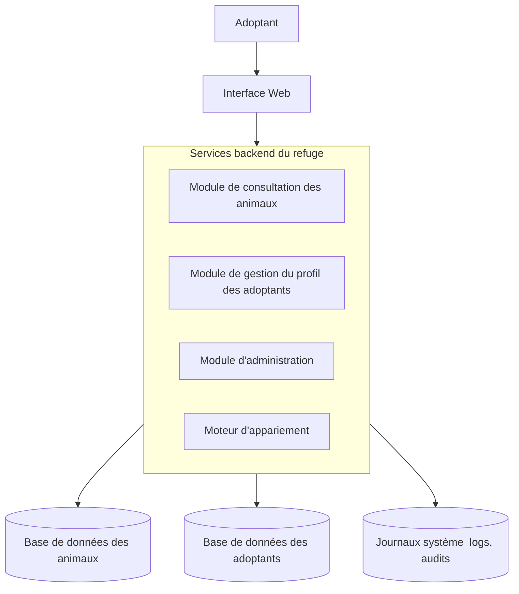

# Exercice : Nos amos les animis
*ah caline...*

## Mise en situation
Vous êtes analyste en sécurité pour un refuge animalier en pleine modernisation. Grâce à une nouvelle application Web, le refuge souhaite améliorer l’adoption des animaux en offrant aux visiteurs :
- une consultation simple et rapide des animaux disponibles pour l'adoption
- la création d’un profil personnel pour les personnes souhaitant adopter
- un moteur d’appariement intelligent qui suggère les animaux les plus compatibles selon le profil des adoptants

Votre rôle consiste à analyser les menaces potentielles qui pèsent sur ce système afin d’aider le refuge à bâtir une application sécuritaire, fiable et durable.

Imaginez la catastrophe si une personne ayant une mobilité limitée et habitant dans un petit appartement se retrouvait avec un grand danois hyperactif!

## Objectifs
- Représenter les différents éléments d'un système dans des DFD
- Appliquer l'analyse STRIDE sur chacun des éléments
- Pour chaque risque significatif identifié, proposer des contre-mesures réalistes et appropriés

## 🧩 Contexte général
Au refuge, les visiteurs peuvent se connecter sur une tablette ou un kiosque interactif pour :
1. consulter les animaux disponibles et leurs fiches ;
2. créer leur profil d’adoptant ;
3. obtenir, grâce au moteur d’appariement, une liste d’animaux compatibles.

Le système s’appuie sur :
- une base des animaux ;
- une base des adoptants ;
- un moteur d’appariement (processus complexe unique).

### Adoptant
Personne utilisant l’application pour consulter les animaux ou créer un profil.

### Interface Web
Permet l’accès à l’application par :
- tablette,
- borne interactive,
- navigateur Web.

### Module de consultation des animaux**
Affiche les fiches : race, âge, comportement, santé, etc.

### Module de gestion du profil adoptant**
Permet la saisie : mode de vie, allergies, préférences, expérience, etc.

### Module d'administration (interne)**
Pour les employés du refuge :
- mises à jour des fiches des animaux,

### Moteur d’appariement (complexe)**
- Analyse et compare :
    - les données du visiteur,
    - les besoins des animaux,
    - l’historique d’adoption.

- Produit un **score de compatibilité**.
- Propose une liste d'animaux compatibles au profil de l'adoptant, en ordre décroissant de *match*

### **Base de données des animaux**
Données biométriques, santé, comportement, statut.

### **Base des adoptants**
Données personnelles, préférences, historique.

### **Journal système**
Logs d’actions : connexions, modifications, accès internes.

---

