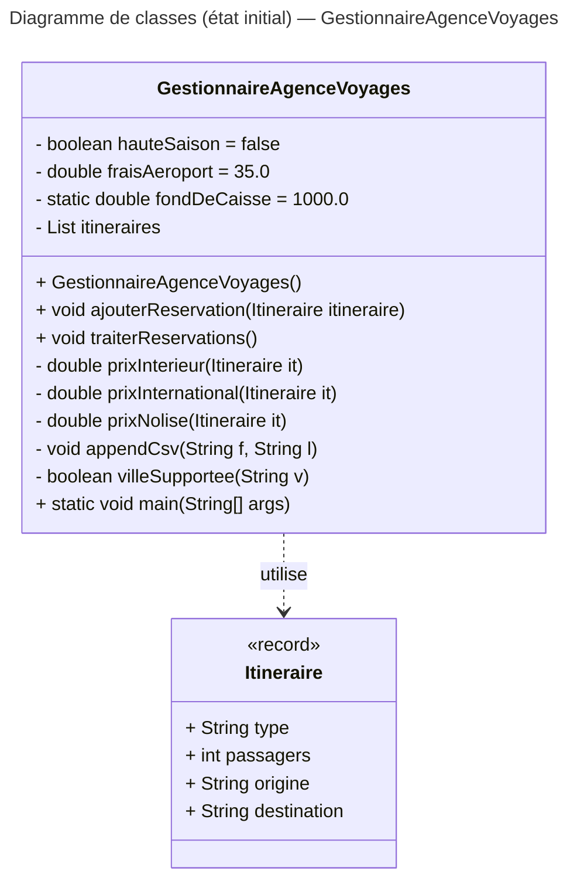

# Exercice: Diagrammes UML

## Objectifs

- Comprendre les bases de la modélisation UML (*Unified Modeling Language*)
- Utiliser le diagramme de classes pour représenter l'architecture d'une application
- Utiliser le diagramme de séquence pour représenter le fonctionnement d'une application

## Contexte

Utiliser la [question 6](../exercices/solid) de l'exercice sur les principes SOLID afin de modifier un diagramme de classes UML existant et de concevoir un diagramme de séquence simple.


## 1. Diagramme de classes

Le code de départ de la [question 6](../exercices/solid) a été modélisé en diagramme de classes UML (voir le diagramme et le code source Mermaid ci-bas). De façon itérative, en corrigeant les infractions aux principes SOLID présentes dans le code, modifiez le diagramme de classes pour modéliser vos améliorations.

### Diagramme



### Code source

```
---
title: Diagramme de classes (état initial) — GestionnaireAgenceVoyages
---
classDiagram
    direction TB

    class GestionnaireAgenceVoyages {
        - boolean hauteSaison = false
        - double fraisAeroport = 35.0
        - static double fondDeCaisse = 1000.0
        - List<Itineraire> itineraires
        + GestionnaireAgenceVoyages()
        + void ajouterReservation(Itineraire itineraire)
        + void traiterReservations()
        - double prixInterieur(Itineraire it)
        - double prixInternational(Itineraire it)
        - double prixNolise(Itineraire it)
        - void appendCsv(String f, String l)
        - boolean villeSupportee(String v)
    }

    class Itineraire {
        <<record>>
        + String type
        + int passagers
        + String origine
        + String destination
    }

    %% Relations
    GestionnaireAgenceVoyages ..> Itineraire : utilise
```

## 2. Diagramme de séquence

Représentez maintenant le scénario principal (traitement des réservations) de votre application corrigée dans un diagramme de séquence UML.