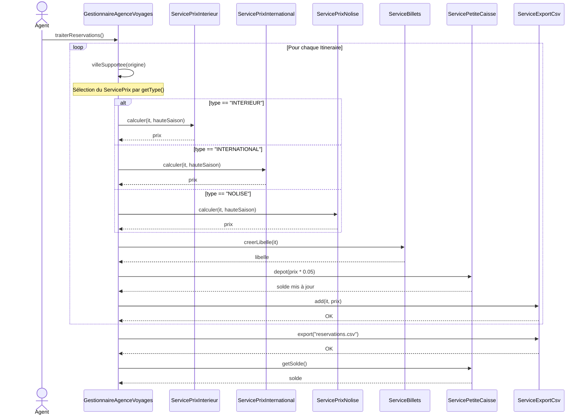

# Exercice: Diagrammes UML - Corrigé

## Objectifs

- Comprendre les bases de la modélisation UML (*Unified Modeling Language*)
- Utiliser le diagramme de classes pour représenter l'architecture d'une application
- Utiliser le diagramme de séquence pour représenter le fonctionnement d'une application

## Contexte

Utiliser la [question 6](../exercices/solid) de l'exercice sur les principes SOLID afin de modifier un diagramme de classes UML existant et de concevoir un diagramme de séquence simple.

## 1. Diagramme de classes

En fonction de la correction réalisée en classe, voici le diagramme de classes résultant. Bien sûr, si les problèmes SOLID ont été réglés différemment, le diagramme de classes devra aussi être ajusté.

```mermaid
---
title: Agence de voyages — Diagramme de classes (refactorisation qui corrige les failles SOLID)
---
classDiagram
    direction TB

    class GestionnaireAgenceVoyages {
        - List<ServicePrix> servicesPrix
        - ServicePetiteCaisse servicePetiteCaisse
        - ServiceExport serviceExport
        - ServiceBillets serviceBillets
        - boolean hauteSaison
        - List<Itineraire> itineraires
        + GestionnaireAgenceVoyages(List<ServicePrix>, ServiceExport, ServicePetiteCaisse, ServiceBillets)
        + void ajouterReservation(Itineraire)
        + void traiterReservations()
        - boolean villeSupportee(String)
        + static void main(String[])
    }

    class Itineraire {
        <<record>>
        + String type
        + int passagers
        + String origine
        + String destination
    }

    class ServicePetiteCaisse {
        <<interface>>
        + void depot(double)
        + void retrait(double)
        + double getSolde()
    }

    class ServicePetiteCaisseRegulier {
        - double solde
        + ServicePetiteCaisseRegulier(double)
        + void depot(double)
        + void retrait(double)
        + double getSolde()
    }

    class ServiceBillets {
        <<interface>>
        + String creerLibelle(Itineraire)
    }

    class ServiceBilletsSimple {
        + String creerLibelle(Itineraire)
    }

    class ServiceExport {
        <<interface>>
        + void add(Itineraire, double)
        + void export(String)
    }

    class ServiceExportCsv {
        - List<Itineraire> itineraires
        - List<Double> prix
        + void add(Itineraire, double)
        + void export(String)
    }

    class ServicePrix {
        <<interface>>
        + String getType()
        + double calculer(Itineraire, boolean)
    }

    class ServicePrixInterieur {
        - double fraisFixes
        + ServicePrixInterieur(double)
        + String getType()
        + double calculer(Itineraire, boolean)
    }

    class ServicePrixInternational {
        - double fraisFixes
        + ServicePrixInternational(double)
        + String getType()
        + double calculer(Itineraire, boolean)
    }

    class ServicePrixNolise {
        - double fraisFixes
        + ServicePrixNolise(double)
        + String getType()
        + double calculer(Itineraire, boolean)
    }

    %% Implémentations
    ServicePetiteCaisseRegulier ..|> ServicePetiteCaisse
    ServiceBilletsSimple ..|> ServiceBillets
    ServiceExportCsv ..|> ServiceExport
    ServicePrixInterieur ..|> ServicePrix
    ServicePrixInternational ..|> ServicePrix
    ServicePrixNolise ..|> ServicePrix

    %% Associations & cardinalités
    GestionnaireAgenceVoyages --> "1..*" ServicePrix : servicesPrix
    GestionnaireAgenceVoyages --> ServiceExport : serviceExport
    GestionnaireAgenceVoyages --> ServicePetiteCaisse : servicePetiteCaisse
    GestionnaireAgenceVoyages --> ServiceBillets : serviceBillets
    GestionnaireAgenceVoyages *-- "0..*" Itineraire : itineraires

    ServiceExportCsv *-- "0..*" Itineraire : lignes

```

## 2. Diagramme de séquence

