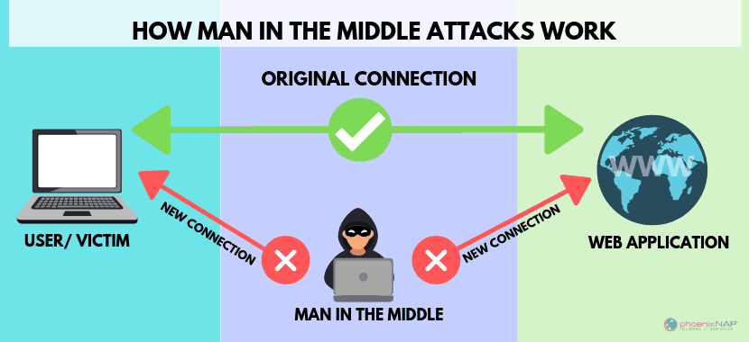

# Certificats

Un **certificat numérique** est un document électronique qui associe une **clé publique** à l'**identité d'une entité** (telle qu'une personne, une organisation ou un appareil) et est utilisé pour garantir l'**authenticité**, l'**intégrité** et la **sécurité** des communications sur un **réseau public** (comme internet).

Il contient généralement :
- une **clé publique**,
- des informations sur le **sujet**,
- des informations sur l’**émetteur**,
- une **signature numérique**,
- diverses **extensions** précisant son usage. 

---

## Types de certificats
Il existe plusieurs types de certificats numériques, dont les plus connus sont:

- **X.509** : certificats permettant d'associer **une clé publique** à une **entité** en se basant sur la norme **X.509**.
- **PGP** : certificats basés sur le modèle à **clé asymétrique**, souvent utilisé pour assurer la **sécurité de communications** ou de **fichiers**.
- **S/MIME** : certificats utilisés pour sécuriser les **courriels**. Bien que la spécification S/MIME permette l'utilisation de différents types de certificats, la majorité des implémentations utilisent en fait des certificats **X.509**.

Notamment grâce à leur utilisation dans TLS, les certificats X.509 sont, de loin, les plus répandus.

---

## Historique
La norme **X.509** a été publiée pour la première fois le 3 juillet 1988 par la division de standardisation de l'Union Internationale des Télécommunications (UIT-T, ou *ITU-T* en anglais). Le but principal était de fournir un mécanisme permettant de **sécuriser l'accès à l'information** en évitant les attaques de type *man-in-the-middle*.



---

## Norme X.509

La norme **X.509** définit :
- **Le contenu de base des certificats**, c'est-à-dire l'information **obligatoire** et **optionnelle** pouvant se retrouver dans le certificat.
- **Des extensions (v3)** permettant d'ajouter de l'**information additionnelle** à l'information de base des certificats.
- **Des mécanismes de validation** permettant de vérifier la **validité** et l'**authenticité* de chaque certificat.
- **Des mécanismes de révocation** permettant de publier des listes de certificats **n'étant plus dignes de confiance**, par exemple parce qu'ils ont été **compromis**.

Les certificats X.509 fonctionnent dans une **chaîne de confiance** :
- l’autorité de certification **racine** (*Root CA*),
- les autorités **intermédiaires**,
- le certificat final.

---

## Visualisation d’un certificat
Il est possible d’afficher un certificat :
- via un **navigateur web**,
- via un outil système (Windows, macOS, Linux),
- via OpenSSL :
    ```bash
    openssl x509 -in certificat.crt -text -noout
    ```

Les navigateurs permettent aussi de consulter directement le certificat d’un site HTTPS.

---

## Récupération du certificat d’un site web
OpenSSL peut extraire le certificat d’un serveur :
```bash
openssl s_client -connect example.com:443 -showcerts
```

On peut ensuite afficher son contenu avec :
```bash
openssl x509 -in <certificat> -text -noout
```
---

Les certificats X.509 constituent donc la base de la sécurité moderne sur Internet et sont essentiels pour authentifier des services et protéger les communications. Ils sont au cœur du fonctionnement de HTTPS, des VPN, des infrastructures à clés publiques (PKI) et de nombreux systèmes d’entreprise.
