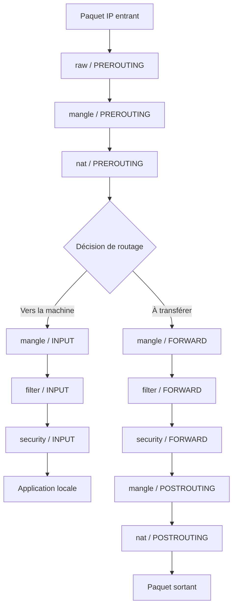
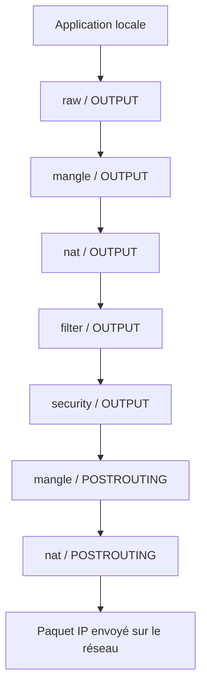

# iptables

**iptables** est l’outil historique permettant de configurer Netfilter.

Caractéristiques :

- très puissant
- très granulaire
- configuration explicite
- courbe d’apprentissage élevée

---

## Tables et chaînes

### Tables
Comme son nom l'indique, iptables et composé de plusieurs tables permettant d'interagir d'une façon différente avec les paquets IP. 

| Table | Rôle principal | Description |
|------|----------------|-------------|
| **filter** | Filtrage du trafic | Table **par défaut** d’iptables. Elle décide si un paquet est **autorisé ou bloqué**. Utilisée pour implémenter le pare-feu classique. Chaînes principales : `INPUT`, `OUTPUT`, `FORWARD`. |
| **nat** | Translation d’adresses (NAT) | Utilisée pour **modifier les adresses IP et ports** des paquets (DNAT, SNAT, MASQUERADE). Typiquement utilisée pour le partage de connexion et le port forwarding. Chaînes : `PREROUTING`, `POSTROUTING`, `OUTPUT`. |
| **mangle** | Modification des paquets | Permet de **modifier des champs des paquets** (TTL, TOS, marquage). Utilisée pour des besoins avancés comme la QoS ou le routage complexe. Chaînes : `PREROUTING`, `INPUT`, `FORWARD`, `OUTPUT`, `POSTROUTING`. |
| **raw** | Gestion du suivi de connexion | Table utilisée **avant le suivi de connexion (conntrack)**. Sert principalement à exclure certains paquets du suivi d’état. Chaînes : `PREROUTING`, `OUTPUT`. |
| **security** | Contrôle de sécurité renforcé | Utilisée pour les **politiques de sécurité obligatoires** (ex. SELinux). Peu utilisée dans un contexte pédagogique standard. Chaînes similaires à `filter`. |

La table **filter** étant celle qui est responsable du filtrage des paquets, c'est celle-ci que nous étudierons plus en détails pour une utilisation en tant que pare-feu.

### Chaînes

Dans iptables, une chaîne est une liste de règles qui s’appliquent à un moment précis du trajet d’un paquet réseau (par exemple quand il arrive sur la machine ou quand il en sort). Une chaîne appartient toujours à une table donnée, et n’existe que dans cette table.

Les tables déterminent le type de traitement effectué sur le paquet (filtrage, NAT, modification, etc), tandis que les chaînes déterminent à quel moment ce traitement a lieu.

| Chaîne | Rôle | Description |
|------|------|-------------|
| **INPUT** | Trafic entrant | Traite les **paquets destinés à la machine locale**. Toute connexion entrante (ex. SSH, HTTP) passe par cette chaîne avant d’être acceptée ou bloquée. |
| **OUTPUT** | Trafic sortant | Traite les **paquets générés par la machine elle-même**. Permet de contrôler vers quels services ou hôtes la machine peut se connecter. |
| **FORWARD** | Trafic transitant | Traite les **paquets qui traversent la machine sans lui être destinés**. Utilisée lorsque la machine agit comme **routeur ou passerelle**. |


### Flux typique d'un paquent IP

**En entrée**



**En sortie**



---

## Commandes iptables

Une commande iptables prend la forme suivante :
```bash
iptables [OPTIONS GLOBALES] <ACTION_SUR_CHAÎNE> <CHAÎNE> [CRITÈRES] -j <DÉCISION>
```

où

```
iptables
│
├─ ACTION SUR LA CHAÎNE
│   ├─ -A  (append : ajouter à la fin)
│   ├─ -I  (insert : insérer à une position)
│   ├─ -D  (delete : supprimer)
│   ├─ -P  (policy : règle par défaut)
│
├─ CHAÎNE
│   ├─ INPUT
│   ├─ OUTPUT
│   └─ FORWARD
│
├─ CRITÈRES (optionnels, cumulables)
│   ├─ protocole        (-p tcp | udp | icmp)
│   ├─ port             (--dport 80, --sport 22)
│   ├─ adresse IP       (-s, -d)
│   ├─ interface        (-i, -o)
│   ├─ état connexion   (-m state --state ...)
│
└─ DÉCISION (target)
    ├─ ACCEPT
    ├─ DROP
    ├─ REJECT
    └─ LOG
```


### Modification des politiques par défaut

```bash
sudo iptables -P INPUT DROP
sudo iptables -P OUTPUT ACCEPT
```

Bloque tout en entrée, autorise les sorties.

---

### États de connexion

```bash
sudo iptables -A INPUT -m state --state ESTABLISHED,RELATED -j ACCEPT
```

Autorise les connexions déjà établies.

---

### Autoriser SSH

```bash
sudo iptables -A INPUT -p tcp --dport 22 -j ACCEPT
```

### Autoriser HTTP

```bash
sudo iptables -A INPUT -p tcp --dport 80 -j ACCEPT
```

---

## Ordre des règles

Les règles sont évaluées **de haut en bas**.

```bash
sudo iptables -L --line-numbers
```

---

## Sauvegarde et persistance

```bash
sudo iptables-save > /etc/iptables/rules.v4
sudo iptables-restore < /etc/iptables/rules.v4
```
