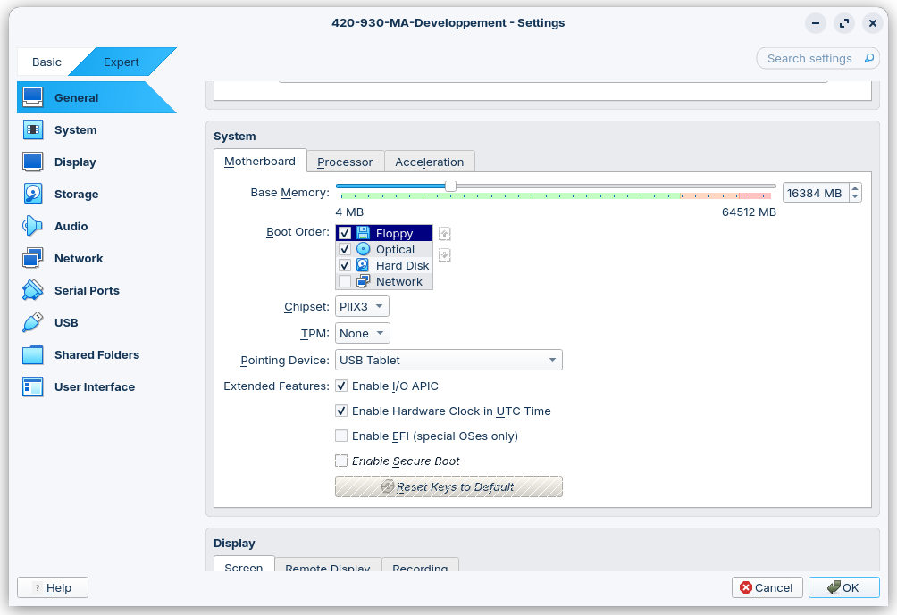
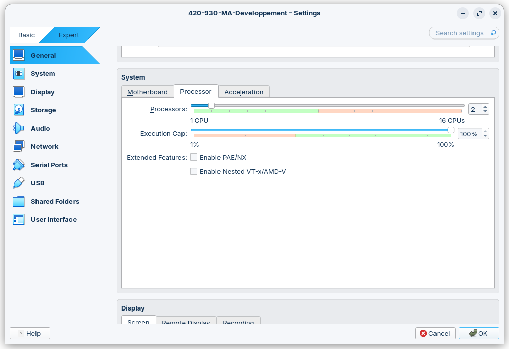
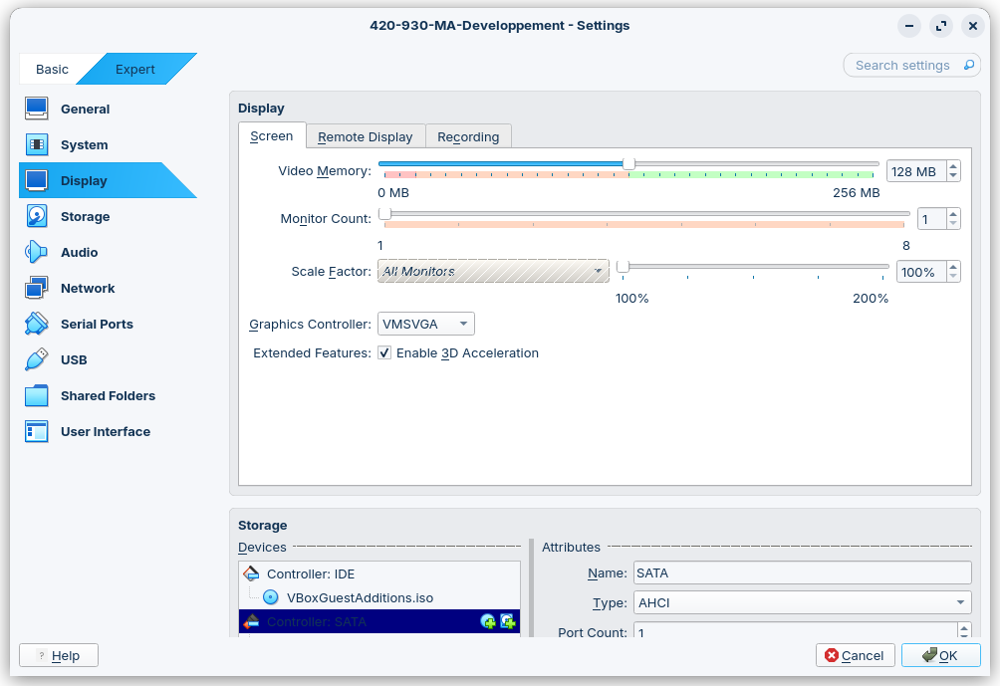

# Machine virtuelle Ubuntu 24.04 LTS (MATE)

## Information générale
* Nom d'utilisateur : **dev**
* Mot de passe : **dev**

## Modification du mot de passe
Pour modifier le mot de passe par défaut:
```bash
passwd
```
Le système vous demandera votre mot de passe courant ainsi que le nouveau mot de passe désiré.

## Modification des paramètres

La machine virtuelle a été créée avec une configuration minimale:

- 2 CPU
- 4 GB de mémoire
- 32 MB de mémoire video
- Aucune accélération 3D

Si votre système hôte le permet, il est recommandé d'allouer plus de mémoire RAM (8 ou 16GB) et vidéo (128MB) à la machine virtuelle, ainsi que d'activer l'accélération 3D.

### 1. Ouvrir les paramètres de la machine virtuelle

Dans VirtualBox :
- Faire un clic droit sur la machine virtuelle
- Sélectionner **Settings...**

### 2. Ajuster la mémoire vive (RAM)
- Sous **System > Motherboard**, ajuster la mémoire RAM



### 3. Ajuster le nombre de processeurs
- Sous **System > Processor**, ajuster le nombre de CPUs virtuels si besoin



### 4. Ajuster les paramètres vidéo
- Sous **Display > Screen** :
 - ajuster la mémoire vidéo (128MB recommandé)
 - activer l'accélération 3D



## Installation des additions invités VirtualBox (Guest Additions)

### 1. Mettre à jour le système

```bash
sudo apt update && sudo apt upgrade -y
```

### 2. Installer les paquets nécessaires

```bash
sudo apt install build-essential dkms linux-headers-$(uname -r) -y
```

### 3. Insérer l’image ISO des Guest Additions

Dans le menu de VirtualBox :

- Aller dans **Périphériques > Insérer l’image CD des Additions Invité...**

Cela montera un CD dans `/media/<utilisateur>/VBox_GAs_...`

### 4. Exécuter le script d’installation

```bash
sudo sh /media/$USER/VBox_GAs_*/VBoxLinuxAdditions.run
```

### 5. Redémarrer la machine virtuelle

```bash
sudo reboot
```

---

### 6. Vérification

Après redémarrage, vérifier que :

- Le redimensionnement automatique de l’écran fonctionne
- Le presse-papiers partagé est actif (si activé dans les paramètres)


