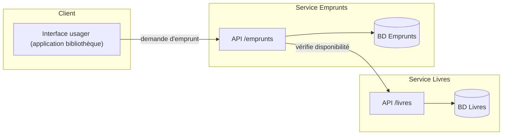
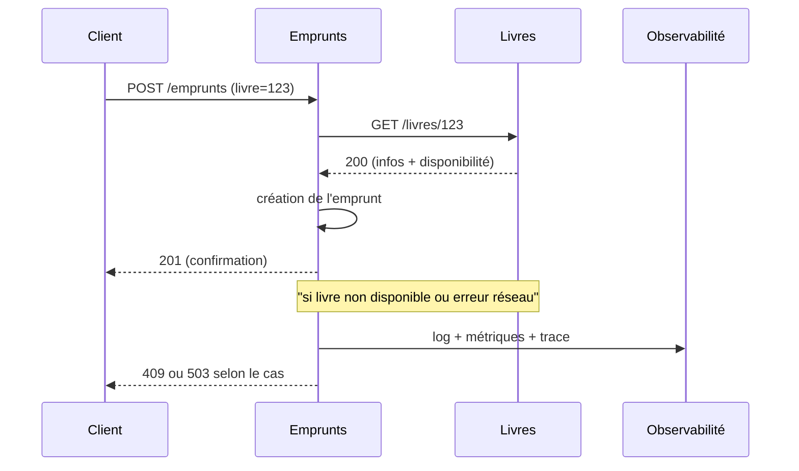

## Description
Les microservices sont une approche architecturale où l’application est composée de services faiblement couplés, déployables indépendamment, communiquant souvent via des API REST ou de la messagerie. Plus précisément, cette architecture se caractérise par la mise en place de  services autonomes où chaque service :

- est responsable d'un domaine métier bien **délimité** (frontière claire)
- possède son cycle de vie (*build*, déploiement, *scaling*, etc) **indépendant**
- gère ses données (schéma et stockage **indépendants** - aucun partage direct bases de données)
- collabore avec les autres services via contrats explicites (APIs, évènements, fichiers, *streams*), et non via des appels de méthodes directs

{: .highlight}
> Les changements restent donc, dans la très grande majorité des cas, très **localisés**. On peut publier une nouvelle version d’un service sans redéployer tout le système. La **résilience** augmente (pannes isolées), au prix d’une **complexité accrue** due à la distribution du système (réseau, latence, observabilité, sécurité inter‑services, etc).

## Quand les utiliser ?
- Domaine naturellement **modulaire** (frontières métier claires).
- Besoin de **déploiements fréquents** et **scalabilité indépendante** par capabilité.
- Organisation en **équipes autonomes** responsables d’un service.

## Avantages
- **Autonomie** : les équipes, les technologies utilisées, la cadence de *release* peuvent être différents selon le microservice.
- ***Scalabilité* indépendante** : on peut *scale* le service *Recommandations* sans toucher au service *Catalogue*.
- **Résilience accrue** : la défaillance d’un service n’arrête pas tout, surtout si des comportements par défaut et des mécanismes de *fallback* sont bien définis.

## Inconvénients
- **Complexité opérationnelle** : orchestration, observabilité, journalisation distribuée, algorithmes de ré-essai (*retry*) en cas d'échec, etc.
- **Gouvernance des données** : duplication contrôlée, consistance éventuelle, migrations versionnées, etc.
- **Coûts** : plus de pipelines, plus d’environnements, plus de surveillance, etc.

{: .warning}

> L'architecture par microservices **ne définit pas** :
> - l'architecture interne d’un service (MVC, *Hexagonal*, *Clean*, procédural, etc)
> - un protocole unique pour la communication inter-services (HTTP, messages, fichiers, etc)
> - une taille absolue (le terme *micro* est relatif à votre domaine et à votre organisation).

## Bonnes pratiques
- Séparer les microservices par **domaine métier** stable (et non, par exemple, par couche technique).
- Ne jamais partager directement les sources de données entre les microservices.
- Utiliser des **contrats versionnés**  (APIs REST, événements, etc) pour partager des données ou communiquer entre les services.
- Implémenter rapidement des mécanismes de **surveillance** et de **résilience** (corrélation de *logs*, alertes, métriques, mécanismes de *timeout* et de *backoff/retry*) 

## Exemple

### Services

### Séquence d’un appel inter‑services

## Liens utiles
- [https://microservices.io/](https://microservices.io/)
- [https://martinfowler.com/articles/microservices.html](https://martinfowler.com/articles/microservices.html)
