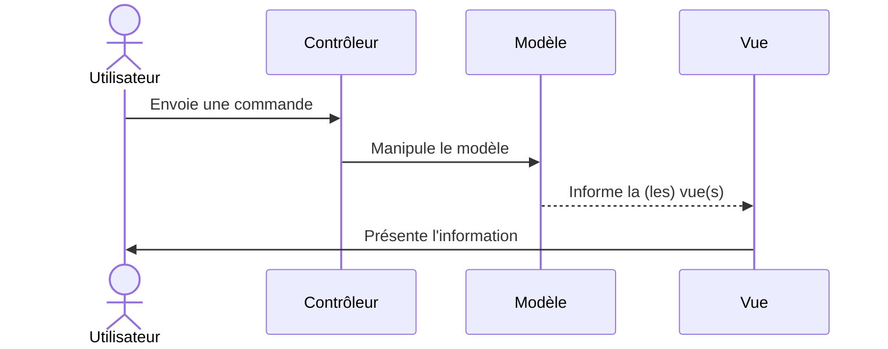
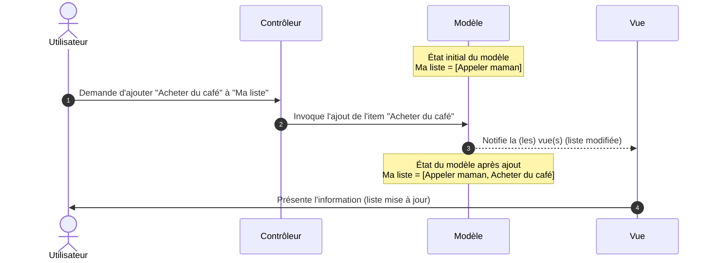

# MVC — Patron d’architecture interne

## Définition

**MVC (Modèle–Vue–Contrôleur)** est un patron d’architecture **interne** qui organise une application en **trois rôles** :
- **Modèle** : représente l’état et la logique métier (règles, validations, invariants). Le modèle ne dépend pas de la présentation ; il peut inclure des *services métier* et des *dépôts* (abstractions de persistance). Lorsqu'il change, il informe la vue qu'elle doit se mettre à jour.
- **Vue** : produit la représentation estinée au consommateur (HTML, JSON, interface graphique "lourde", etc). La vue ne contient **aucune** logique métier, seulement du formatage et de la mise en forme des données.
- **Contrôleur** : reçoit l’entrée (requêtes) et orchestre les appels au modèle. Le contrôleur doit rester **mince** et déléguer la logique au modèle.

{: .highlight}
> Dans les implémentations classiques du MVC, le modèle notifie la ou les vues de façon asynchrone, généralement à l’aide de messages ou d’événements (patron *Observer*). Cette approche fonctionne très bien pour les interfaces graphiques plus lourdes, qui conservent un état, mais moins bien pour les représentations sans état (*stateless*) ou pour les cas où la vue est retournée directement (HTML, JSON, XML, etc.).
>
> Il est donc tout à fait acceptable que le modèle soit interrogé et que la vue soit générée de manière synchrone lorsque cela est nécessaire, sans que cela ne modifie le principe fondamental du patron MVC.

**Ce que MVC n’est pas :**
- Ce n’est **pas** une architecture *système* ; il ne décrit pas la collaboration entre plusieurs applications.
- Ce n’est **pas** un modèle de **données** ; il ne force pas une base partagée (au contraire, la persistance reste un détail derrière des interfaces).

## Quand l’utiliser ?
- Vous exposez un interface graphique (ou simplement une API) et souhaitez **isoler présentation et logique métier**.
- Vous avez des **règles** testables indépendamment de la couche web.
- Vous souhaitez **faire évoluer** l’interface (ou l’API) sans toucher au cœur métier.

## Avantages
- **Séparation nette** : le contrôleur "aiguille" invoque le modèle et rafraîchit la vue; le modèle connaît la logique métier; la vue formatte les données.
- **Testabilité** : on peut tester le Modèle sans serveur web.
- **Évolutivité interne** : on remplace la vue ou la persistance sans réécrire le métier.

## Inconvénients / pièges à éviter
- **Gros contrôleurs** : éviter la logique métier dans le contrôleur; elle devrait être contenue dans le modèle
- **Vue intelligente** : la vue ne devrait avoir connaissance que de la logique de représentation, pas de la logique métier

## Structure générale

---

## Exemple - Liste de tâches avec interface graphique

---

## Exemple : Tickets de support technique (API seulement)

Cet exemple illustre un service *backend* interne qui gère des tickets de support pour illustrer qu'une **vue** peut également être une représentation d'un objet du modèle dans un **format d'échange** (comme JSON ou XML), sans interface graphique.

### Rôles MVC et classes

**Modèle (*Model*)**
- `Ticket` — entité métier (id, titre, description, priorité, état).
- `TicketRepository` — interface de persistance (findAll, findById, save).
- `InMemoryTicketRepository` — implémentation concrète (stockage en mémoire).
- `TicketService` — logique métier (validation, changement d’état, filtrage par priorité).

**Vue (*View*)**
- `TicketDto` — représentation destinée à la sortie (JSON pour l’API).
- `TicketMapper` — conversion `Ticket → TicketDto`.

**Contrôleur (*Controller*)**
- `TicketController` — reçoit les requêtes HTTP (ex. `GET /tickets`), appelle le service, retourne des DTO.

### Scénario
1. Le client appelle `GET /tickets?priorite=haute` : `TicketController` (**Contrôleur**) reçoit la requête.
2. Le contrôleur délègue à `TicketService.findByPriorite("haute")` : Le **modèle** applique la logique métier.
3. Le service interroge **`TicketRepository`** / **`InMemoryTicketRepository`** : Obtention des tickets à partir des données du **modèle**
4. Le service convertit chaque `Ticket` en **`TicketDto`** via **`TicketMapper`** : TicketDto est donc la **vue** représentant les données du modèle.
5. Le contrôleur renvoie la liste de `TicketDto` en JSON au client.

### Résumé des rôles
- **Modèle :** `Ticket`, `TicketRepository`, `InMemoryTicketRepository`, `TicketService`
- **Vue :** `TicketDto`, `TicketMapper`
- **Contrôleur :** `TicketController`

---

## Liens utiles
- [https://en.wikipedia.org/wiki/Model%E2%80%93view%E2%80%93controller](https://en.wikipedia.org/wiki/Model%E2%80%93view%E2%80%93controller)
- [https://martinfowler.com/eaaDev/uiArchs.html](https://martinfowler.com/eaaDev/uiArchs.html)
