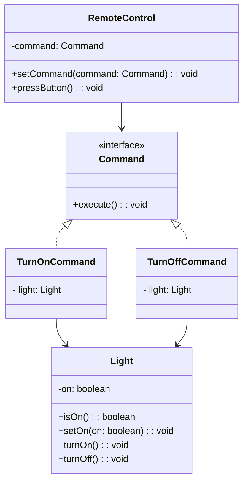

## Description
Command encapsule une requête dans un objet, ce qui permet de paramétrer des clients avec des opérations, de les mettre en file, d’enregistrer l’historique et de supporter l’annulation et le rétablissement (*undo/redo*).

## Quand l'utiliser ?
- Lorsque vous souhaitez découpler l’émetteur de la requête du récepteur qui l’exécute.
- Pour gérer l’historique et l’annulation/rétablissement d’actions (*undo*/*redo*) - en utilisant la variante d'annulation.

## Avantages
- Faible couplage entre invocateur et récepteur.
- Historisation et macro-commandes (commandes combinant plusieurs autres commandes) possibles.

## Inconvénients
- Multiplication de classes de commandes.
- Complexité accrue si l’annulation est complexe.


## Exemple

### Diagramme de classes


### Code Java
```java
interface Command {
    void execute();
}

class Light {
    private boolean on;

    public boolean isOn() {
        return this.on;
    }

    public void setOn(boolean on) {
        this.on = on;
    }

    public void turnOn() {
        this.setOn(true);
        System.out.println("Light ON");
    }

    public void turnOff() {
        this.setOn(false);
        System.out.println("Light OFF");
    }
}

class TurnOnCommand implements Command {
    private Light light;

    public TurnOnCommand(Light light) {
        this.light = light;
    }

    @Override
    public void execute() {
        this.light.turnOn();
    }
}

class TurnOffCommand implements Command {
    private Light light;

    public TurnOffCommand(Light light) {
        this.light = light;
    }

    @Override
    public void execute() {
        this.light.turnOff();
    }
}

class RemoteControl {
    private Command command;

    public void setCommand(Command command) {
        this.command = command;
    }

    public void pressButton() {
        if (this.command != null) {
            this.command.execute();
        }
    }
}

class Demo {
    public static void main(String[] args) {
        Light light = new Light();
        RemoteControl remote = new RemoteControl();
        remote.setCommand(new TurnOnCommand(light));
        remote.pressButton();
        remote.setCommand(new TurnOffCommand(light));
        remote.pressButton();
    }
}
```

## Variante avec annulation (`undo()`)

Dans la définition classique du patron **Command**, seule la méthode `execute()` est obligatoire. Cependant, dans certaines applications — éditeurs de texte, logiciels graphiques, outils de modélisation — il est nécessaire de pouvoir **annuler** (*undo*) ou **refaire** (*redo*) une action. Dans ces cas, une variante du patron peut être utilisée.

Pour permettre l’annulation, les commandes doivent être capables de **revenir à l’état précédent**, opération représentée par la méthode `undo()`. Par exemple :
- `LightOnCommand.execute()` : allume la lumière  
- `LightOnCommand.undo()` : éteint la lumière  

Il n’est pas recommandé d’ajouter `undo()` dans l’interface `Command` lorsque toutes les commandes ne sont pas annulables. Afin de respecter le principe de ségrégation des interfaces (***ISP***), une meilleure approche consiste à définir une sous‑interface :

```java
public interface Command {
    void execute();
}

public interface UndoableCommand extends Command {
    void undo();
}
```

---

## Liens utiles
- [https://refactoring.guru/design-patterns/command](https://refactoring.guru/design-patterns/command)
- [https://en.wikipedia.org/wiki/Command_pattern](https://en.wikipedia.org/wiki/Command_pattern)
