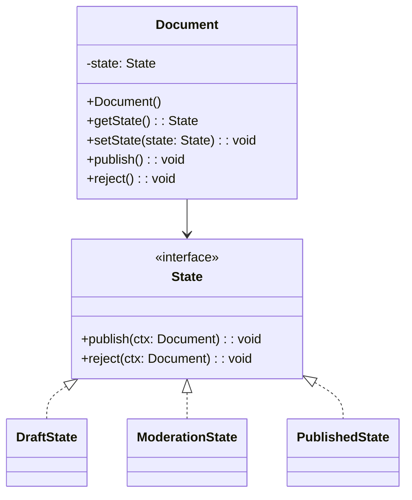

## Description
State permet à un objet de modifier son comportement lorsque son état interne change, comme si l’objet changeait de classe.

## Quand l'utiliser ?
- Lorsque un objet possède des comportements distincts selon des états bien définis.
- Pour remplacer des blocs conditionnels volumineux basés sur l’état.

## Avantages
- Localise la logique liée à chaque état.
- Facilite l’ajout de nouveaux états et transitions.

## Inconvénients
- Nombre accru de classes.
- Coordination des transitions à bien maîtriser.

---

## Exemple

### Diagramme de classes


### Code Java
```java
interface State {
    void publish(Document ctx);
    void reject(Document ctx);
}

class Document {
    private State state;

    public Document() {
        this.state = new DraftState();
    }

    public State getState() {
        return this.state;
    }

    public void setState(State state) {
        this.state = state;
    }

    public void publish() {
        this.state.publish(this);
    }

    public void reject() {
        this.state.reject(this);
    }
}

class DraftState implements State {
    @Override
    public void publish(Document ctx) {
        System.out.println("Draft -> Moderation");
        ctx.setState(new ModerationState());
    }

    @Override
    public void reject(Document ctx) {
        System.out.println("Draft rejected (no change)");
    }
}

class ModerationState implements State {
    @Override
    public void publish(Document ctx) {
        System.out.println("Moderation -> Published");
        ctx.setState(new PublishedState());
    }

    @Override
    public void reject(Document ctx) {
        System.out.println("Moderation -> Draft");
        ctx.setState(new DraftState());
    }
}

class PublishedState implements State {
    @Override
    public void publish(Document ctx) {
        System.out.println("Already published");
    }

    @Override
    public void reject(Document ctx) {
        System.out.println("Published -> Draft");
        ctx.setState(new DraftState());
    }
}

class Demo {
    public static void main(String[] args) {
        Document doc = new Document();
        doc.publish();
        doc.publish();
        doc.reject();
    }
}
```

---

## Liens utiles
- [https://refactoring.guru/design-patterns/state](https://refactoring.guru/design-patterns/state)
- [https://en.wikipedia.org/wiki/State_pattern](https://en.wikipedia.org/wiki/State_pattern)
