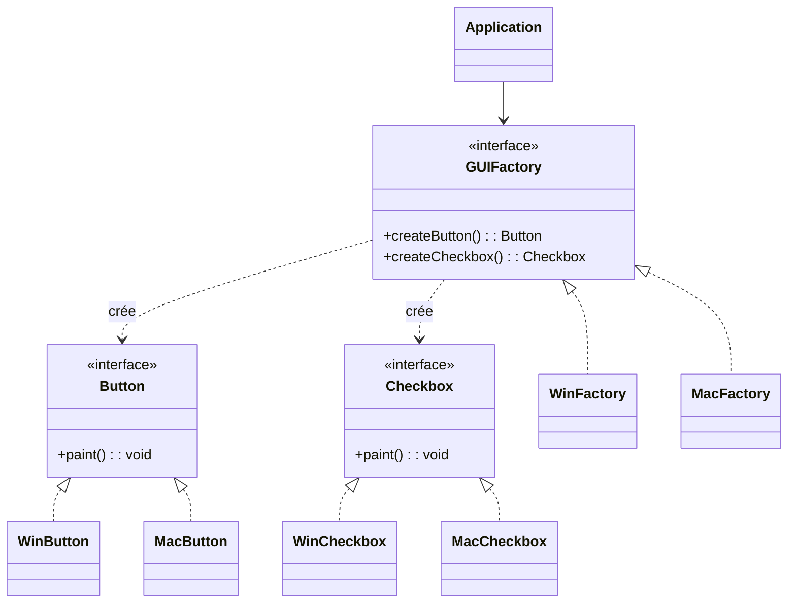

## Description
Abstract Factory définit une interface centrale dont le rôle est de fournir un ensemble complet de méthodes capables de créer plusieurs objets qui appartiennent tous à une même famille logique. Chaque famille représente une variation d’un même ensemble de produits : par exemple, différents styles d’interface graphique, différents environnements dans un jeu, ou encore différents ensembles d’outils adaptés à un système d’exploitation précis. L’idée essentielle est que le code client peut demander à la fabrique de produire ces objets sans jamais connaître ni manipuler directement leurs classes concrètes.

Ce patron garantit ainsi qu’une fois une famille choisie, tous les objets créés seront compatibles et homogènes, puisqu’ils proviennent de la même implémentation concrète de la fabrique. Cette cohérence est cruciale lorsqu’on souhaite éviter de mélanger des composants qui n’ont pas été conçus pour fonctionner ensemble (comme un bouton “thème sombre” avec une barre de menu “thème clair”). L’Abstract Factory impose donc une forme d'uniformité structurelle : choisir un contexte, une variante, un thème, etc. puis laisser la fabrique produire automatiquement tous les éléments conformes à ce choix.

En pratique, le patron repose sur une abstraction commune (souvent une interface ou une classe abstraite) qui déclare les méthodes de création pour chaque type de produit. Les différentes fabriques concrètes – par exemple *DarkThemeFactory* et *LightThemeFactory* – implémentent chacune ces méthodes afin de produire leur propre version spécialisée de chaque produit : un bouton sombre, une case à cocher sombre, un menu sombre, etc. Le code client ne voit que l’interface abstraite ; il ne sait donc pas s’il manipule une version sombre ou claire, et c’est précisément ce qui permet de changer dynamiquement ou facilement la famille entière d’objets sans modifier le code qui les utilise.

L’Abstract Factory est particulièrement utile lorsque la logique d’une application dépend fortement d’un contexte global : le style visuel choisi, le système d’exploitation, une région géographique, une faction dans un jeu, etc. En centralisant la décision sur la famille d’objets à utiliser, le patron permet d’éviter une prolifération de conditions `if` ou `switch` dispersées dans le code, et facilite grandement l’extension : pour ajouter une nouvelle famille complète, il suffit d’implémenter une nouvelle fabrique concrète, sans toucher aux classes existantes.


{: .highlight}
> En résumé, l’Abstract Factory n’est pas seulement un moyen de créer des objets : c’est un outil d’organisation, un moyen d'assurer la cohérence interne d’un ensemble de composants, et une façon élégante de découpler entièrement le code client de toute connaissance sur les classes concrètes qu’il utilise. Le résultat est un système plus flexible, mieux structuré et plus facile à faire évoluer.

## Quand l'utiliser ?
- Lorsque des produits doivent varier ensemble (même famille) selon une plateforme ou un thème.
- Pour assurer la cohérence entre objets créés.

## Avantages
- Encapsule les variations de familles de produits.
- Simplifie le remplacement d’une famille entière.

## Inconvénients
- Nombre de classes et d’interfaces plus important.
- Rigidité si l’on souhaite mélanger des produits de familles différentes.

## Exemple

### Diagramme de classes


### Code Java
```java
interface Button {
    void paint();
}

interface Checkbox {
    void paint();
}

class WinButton implements Button {
    @Override
    public void paint() {
        System.out.println("Windows Button");
    }
}

class MacButton implements Button {
    @Override
    public void paint() {
        System.out.println("Mac Button");
    }
}

class WinCheckbox implements Checkbox {
    @Override
    public void paint() {
        System.out.println("Windows Checkbox");
    }
}

class MacCheckbox implements Checkbox {
    @Override
    public void paint() {
        System.out.println("Mac Checkbox");
    }
}

interface GUIFactory {
    Button createButton();
    Checkbox createCheckbox();
}

class WinFactory implements GUIFactory {
    @Override
    public Button createButton() {
        return new WinButton();
    }
    @Override
    public Checkbox createCheckbox() {
        return new WinCheckbox();
    }
}

class MacFactory implements GUIFactory {
    @Override
    public Button createButton() {
        return new MacButton();
    }
    @Override
    public Checkbox createCheckbox() {
        return new MacCheckbox();
    }
}

class Application {
    private GUIFactory factory;

    public Application(GUIFactory factory) {
        this.factory = factory;
    }

    public void setFactory(GUIFactory factory) {
        this.factory = factory;
    }

    public void render() {
        Button b = this.factory.createButton();
        Checkbox c = this.factory.createCheckbox();
        b.paint();
        c.paint();
    }
}

class Demo {
    public static void main(String[] args) {
        Application app = new Application(new WinFactory());
        app.render();
        app.setFactory(new MacFactory());
        app.render();
    }
}
```


## Liens utiles
- [https://refactoring.guru/design-patterns/abstract-factory](https://refactoring.guru/design-patterns/abstract-factory)
- [https://en.wikipedia.org/wiki/Abstract_factory_pattern](https://en.wikipedia.org/wiki/Abstract_factory_pattern)
