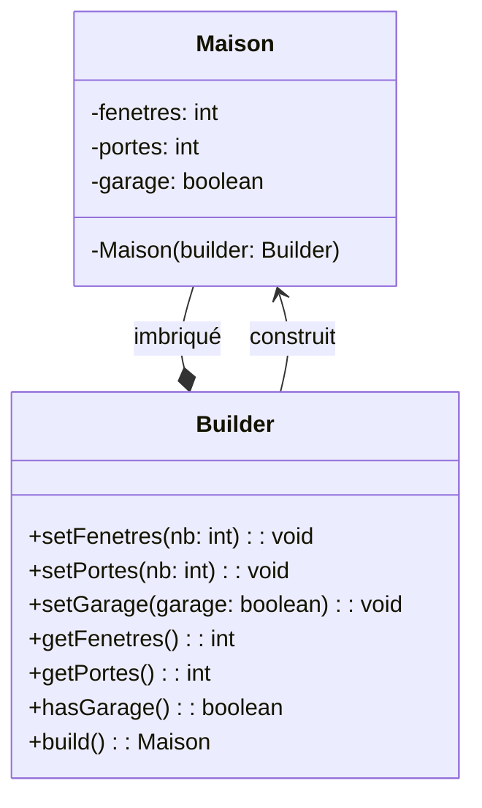

## Description
Builder est un patron de création qui permet de construire des objets complexes étape par étape, tout en séparant clairement la construction de la représentation finale. Contrairement à d’autres patrons de création, Builder vise surtout à **éviter les constructeurs à rallonge** et à rendre le processus de création plus clair, flexible et lisible.

Le patron Builder sépare la construction d’un objet de sa représentation et rend explicite l’enchaînement des étapes. En Java et la plupart des langages modernes, on l’implémente fréquemment via un builder imbriqué pour créer des objets immuables tout en centralisant les validations au moment de build().


## Quand l'utiliser ?
- Lorsque la création d’un objet nécessite **de nombreuses options** ou paramètres.
- Lorsque vous voulez éviter plusieurs constructeurs surchargés (*constructor telescoping*).
- Lorsque vous voulez rendre la construction d’objet **plus lisible** et progressive.
- Lorsque certaines étapes sont facultatives ou qu’un ordre spécifique n’est pas strictement requis.
- Particulièrement utile lorsque l'objet résultant est **immuable**.

## Avantages
- Le code client devient plus lisible et intuitif, surtout avec une interface *fluent*.
- Les objets complexes peuvent être construits sans exposer leur logique interne.
- Facilite l’ajout de nouveaux paramètres de construction sans casser l’existant.
- Évite les constructeurs surchargés et difficiles à maintenir.
- Centralise les validations et garantit des invariants à la construction.

## Inconvénients
- Nécessite une classe Builder supplémentaire.
- Peut être excessif pour des objets très simples.
- Le client doit appeler manuellement les étapes

## Exemple

{: .highlight}
La version GoF historique définit une interface *Builder* et un *Director* qui orchestre les étapes. Bien qu'elle reste utile à connaître pour comprendre l'intention originale du patron, elle est moins fréquente dans les applications modernes, où la version simplifiée présentée ici est plus courante.


### Diagramme de classes


### Code Java
```java
public class Maison {
    private final int fenetres;
    private final int portes;
    private final boolean garage;

    private Maison(Builder builder) {
        this.fenetres = builder.getFenetres();
        this.portes = builder.getPortes();
        this.garage = builder.hasGarage();
    }

    public int getFenetres() {
        return this.fenetres;
    }

    public int getPortes() {
        return this.portes;
    }

    public boolean hasGarage() {
        return this.garage;
    }


    public static class Builder {

        // Valeurs par défaut lorsque cela fait du sens.
        // Cela permet de ne pas avoir à invoquer toutes les méthodes du builder.
        private int fenetres = 4;
        private int portes = 2;
        private boolean garage = false;

        public void setFenetres(int nb) {
            this.fenetres = nb;
        }

        public void setPortes(int nb) {
            this.portes = nb;
        }

        public void setGarage(boolean garage) {
            this.garage = garage;
        }

        public int getFenetres() {
            return this.fenetres;
        }

        public int getPortes() {
            return this.portes;
        }

        public boolean hasGarage() {
            return this.garage;
        }

        public Maison build() {
            // validations
            if (this.portes < 1) {
                throw new IllegalArgumentException("Une maison doit avoir au moins une porte.");
            }
            if (this.fenetres < 1) {
                throw new IllegalArgumentException("Une maison doit avoir au moins une fenêtre.");
            }

            return new Maison(this);
        }
    }
}

public class Demo {
    public static void main(String[] args) {
        Maison.Builder builder = new Maison.Builder();

        builder.setFenetres(6);
        builder.setPortes(2);
        builder.setGarage(true);

        Maison maison = builder.build();

        System.out.println("Maison construite: " + maison.getFenetres() + " fenêtres");
    }
}
```

## Liens utiles
- Version moderne : [https://javadevcentral.com/effective-java-builder-pattern/#the-builder](https://javadevcentral.com/effective-java-builder-pattern/#the-builder)
- Version classique (pour référence) : [https://refactoring.guru/design-patterns/builder](https://refactoring.guru/design-patterns/builder)
