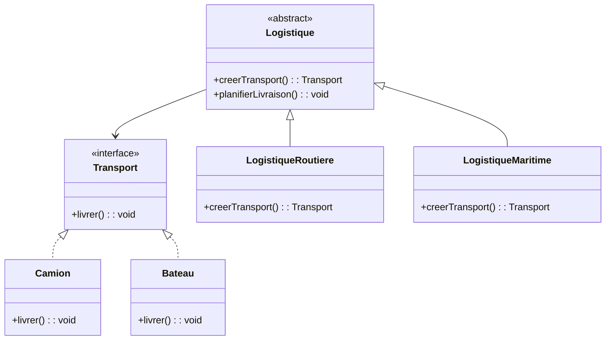

## Description
Factory method est un patron de création dont l’objectif est de déléguer la création d’objets à des sous-classes, permettant ainsi aux classes dérivées de décider quel objet concret instancier. Contrairement à une *Simple Factory* (souvent simplement appelée *Factory* dans le langage courant), le Factory Method est un véritable patron de conception documenté par le *Gang of Four*. Il repose sur l’**héritage** et sur la **redéfinition d’une méthode de création**.

Il est important de distinguer clairement :

- **Simple Factory (ou "Factory") — *PAS un "vrai" patron de conception*** :
  - C’est simplement une classe utilitaire qui possède une méthode statique `create(...)`.
  - Elle décide elle-même quel objet instancier.
  - Elle ne repose ni sur l’héritage ni sur le polymorphisme.
  - Elle centralise la création, mais n'offre pas d’extensibilité propre.

- **Factory Method — *VRAI patron de conception*** :
  - Définit **une méthode d'instance abstraite** destinée à être redéfinie par des sous-classes.
  - Permet aux sous-classes de **choisir quel objet concret créer**.
  - Favorise l’extensibilité en ajoutant de nouveaux types d’objets sans modifier le code existant.
  - S'inscrit dans une architecture orientée objet utilisant l'héritage.

Le factory method est donc un mécanisme de **polymorphisme appliqué à la création d’objets**, contrairement à la *simple factory*, qui encapsule seulement une logique de création.

## Quand l'utiliser ?
- Lorsque le code doit créer des objets, mais que la classe parente veut laisser la décision finale aux sous-classes.
- Lorsque vous devez ajouter facilement de nouveaux produits sans modifier le code client existant.
- Lorsque l’instanciation varie selon le contexte, une configuration, ou une variante algorithmique.
- Lorsque vous souhaitez découpler le **code client** des **classes concrètes** créées.

## Avantages
- Permet d’introduire facilement de **nouveaux types d’objets**.
- Réduit le couplage avec les classes concrètes.
- Contribue à respecter le principe ouvert/fermé (***OCP***, ouvert à l’extension, fermé à la modification).
- Permet de déplacer la logique de création dans des sous-classes spécialisées.

## Inconvénients
- Introduit plusieurs classes supplémentaires.
- Repose sur l’héritage, ce qui rend la structure moins flexible que Strategy ou Abstract Factory.
- Peut sembler « trop complexe » pour des besoins simples, où une SimpleFactory suffirait.

## Exemple

### Diagramme de classes


### Code Java
```java
// Produit (interface ou classe abstraite)
public interface Transport {
    void livrer();
}

// Produits concrets
public class Camion implements Transport {

    @Override
    public void livrer() {
        System.out.println("Livraison par camion");
    }
}

public class Bateau implements Transport {

    @Override
    public void livrer() {
        System.out.println("Livraison par bateau");
    }
}

// Créateur (classe abstraite)
public abstract class Logistique {

    public abstract Transport creerTransport();

    public void planifierLivraison() {
        Transport transport = this.creerTransport();
        transport.livrer();
    }
}

// Créateurs concrets
public class LogistiqueRoutiere extends Logistique {

    @Override
    public Transport creerTransport() {
        return new Camion();
    }
}

public class LogistiqueMaritime extends Logistique {

    @Override
    public Transport creerTransport() {
        return new Bateau();
    }
}

// Démonstration
public class Demo {

    public static void main(String[] args) {
        Logistique logistique;

        logistique = new LogistiqueRoutiere();
        logistique.planifierLivraison();

        logistique = new LogistiqueMaritime();
        logistique.planifierLivraison();
    }
}
```

## Liens utiles
- [https://refactoring.guru/design-patterns/factory-method](https://refactoring.guru/design-patterns/factory-method)
- [https://en.wikipedia.org/wiki/Factory_method_pattern](https://en.wikipedia.org/wiki/Factory_method_pattern)
