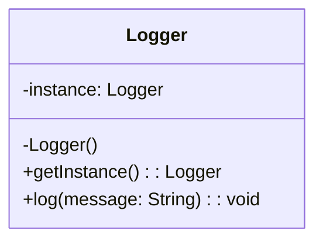

## Description
Singleton garantit qu’une classe ne possède qu’une seule instance et fournit un point d’accès global à celle-ci, qui est utilisé où nécessaire dans toute l'application.

## Quand l'utiliser ?
- Lorsque une ressource partagée doit être unique (journalisation, configuration, pool de connexions, etc.).
- Quand vous avez besoin d’un accès global contrôlé.

## Avantages
- Instance unique contrôlée.
- Initialisation paresseuse (*lazy init*) possible.

## Inconvénients
- Peut cacher des dépendances globales, compliquant les tests.
- Risques en environnement concurrent sans gestion appropriée.
- Lorsque mal utilisé, peut constituer le début d'un *God object*.

## Exemple

### Diagramme de classes


### Code Java
```java
class Logger {
    private static volatile Logger instance;

    private Logger() {
    }

    public static Logger getInstance() {
        if (instance == null) {
            synchronized (Logger.class) {
                if (instance == null) {
                    instance = new Logger();
                }
            }
        }
        return instance;
    }

    public void log(String message) {
        System.out.println("LOG: " + message);
    }
}

class Demo {
    public static void main(String[] args) {
        Logger.getInstance().log("Hello");
    }
}
```

## Liens utiles
- [https://refactoring.guru/design-patterns/singleton](https://refactoring.guru/design-patterns/singleton)
- [https://en.wikipedia.org/wiki/Singleton_pattern](https://en.wikipedia.org/wiki/Singleton_pattern)
