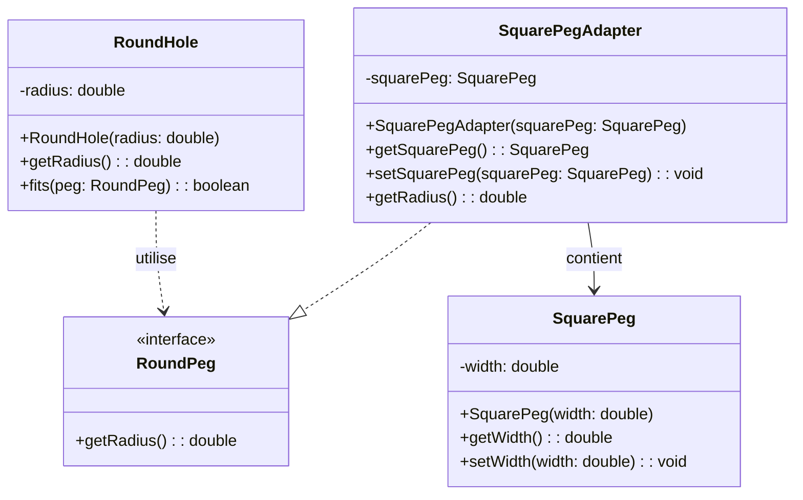

## Description

Adapter permet de faire collaborer des interfaces incompatibles en enveloppant (ou en *adaptant*) un objet existant pour qu’il expose l’interface attendue par le client.

## Quand l'utiliser ?

- Lorsque vous souhaitez réutiliser une classe existante dont l’interface ne correspond pas à celle requise.
- Quand vous voulez intégrer progressivement un composant tiers sans modifier son code.

## Avantages

- Favorise la réutilisation de composants existants.
- Isole les changements d’interface, limitant l’impact sur le reste du code.

## Inconvénients

- Multiplie parfois les couches d’indirection.
- Peut masquer des incompatibilités conceptuelles plus profondes.

## Exemple

### Diagramme de classes
Dans l'exemple suivant, on réutilise la célèbre phrase "faire entrer un carré dans un rond", et on démontre que c'est en fait possible si on possède le bon adaptateur.



### Code Java
```java
// Cible : l’interface attendue par RoundHole
public interface RoundPeg {
    double getRadius();
}

// Client : RoundHole ne dépend que de l’interface
public class RoundHole {
    private double radius;

    public RoundHole(double radius) {
        this.radius = radius;
    }

    public double getRadius() {
        return this.radius;
    }

    public boolean fits(RoundPeg peg) {
        if (peg == null) {
            return false;
        }
        return peg.getRadius() <= this.radius;
    }
}

// Adaptee : API existante incompatible
public class SquarePeg {
    private double width;

    public SquarePeg(double width) {
        this.width = width;
    }

    public double getWidth() {
        return this.width;
    }

    public void setWidth(double width) {
        this.width = width;
    }
}

// Adapter par implémentation (Object Adapter)
public class SquarePegAdapter implements RoundPeg {
    private SquarePeg squarePeg;

    public SquarePegAdapter(SquarePeg squarePeg) {
        this.squarePeg = squarePeg;
    }

    public SquarePeg getSquarePeg() {
        return this.squarePeg;
    }

    public void setSquarePeg(SquarePeg squarePeg) {
        this.squarePeg = squarePeg;
    }

    @Override
    public double getRadius() {
        if (this.squarePeg == null) {
            return 0.0;
        }
        // Rayon du cercle circonscrivant le carré (demi-diagonale)
        return (this.squarePeg.getWidth() * Math.sqrt(2.0)) / 2.0;
    }
}

// Démonstration
public class Demo {
    public static void main(String[] args) {
        RoundHole hole = new RoundHole(5.0);
        SquarePeg squarePeg = new SquarePeg(7.0);
        RoundPeg adapter = new SquarePegAdapter(squarePeg);

        System.out.println(hole.fits(adapter));
    }
}
```

{: .highlight-title}
> Variante *class adapter* (adaptateur par héritage)
>
> Dans plusieurs ouvrages sur les patrons de conception incluant ceux de la *Gang of Four*, on mentionne une variante appelée le *class adapter*. Au lieu d'implémenter l'interface cible et de contenir un objet adapté (*adaptee*), le *class adapter* hérite simultanément de la cible (*target*) et de l’objet adapté (*adaptee*), ce qui lui permet de réutiliser directement le comportement de l’adaptee sans la contenir. Cette approche est possible dans les langages qui autorisent l’héritage multiple (par exemple C++ et Python). En revanche, dans un langage à héritage simple comme Java, C# et plusieurs autres, on ne peut pas hériter de la cible et de l’objet adapté à la fois : il faut alors hériter de la cible et contenir l’objet adapté.En pratique, dans les langages à héritage simple, le *class adapter* s’implémente donc presque comme l’*object adapter*, sauf que l’on hérite de la cible au lieu d’implémenter son interface
>
> À noter que cette variante devient fragile ou carrément impossible si la cible est `final`, ou si l’on veut adapter plusieurs Adaptees différentes ; l’object adapter (implémentation + composition) reste alors plus souple, testable et compatible avec l’injection de dépendances. 
>
> Le *class adapter* est généralement recommandable lorsque la cible est une classe et que l’adaptateur doit véritablement être un sous‑type concret de cette classe (ex. API existantes qui exigent ce type, accès à des membres protected, génériques, etc). Dans les autres cas — notamment si la cible est une interface ou si l’on recherche flexibilité et testabilité — l’*object adapter* (implémentation + composition) est à privilégier.

---


## Liens utiles

- [https://refactoring.guru/design-patterns/adapter](https://refactoring.guru/design-patterns/adapter)
- [https://en.wikipedia.org/wiki/Adapter_pattern](https://en.wikipedia.org/wiki/Adapter_pattern)
