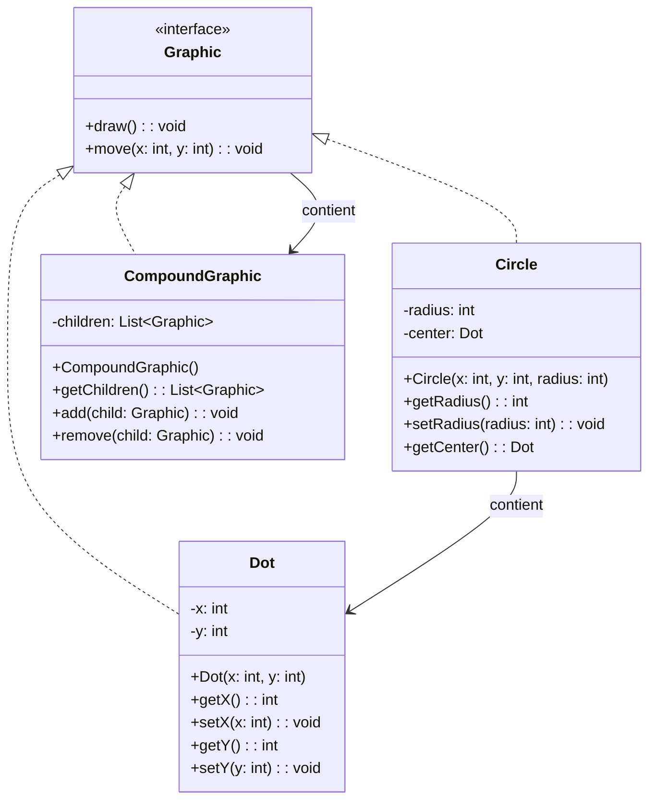

## Description
Composite définit une interface commune permettant de manipuler de façon uniforme des objets simples (feuilles) et des ensembles d’objets (composites). Grâce à cette interface partagée, le code client n’a pas à connaître la structure interne de l’objet qu’il manipule. Si l’objet est un composite, il se charge lui-même d’appliquer l’opération à chacun de ses sous‑objets.

## Quand l'utiliser ?
- Lorsque vous manipulez des hiérarchies d’objets (arborescences) où les clients ne devraient pas connaître la différence entre une feuille et un noeud composé.
- Pour permettre des opérations récursives uniformes.

## Avantages
- Simplifie le code client.
- Ajoute et retire des éléments sans impacter la logique métier.

## Inconvénients
- Peut rendre les contraintes de type moins explicites.
- Débogage parfois plus complexe dans les structures profondes.

## Exemple


### Diagramme de classes


### Code Java
```java
import java.util.ArrayList;
import java.util.List;

interface Graphic {
    void draw();
    void move(int x, int y);
}

class Dot implements Graphic {
    private int x;
    private int y;

    public Dot(int x, int y) {
        this.x = x;
        this.y = y;
    }

    public int getX() {
        return this.x;
    }

    public void setX(int x) {
        this.x = x;
    }

    public int getY() {
        return this.y;
    }

    public void setY(int y) {
        this.y = y;
    }

    @Override
    public void draw() {
        System.out.println("Draw Dot at (" + this.x + ", " + this.y + ")");
    }

    @Override
    public void move(int x, int y) {
        this.x = x;
        this.y = y;
    }
}

class Circle implements Graphic {
    private int radius;
    private Dot center;

    public Circle(int x, int y, int radius) {
        this.center = new Dot(x, y);
        this.radius = radius;
    }

    public int getRadius() {
        return this.radius;
    }

    public void setRadius(int radius) {
        this.radius = radius;
    }

    public Dot getCenter() {
        return this.center;
    }

    @Override
    public void draw() {
        System.out.println("Draw Circle r=" + this.radius);
        this.center.draw();
    }

    @Override
    public void move(int x, int y) {
        this.center.move(x, y);
    }
}

class CompoundGraphic implements Graphic {
    private List<Graphic> children;

    public CompoundGraphic() {
        this.children = new ArrayList<Graphic>();
    }

    public List<Graphic> getChildren() {
        return this.children;
    }

    public void add(Graphic child) {
        this.children.add(child);
    }

    public void remove(Graphic child) {
        this.children.remove(child);
    }

    @Override
    public void draw() {
        for (Graphic child : this.children) {
            child.draw();
        }
    }

    @Override
    public void move(int x, int y) {
        for (Graphic child : this.children) {
            child.move(x, y);
        }
    }
}

class Demo {
    public static void main(String[] args) {
        CompoundGraphic all = new CompoundGraphic();
        all.add(new Dot(1, 2));
        all.add(new Circle(3, 4, 10));
        all.draw();
    }
}
```

## Liens utiles
- [https://refactoring.guru/design-patterns/composite](https://refactoring.guru/design-patterns/composite)
- [https://en.wikipedia.org/wiki/Composite_pattern](https://en.wikipedia.org/wiki/Composite_pattern)
