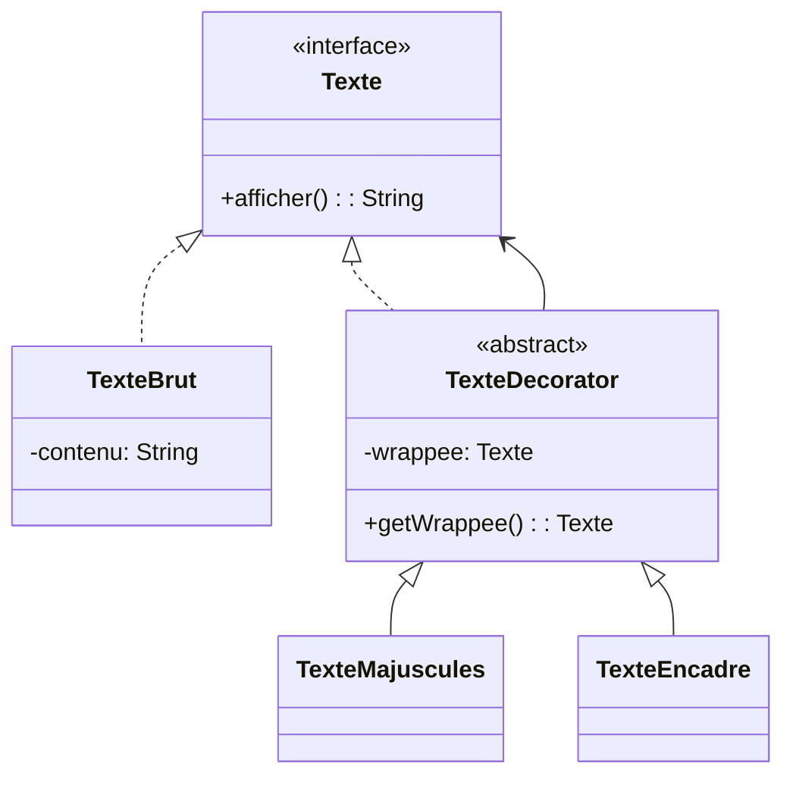

## Description
Decorator ajoute des responsabilités à un objet dynamiquement en l’enveloppant dans d’autres objets respectant la même interface. Il permet d’étendre le comportement d’un objet existant **sans modifier son code** et sans recourir à l’héritage multiple. Le Decorator favorise la composition plutôt que l’héritage et permet une grande flexibilité.

## Quand l'utiliser ?
- Lorsque vous souhaitez ajouter ou combiner des fonctionnalités à la volée sans modifier la classe d'origine.
- Lorsque l’héritage entraîne une explosion de sous-classes dédiées à chaque combinaison de comportements.

## Avantages
- Composition flexible de comportements.
- Respect du principe ouvert/fermé (***OCP***)
- Possibilité d'ajouter des responsabilités de manière dynamique.

## Inconvénients
- Peut mener à une accumulation complexe de décorateurs.
- Le débogage peut devenir plus difficile.

## Exemple

## Diagramme de classes


### Code Java
```java
interface Texte {
    String afficher();
}

class TexteBrut implements Texte {
    private String contenu;

    public TexteBrut(String contenu) {
        this.contenu = contenu;
    }

    @Override
    public String afficher() {
        return this.contenu;
    }
}

abstract class TexteDecorator implements Texte {
    private Texte wrappee;

    public TexteDecorator(Texte wrappee) {
        this.wrappee = wrappee;
    }

    public Texte getWrappee() {
        return this.wrappee;
    }
}

class TexteMajuscules extends TexteDecorator {

    public TexteMajuscules(Texte wrappee) {
        super(wrappee);
    }

    @Override
    public String afficher() {
        return getWrappee().afficher().toUpperCase();
    }
}

class TexteEncadre extends TexteDecorator {

    public TexteEncadre(Texte wrappee) {
        super(wrappee);
    }

    @Override
    public String afficher() {
        String contenu = getWrappee().afficher();
        String ligne = "+" + "-".repeat(contenu.length()) + "+";
        return ligne + "
|" + contenu + "|
" + ligne;
    }
}

class Demo {
    public static void main(String[] args) {
        Texte texte = new TexteBrut("Bonjour le monde");
        texte = new TexteMajuscules(texte);
        texte = new TexteEncadre(texte);

        System.out.println(texte.afficher());
    }
}
```

## Liens utiles
- [https://refactoring.guru/design-patterns/decorator](https://refactoring.guru/design-patterns/decorator)
- [https://en.wikipedia.org/wiki/Decorator_pattern](https://en.wikipedia.org/wiki/Decorator_pattern)