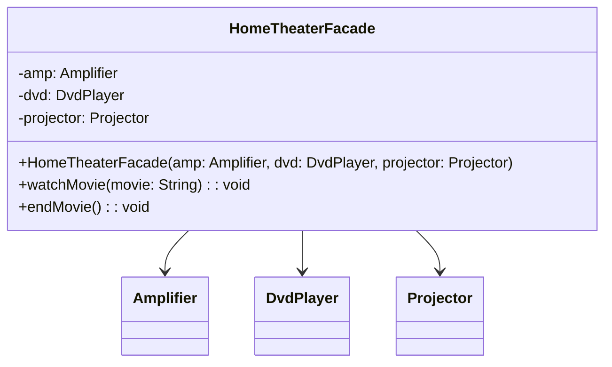

## Description
Facade fournit une interface unifiée et simple vers un sous-système complexe, afin de simplifier son utilisation par les clients.

## Quand l'utiliser ?
- Lorsque vous voulez réduire l’assemblage et l’orchestration de nombreux objets internes.
- Pour exposer une API simple à un système existant.

## Avantages
- Diminue le couplage entre le client et les détails internes du sous-système.
- Améliore la lisibilité et l'apprentissage de nouveaux développeurs.

## Inconvénients
- Risque de devenir un point unique difficile à maintenir si trop de responsabilités.
- Peut cacher des problèmes de conception internes.
- Lorsque mal utilisé, peut représenter un *God object* en formation...

## Exemple

## Diagramme de classes


### Code Java
```java
class Amplifier {
    public void on() {
        System.out.println("Amplifier on");
    }
    public void off() {
        System.out.println("Amplifier off");
    }
}

class DvdPlayer {
    public void on() {
        System.out.println("DVD on");
    }
    public void play(String movie) {
        System.out.println("Playing: " + movie);
    }
    public void off() {
        System.out.println("DVD off");
    }
}

class Projector {
    public void on() {
        System.out.println("Projector on");
    }
    public void wideScreenMode() {
        System.out.println("Projector widescreen mode");
    }
    public void off() {
        System.out.println("Projector off");
    }
}

class HomeTheaterFacade {
    private Amplifier amp;
    private DvdPlayer dvd;
    private Projector projector;

    public HomeTheaterFacade(Amplifier amp, DvdPlayer dvd, Projector projector) {
        this.amp = amp;
        this.dvd = dvd;
        this.projector = projector;
    }

    public void watchMovie(String movie) {
        this.amp.on();
        this.projector.on();
        this.projector.wideScreenMode();
        this.dvd.on();
        this.dvd.play(movie);
    }

    public void endMovie() {
        this.dvd.off();
        this.projector.off();
        this.amp.off();
    }
}

class Demo {
    public static void main(String[] args) {
        HomeTheaterFacade facade = new HomeTheaterFacade(new Amplifier(), new DvdPlayer(), new Projector());
        facade.watchMovie("Inception");
        facade.endMovie();
    }
}
```

## Liens utiles
- [https://refactoring.guru/design-patterns/facade](https://refactoring.guru/design-patterns/facade)
- [https://en.wikipedia.org/wiki/Facade_pattern](https://en.wikipedia.org/wiki/Facade_pattern)
