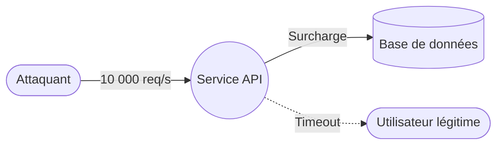
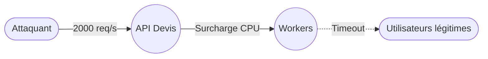

# 3.5 — Denial of Service (Déni de service)

## 📌 3.5.1 Définition complète

Un **Denial of Service (DoS)** désigne toute action visant à **rendre un service partiellement ou totalement indisponible**, que ce soit :

- pour les utilisateurs légitimes,  
- pour les autres services internes,  
- ou pour les systèmes dépendants.

> 🚫 *DoS = empêcher un système de fonctionner correctement, souvent en épuisant ses ressources.*

Cette menace vise la **disponibilité**, l’un des piliers du modèle CIA.

---

## 📌 3.5.2 Objectifs d’un attaquant en DoS

- Bloquer ou ralentir un service critique  
- Empêcher des utilisateurs d’accéder à un système  
- Saturer les ressources (CPU, RAM, réseau, DB)  
- Provoquer des erreurs ou crashs  
- Créer une diversion pour d’autres attaques

---

## 📌 3.5.3 Comment le DoS apparaît dans un DFD

| Élément DFD | Risque |
|-------------|--------|
| **Processus** | Surcharge CPU/mémoire |
| **Flux de données** | Saturation réseau |
| **Stockage** | Requêtes massives bloquantes |

---

## 📌 3.5.4 Formes courantes de DoS

### 🌐 DoS réseau
- Saturation bande passante  
- SYN flood

### 🧮 DoS applicatif
- Appels lourds  
- Paramètres extrêmes

### 🗄️ DoS sur base de données
- Requêtes non optimisées  
- Verrous prolongés

### 🔁 DDoS (Distributed)
- Plusieurs sources simultanées

### 🎣 DoS logique
- Uploads massifs  
- Création abusive de sessions

---

## 📌 3.5.5 Scénarios réels et pédagogiques

### 🎯 Route lente appelée massivement
CPU saturée → service KO.

### 🎯 SYN flood
Plus de sockets disponibles.

### 🎯 DoS SQL
Requêtes lourdes bloquant les tables.

### 🎯 Upload massif
Disque saturé.

---

## 📌 3.5.6 Contre‑mesures

### 🌐 Protection réseau
- Pare-feu  
- CDN / anti‑DDoS

### 🧮 Rate limiting
- Quotas par IP / utilisateur

### 🛠️ Optimisation applicative
- Mise en cache  
- Réduction des coûts par requête

### 🗄️ Résilience DB
- Indexation  
- Pool de connexions

### 🧱 Isolation
- Découplage des composants critiques

### 🧪 Tests
- Tests de charge  
- Chaos engineering

---

## 📌 3.5.7 Exemple immersif

Résultat : files saturées, indisponibilité.

Correctifs :
- Mise en cache  
- Rate limiting  
- Asynchronisme  
- Scalabilité horizontale

---

## 📌 3.5.8 Synthèse

- DoS = attaque contre la **disponibilité**.  
- Peut être simple ou sophistiqué.  
- Défense : combiner protections réseau + optimisation + surveillance.
