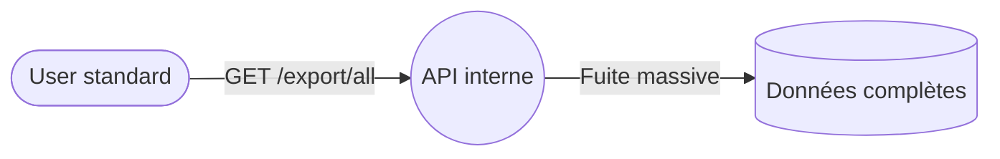

# 3.6 — Elevation of Privilege (Élévation de privilèges)

## 📌 3.6.1 Définition complète

L’**Élévation de privilèges (Elevation of Privilege, EoP)** consiste pour un attaquant à **obtenir des permissions, rôles ou accès supérieurs** à ceux qu’il devrait normalement avoir.

> 🔐 *EoP = franchir une barrière d’autorisation pour accéder à plus de pouvoir que prévu.*

Elle permet souvent à un attaquant de :
- prendre le contrôle du système,  
- accéder à des données sensibles,  
- désactiver des protections,  
- persister dans l’environnement.

---

## 📌 3.6.2 Objectifs d’un attaquant en EoP

- Passer d’un rôle “faible” à un rôle “fort” (ex. : user → admin)  
- Contourner les contrôles d’accès  
- Accéder à des actions réservées  
- Étendre sa portée dans le système

---

## 📌 3.6.3 Comment l’EoP apparaît dans un DFD

| Élément DFD | Risque |
|-------------|--------|
| **Entités externes** | Un utilisateur contourne ses permissions |
| **Processus** | Mauvaise validation des rôles |
| **Stockages** | Accès non prévu à des données sensibles |
| **Flux** | Absence de vérification d’autorisation |

```mermaid
flowchart LR
    User([Utilisateur "basic"]) -->|Requête| App((Application))
    App -->|Mauvaise vérification des permissions| AdminAPI((API Admin))
    User -. Accès admin obtenu .-> AdminAPI
```

---

## 📌 3.6.4 Formes courantes d’Élévation de privilèges

### 🔓 Contrôle d’accès défaillant
- Endpoints admin non protégés.

### 🔁 Élévation verticale
- user → admin.

### 🔁 Élévation horizontale
- Consulter les données d’un autre utilisateur (IDOR).

### 🧪 Abus de logique métier
- Étapes de validation manquantes.

### 🔐 Secrets exposés / permissions mal configurées
- Rôles cloud trop permissifs (ex. : `*:*`).

### 🧬 Escalade via vulnérabilité technique
- Injection ou contournement de middleware.

---

## 📌 3.6.5 Scénarios réels et pédagogiques

### 🎯 Endpoint admin non protégé
`POST /api/admin/create-user` accessible à tous les utilisateurs authentifiés.

### 🎯 IDOR donnant accès aux comptes d’autres utilisateurs
Accès à `/api/account/12346` sans permission.

### 🎯 Mauvaise gestion des JWT
Un JWT modifié (`role": "admin"`) accepté faute de validation.

### 🎯 Contournement d’un middleware
Accès non filtré à `/internal/export-all-data`.

---

## 📌 3.6.6 Contre‑mesures

### 🧱 Contrôles d’accès stricts
- Vérifier les permissions **côté serveur**.

### 🔐 Validation stricte des identités
- Tokens signés et vérifiés.

### 🔏 Séparation des rôles (RBAC / ABAC)
- Permissions minimales.

### 🧩 Protection des ressources internes
- mTLS, segmentation réseau.

### 🧪 Tests réguliers
- Tests d’accès horizontaux/verticaux.

### 📦 Journaux et alertes
- Journalisation des actions sensibles.

---

## 📌 3.6.7 Exemple immersif



Cause : middleware d’autorisation oublié.

Correctifs :
- Vérifier tous les endpoints  
- Séparer routes publiques / internes  
- Claims “admin-only” dans les tokens

---

## 📌 3.6.8 Synthèse

- EoP = **accès au‑delà des privilèges autorisés**.  
- Souvent critique et dévastatrice.  
- Solutions : contrôles stricts, RBAC, tokens signés, segmentation, audits.
