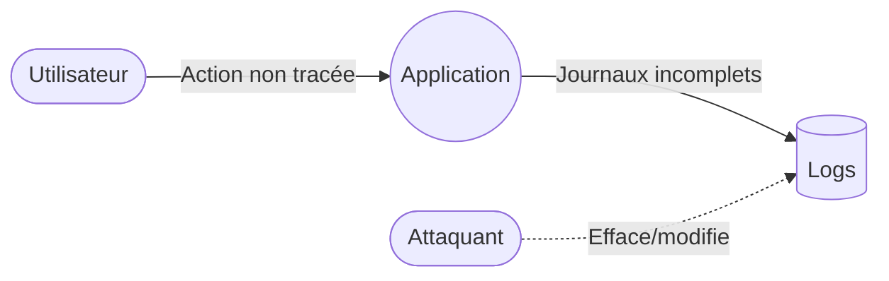

# 3.3 — Repudiation (Répudiation)

## 📌 3.3.1 Définition complète

La **Répudiation** désigne toute situation où un utilisateur — légitime ou malveillant — peut **nier avoir effectué une action**, parce que le système ne dispose **pas de preuves fiables** permettant d’attribuer cette action de façon certaine.

En d’autres mots :

> 🧾 *Repudiation = impossibilité de prouver “qui a fait quoi, quand et comment”.*

Cette menace se produit lorsque :

- les journaux ne sont pas complets,  
- les journaux ne sont pas fiables (non signés, modifiables),  
- les actions ne sont pas traçables,  
- l’identité n’est pas correctement associée aux actions,  
- les systèmes n’ont pas les moyens de détecter ou prouver l’origine d’une action.

La répudiation peut être volontaire (attaquant) ou accidentelle (système mal conçu).

---

## 📌 3.3.2 Objectifs d’un attaquant en Repudiation

Un attaquant cherchant la répudiation veut :

- masquer ses actions après une intrusion,  
- effacer des traces compromettantes,  
- nier une opération frauduleuse,  
- compromettre l’intégrité des preuves,  
- contourner les responsabilités légales,  
- confondre les analystes après incident.

La répudiation sert souvent à couvrir d’autres attaques (Tampering, EoP…).

---

## 📌 3.3.3 Comment la Répudiation apparaît dans un DFD

| Élément DFD | Risque |
|-------------|--------|
| **Entités externes** | Un utilisateur peut nier une action |
| **Processus** | Actions non journalisées ou mal attribuées |
| **Stockages** | Journaux altérés, supprimés ou non protégés |



---

## 📌 3.3.4 Les formes les plus courantes de Répudiation

### 🗂️ Absence de logs
Aucune trace des actions sensibles.

### 🧹 Logs modifiables ou supprimables
Un attaquant peut effacer ou falsifier ses traces.

### ❓ Mauvaise corrélation identité → action
Actions non associées à un identifiant fiable.

### 🌫️ Manque de preuves cryptographiques
Absence de signature, mauvais horodatage.

---

## 📌 3.3.5 Scénarios réels et pédagogiques

### 🎯 Scénario 1 — Suppression sans preuve
Un fichier critique est supprimé → aucune trace → action non attribuable.

### 🎯 Scénario 2 — Logs modifiés après intrusion
Un attaquant efface ses traces SSH.

### 🎯 Scénario 3 — Actions non reliées à un utilisateur
API acceptant des requêtes anonymes pour des actions sensibles.

### 🎯 Scénario 4 — Horodatage incorrect
Serveurs non synchronisés → logs inutilisables.

---

## 📌 3.3.6 Contre‑mesures

### 🧾 Journalisation exhaustive
- Toutes les actions sensibles doivent être loguées.

### 🔐 Intégrité des logs
- Signatures cryptographiques  
- Hashing en chaîne  
- Immutabilité

### 📦 Stockage protecteur
- SIEM  
- Accès en lecture seule

### 🧱 Corrélation identité → action
- Sessions, JWT, certificats

### ⏱️ Horodatage fiable
- NTP, horodatage signé

### 🧪 Surveillance
- Alertes en cas de suppression ou altération de logs

---

## 📌 3.3.7 Exemple immersif

Un employé modifie des dossiers clients. Les logs montrent :
```
Action: edit_record
User: null
```
Impossible d’attribuer l’action.

Correctifs :
- audit trail complet  
- logs signés  
- stockage immuable

---

## 📌 3.3.8 Synthèse

- La répudiation = *impossibilité de prouver qui a fait quoi*.  
- Souvent liée au Tampering.  
- Contre‑mesures : logs complets, signés, immuables, corrélés aux identités.
