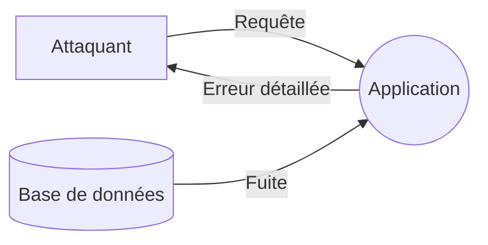
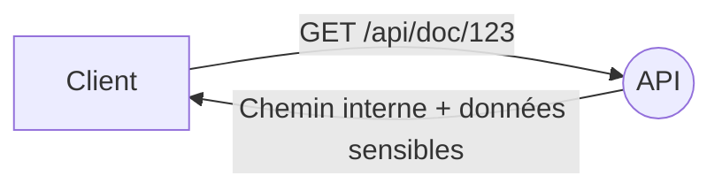

# Information Disclosure (Divulgation d’information)

## Définition complète

**Information Disclosure** désigne toute situation où un attaquant obtient **accès à des informations qu’il ne devrait pas pouvoir consulter**.  
Ces informations peuvent être :

- personnelles,  
- sensibles,  
- confidentielles,  
- techniques,  
- liées à la sécurité (clés, tokens, secrets),  
- ou même structurelles.

En d’autres mots :

> *Information Disclosure = fuite ou exposition non autorisée d’informations.*

Cette menace compromet directement la **confidentialité**.

---

## Objectifs d’un attaquant en Information Disclosure

- Obtenir des informations pour préparer une attaque (reconnaissance).  
- Voler des données sensibles.  
- Récupérer des secrets (clé API, token, mot de passe).  
- Exploiter des erreurs bavardes.  
- Comprendre la structure interne du système.

---

## Comment l’Information Disclosure apparaît dans un DFD

| Élément DFD | Risque |
|-------------|--------|
| **Flux de données** | Interception, clair, manque de chiffrement |
| **Stockages** | Mauvais contrôles d’accès |
| **Processus** | Erreurs détaillées, logs sensibles |

---

## Les formes courantes de divulgation

### Données sensibles en clair
- Mots de passe non hashés  
- Tokens stockés sans protection

### Erreurs trop détaillées
- Stack traces  
- Messages SQL

### Stockage mal configuré
- Buckets publics  
- Répertoires listés

### Fuite dans les logs
- Mots de passe ou clés API logués

### Manque de chiffrement
- HTTP au lieu de HTTPS

---

## Scénarios réels

### Stack trace exposée
L’API renvoie une erreur détaillée.

### Identifiant sensible dans l’URL
IDOR possible.

### Bucket public
Accès non autorisé à des fichiers internes.

### Secret exposé dans les logs
Token visible en clair.

---

## Contre‑mesures

### Contrôles d’accès stricts
- Vérifier permissions en amont.

### Chiffrement global
- TLS partout  
- Bases chiffrées

### Masquage et gestion des erreurs
- Pas de stack traces en production

### Protection du stockage
- Audits  
- Interdiction des buckets publics

### Logs contrôlés
- Masquage des données sensibles

### Tests
- Détection IDOR  
- Scans de fuite

---

## Exemple

L’API divulgue chemin interne et métadonnées.

Correctifs :
- Masquage  
- Contrôles d’accès stricts  
- Retrait des champs internes

---

## Conclusion

- Information Disclosure = **exposition non autorisée d’informations**.  
- Souvent utilisée en phase de reconnaissance.  
- Principales causes : erreurs bavardes, stockage mal configuré, HTTP non sécurisé.  
- Protections : chiffrement, permissions strictes, erreurs génériques, audits.
