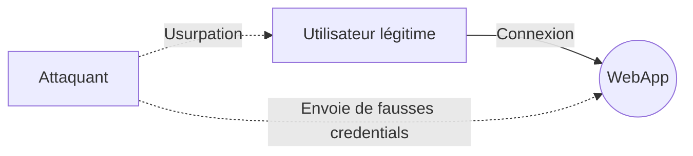
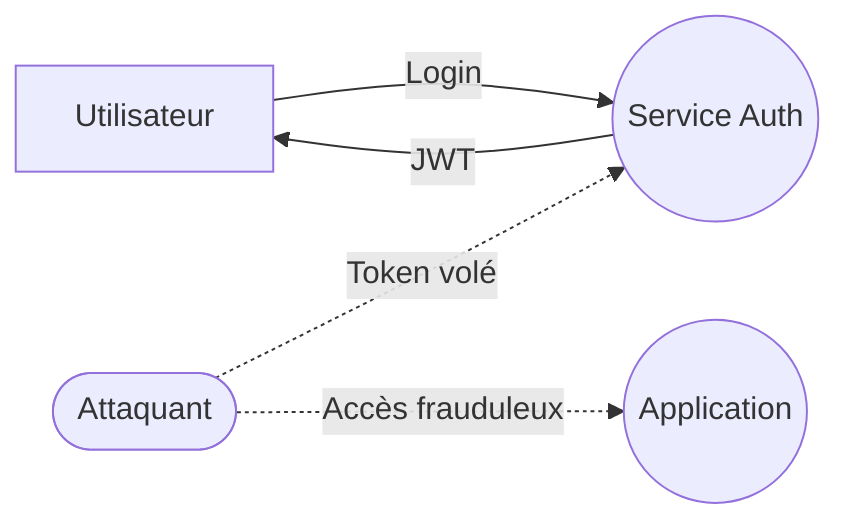

# Spoofing (Usurpation d’identité)

## Définition complète

L'**usurpation** (*spoofing*) consiste pour un attaquant à **se faire passer pour quelqu’un ou quelque chose d’autre**, afin d’accéder à un système, d’interagir avec lui ou d’obtenir des informations qu’il ne devrait pas obtenir.

En d’autres mots :

> *Le Spoofing brise l’authenticité : si un système ne peut plus faire confiance à l’identité d’un acteur, tout le reste s’effondre.*

Le *spoofing* ne concerne pas uniquement les utilisateurs humains.  Il peut viser :

- un **compte utilisateur**,  
- une **application**,  
- un **service interne**,  
- une **machine ou un serveur**,  
- un **token ou certificat**,  
- une **adresse IP**,  
- un **identifiant réseau** (MAC, hostname).  

---

## Objectifs d’un attaquant en usurpation (*spoofing*)

Un attaquant cherche généralement à :

- accéder à un système **sans authentification**,  
- contourner des **mécanismes de sécurité**,  
- obtenir des **droits supérieurs**,  
- tromper un service qui croit parler à un service de confiance,  
- provoquer un comportement inattendu (fraude, vol, sabotage…).

---

## Comment le Spoofing apparaît dans un DFD

Dans un **Data Flow Diagram**, le *spoofing* cible principalement :

| Élément DFD | Risque |
|-------------|--------|
| **Entités externes** | Usurpation de l’utilisateur ou du client |
| **Processus** | Faux service ou application se présentant comme légitime |

Voici un DFD minimaliste montrant un scénario classique de Spoofing :

L’application croit que la requête provient du véritable utilisateur.

---

## Les formes les plus courantes de Spoofing

### 1. **Spoofing d’identifiants utilisateur**
Le plus courant : authentification par vol ou devinette d’identifiants.

### 2. **Spoofing réseau**
Manipulation d’identifiants techniques.

### 3. **Spoofing de services / API**
Un service malveillant se fait passer pour un service interne légitime.

### 4. **Spoofing d’identité machine**
Dans les environnements cloud / microservices.

---

## Scénarios réels

### Scénario 1 — Vol de session (*session hijacking*)
Un attaquant récupère un cookie non protégé : usurpation de l’utilisateur.

### Scénario 2 — API interne usurpée
Une clé API fuit : un attaquant se fait passer pour un service légitime.

### Scénario 3 — Spoofing réseau (ARP poisoning)
L’attaquant redirige le trafic : attaque *man-in-the-middle (MITM)*.

---

## Contre‑mesures

### Authentification robuste
- Authentification multi-facteurs (*MFA*)
- Sessions courtes  
- Rotation des tokens

### Protection des identifiants
- Hashage fort  
- Jamais de tokens en clair

### Sécurisation des communications
- TLS  
- HSTS  
- Signature inter‑services

### Isolation réseau & *Zero Trust*
- TLS mutuel (mTLS)
- Identité machine par certificats

### Journalisation fiable
- Logs immuables  
- Journaux signés

---

## Exemple : Spoofing dans un système web moderne

Un endpoint de debug expose un token → usurpation complète.

---

## Conclusion

- Le *spoofing* attaque **l’authenticité**.  
- Il vise identités humaines et machines.  
- Souvent première étape d’une chaîne d’attaque.  
- Les protections doivent être combinées, par exemple : MFA + TLS + mTLS + rotation + journaux fiables.

