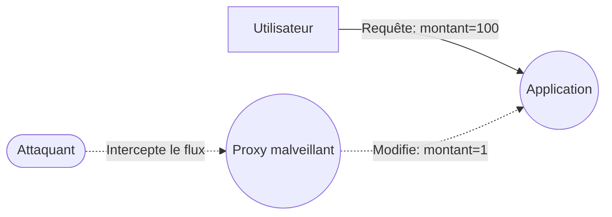
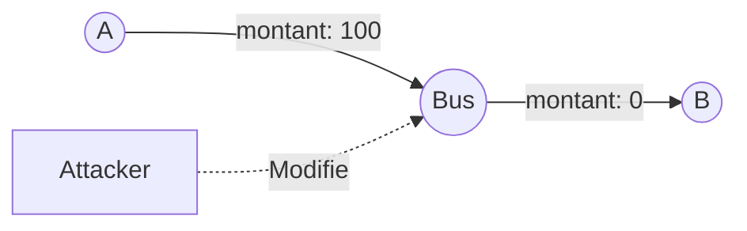
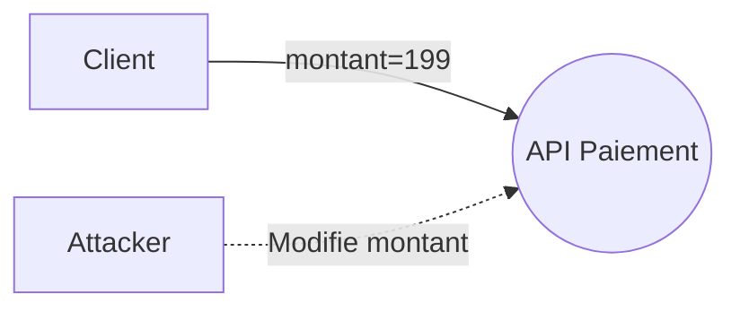

# Tampering (Altération de données)

## Définition complète

Le **Tampering** désigne toute action où un attaquant **modifie intentionnellement des données**, du code ou des messages, dans le but d’altérer le comportement du système.

En d’autres mots :

> *Tampering = corruption volontaire de données pour tromper, altérer, manipuler ou contourner un système.*

Il peut toucher :

- des données **en transit** (flux, messages, API, paramètres),  
- des données **au repos** (fichiers, bases de données, caches),  
- du **code** (scripts, configurations, binaires),  
- la **configuration** d’un service.

Cette menace attaque directement l’un des fondements de la sécurité :

> **L’intégrité.**

---

## Objectifs d’un attaquant en Tampering

L’attaquant cherche généralement à :

- modifier des données pour obtenir un avantage (fraude, manipulation d’état),  
- injecter des données malicieuses pour provoquer un comportement anormal,  
- altérer la configuration afin d’affaiblir la sécurité,  
- modifier des droits ou permissions,  
- corrompre des processus internes, des logs ou des fichiers critiques.

---

## Comment le Tampering apparaît dans un DFD

Dans un DFD, le Tampering se produit typiquement sur :

| Élément DFD | Exemples |
|-------------|----------|
| **Flux de données** | Paramètres altérés, messages modifiés |
| **Stockages** | Fichiers modifiés, données corrompues |
| **Processus** | Injection de code, altération de configuration |

---

## 3.2.4 Les formes les plus courantes de Tampering

### Altération côté client
- Modification de champs cachés  
- Manipulation de paramètres  
- Modification de cookies non signés

### Altération des flux entre services
- Modification de JSON  
- Injection dans une requête interne

### Altération de la base de données
- Changement d’un solde  
- Suppression de journaux

### Altération de configuration ou de code
- Modification d’un fichier `.env`  
- Altération d’un script de déploiement

---

## Scénarios réels

### Scénario 1 — Paramètre modifié
Un champ caché `price=499` est modifié en `price=1`.

### Scénario 2 — Cookie modifié
`role=user` devient `role=admin`.

### Scénario 3 — Altération d’un message entre services

### Scénario 4 — Corruption de logs
Suppression ou modification de journaux.

---

## Contre‑mesures

### Contrôles côté serveur
- Validation stricte  
- Vérification croisée

### Signature et chiffrement
- Cookies signés  
- JWT signés

### Protection des stockages
- Intégrité  
- Audit trail

### Protection de la configuration
- Secrets sécurisés  
- Audit Git

### Sécurité réseau
- mTLS  
- Zero Trust

### Tests et détection
- Fuzzing  
- IDS / WAF

---

## Exemple 

Altération du montant → validation naïve → fraude.

---

## Conclusion

- Tampering = **modification volontaire de données**.  
- Très courant dans les systèmes web/API.  
- Contre‑mesures → validation serveur + signature + Zero Trust.
