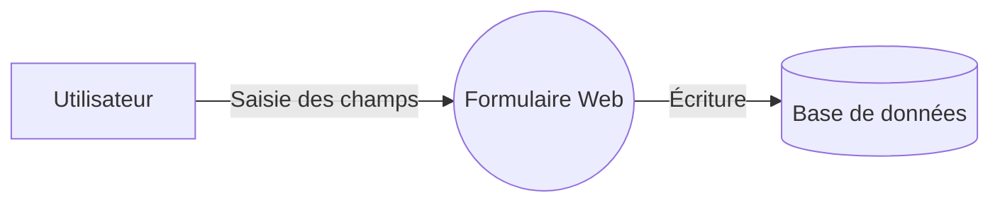

# Méthodologie STRIDE

STRIDE est un modèle de classification des menaces conçu pour aider les équipes à analyser la sécurité d’un système de manière **structurée, cohérente et reproductible**.  
Il permet de répondre à une question simple :

> *Quelles attaques sont possibles sur chaque composant d’un système, et pourquoi ?*

Contrairement à d’autres approches plus abstraites, STRIDE est **opérationnel** : il se base sur la façon dont un attaquant penserait, et sur les points faibles réels présents dans les architectures logicielles.

STRIDE est particulièrement utilisé dans :

- la conception d’architectures logicielles,  
- les revues de sécurité,  
- les audits,  
- les analyses de risques,  
- les systèmes critiques (finance, santé, IoT, transport, etc.).

Il a rapidement gagné en popularité, car : 
- Il fournit une **classification simple**, basée sur six catégories logiques.  
- Il est **directement applicable** sur des diagrammes DFD.  
- Il s’intègre parfaitement dans une approche **“shift‑left”** (sécurité dès la conception).  
- Il est suffisamment général pour s’appliquer à **tout type de système** (web, API, cloud, IoT, etc.).

Aujourd’hui, plus de 25 ans après sa création, STRIDE reste l’un des modèles de modélisation de la menace les plus utilisés au monde, dans l’industrie comme dans l’enseignement.

## Historique

Le modèle STRIDE a été créé **à la fin des années 1990 chez Microsoft** par deux ingénieurs en sécurité : **Loren Kohnfelder** et **Praerit Garg**. Leur objectif était d’aider les équipes de développement à penser la sécurité **dès la conception**, plutôt qu’après coup; une idée très novatrice à l’époque.

Selon les archives techniques de Microsoft, STRIDE trouve ses racines dans un document interne publié en **1999**, intitulé *“The Threats to our Products”*, rédigé par Kohnfelder et Garg. Ce document proposait une liste structurée des menaces informatiques les plus courantes et introduisait le mnémonique **STRIDE**, destiné à rendre le modèle facile à mémoriser et à appliquer.

Le modèle STRIDE...
 
- a été créé pour que même des développeurs non spécialistes puissent identifier des menaces,  
- s’est rapidement imposé comme **un standard de facto** dans l’industrie.

---

## Les menaces STRIDE

Voici un tableau introductif qui résume les six menaces STRIDE et l’objectif de chaque catégorie :

| Catégorie | Nom  | Impact  | Description |
|----------|-------------|------------------|----------------|
| **S** | *Spoofing* (Usurpation) | Authenticité | Usurper une identité |
| **T** | *Tampering* (Altération) | Intégrité | Modifier des données |
| **R** | *Repudiation* (Répudiation) | Non‑répudiation | Nier une action sans preuve |
| **I** | *Information Disclosure* (Divulgation d'information)| Confidentialité | Accéder à des informations non autorisées |
| **D** | *Denial of Service* (Déni de service)| Disponibilité | Rendre un service inutilisable |
| **E** | *Elevation of Privilege* (Élévation de privilèges)| Autorisation | Obtenir des privilèges au‑delà de ses droits |

---

## Les éléments STRIDE

L’une des forces de STRIDE est sa correspondance naturelle avec les éléments d’un **DFD** (Diagramme de flux de données, ou *data flow diagram* en anglais).

Chaque type d’élément est susceptible ou non à certaines menaces, selon le tableau suivant :  

| Élément DFD | Définition | Menaces applicables |
|-------------|---------------------|---------|
| **Entités externes** | Utilisateur ou processus interagissant avec le système mais n'étant pas sous sa responsabilité | S, R |
| **Processus** | Application, service, ou autre programme effectuant du traitement | S, T, R, I, D, E |
| **Stockages de données** | Fichiers, disques, bases de données, ou autre support stockage d'information | T, R, I, D |
| **Flux de données** | Échange d'information entre des entités | T, I, D |

On peut l’interpréter ainsi :

- Une entité externe (ex.: un utilisateur) peut...
    - être usurpée (*tampering*)
    - tenter de nier ses actions (*repudiation*)
- Un flux de données peut...
    - être altéré (*tampering*)
    - divulguer de l'information confidentielle (*information disclosure*)
    - être interrompu (*denial of service*)
- Un stockage de données peut...
    - être altéré (*tampering*)
    - permettre à quelqu'un de camoufler ses actions, par exemple en modifiant des logs (*repudiation*)
    - divulguer l'information confidentielle qu'il contient (*information disclosure*)
    - être rendu indisponible (*denial of service*)
- Un processus peut subir **toutes les menaces** STRIDE, car c’est le coeur du système

---
# Le processus STRIDE
Pour réaliser une modélisation de la menace à l'aide de la méthode STRIDE, on procède habituellement selon les étapes suivantes.

**1. Construire les DFD (diagrammes de flux de données)**  
- On établit d'abord l'inventaire de toutes les composantes du système : entités externes, stockage de données, flux de données et processus de haut niveau
- On les représente ensuite sur un *DFD* de niveau 0, aussi appelé **diagramme de contexte**. 
- Pour chaque processus complexe (c'est-à-dire un processus qui peut être décomposé en plusieurs sous-processus distincts), on crée un DFD spécifique où l'on représente les sous-processus.
- On répète le processus jusqu'à ce qu'il n'y ait plus de processus complexe dans le DFD.

{: .highlight}
>Les symboles généralement acceptés pour représenter les différents éléments sont les suivant :
>
>```mermaid
>flowchart LR
>
>   EntiteExterne[Entité externe]
>    ProcessusSimple((Processus simple))
>    ProcessusComplexe(((Processus complexe)))
>    Stockage[(Stockage)]
>    ProcessusSimple -->|Flux de données| Stockage
>```

**2. Ajouter les frontières de confiance**

- On ajoute, dans les DFD, des lignes pointillées qui délimitent des frontières de confiance (*trust boundaries*). Typiquement, dès que l'on passe d'un environnement plus sécuritaire à un environnement moins sécuritaire, on devrait voir une frontière de confiance apparaître. Par exemple, lorsque l'on passe du réseau privé d'une entreprise à l'internet, on change de zone de confiance.

**3. Analyser STRIDE**
Pour chaque élément dans les DFD, on établit :
- Les menaces possibles (en fonction de la matrice ci-haut)
- Les menaces réelles, c'est-à-dire les menaces potentielles qui sont applicables dans le cas particulier de l'application
- Comment la menace pourrait se concrétiser

**4. Évaluer les risques**
- Pour chaque menace réelle identifiée à l'étape précédente, on calcule un risque associé. On utilise souvent une formule comme :  

   Risque = Probabilité × Impact 

5. **Définir les contre‑mesures**  
- Pour chaque menace présentant un risque au-delà du seuil acceptable pour l'organisation, définir des mesures de mitigation (ou contre-mesures). Ces mesures peuvent être :
 - Techniques
 - Architecturales
 - Procédurales
 - Organisationnelles,
 - etc

---

## Exemple

Prenons un cas très simple : un formulaire web où un utilisateur entre des informations anonymes.

Voici un mini‑DFD :



### Composant **Base de données**

#### Menaces

| Menace | Potentiel ? | Réel ? | Pourquoi ? |
|--------|--------------|------------|-------|
| Spoofing | Non | Non | N/A |
| Tampering | Oui | Oui | Un attaquant pourrait falsifier les données aggrégées dans la BD |
| Repudiation | Oui | Non | Il n'y a pas d'authentification, donc les actions ne sont pas liées aux usagers |
| Information Disclosure | Oui | Oui | Un attaquant pourrait avoir accès aux données de la BD |
| Denial of Service | Oui | Oui | Si on fait planter la BD, le formulaire deviendra indisponible |
| Elevation of Privilege |Non| Non | N/A |

#### Risque

| Menace | Probabilité | Impact | Risque calculé |
| ------ |------------ | ------ | -------------- |
| Tampering | Moyen | Élevé | Élevé |
| Information Disclosure | Moyen | Élevé | Élevé |
| Denial of Service | Élevé | Moyen | Élevé |

#### Contre-mesures

| Menace | Attaque | Mitigation | 
| ------ |------------ | ------ |
| Tampering | Un employé mécontent fausse les données recueillies | Authentification et autorisation sur la BD, activation de l'*audit trail* | 
| Information Disclosure | Un employé mécontent fausse les données recueillies | Authentification et autorisation fortes sur la BD, données chiffrées au repos (*encrypted at rest*) | 
| Denial of Service | Un *bot* bombarde le serveur de requêtes | Mise en place de *throttling* et de bannissement d'IP |
---

