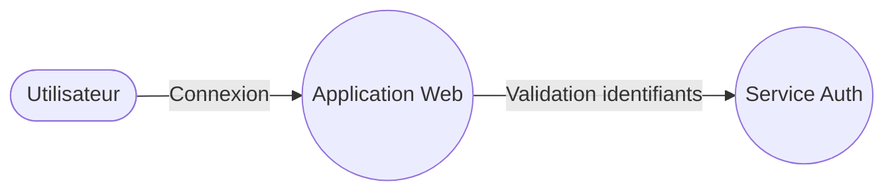

Méthodologie STRIDE

## 📌 2.0 Historique du modèle STRIDE

Le modèle STRIDE a été créé **à la fin des années 1990 chez Microsoft** par deux ingénieurs sécurité : **Loren Kohnfelder** et **Praerit Garg**.  
Leur objectif était d’aider les équipes de développement à penser la sécurité **dès la conception**, plutôt qu’après coup — une idée très novatrice à l’époque.

Selon les archives techniques de Microsoft, STRIDE trouve ses racines dans un document interne publié en **1999**, intitulé *“The Threats to our Products”*, rédigé par Kohnfelder et Garg.  
Ce document proposait une liste structurée des menaces informatiques les plus courantes et introduisait le mnémonique **STRIDE**, destiné à rendre le modèle facile à mémoriser et à appliquer.

Plusieurs sources modernes confirment que :

- le modèle a été conçu **spécifiquement pour accompagner le SDL (Security Development Lifecycle)** de Microsoft,  
- il a été créé pour que même des développeurs non spécialistes puissent identifier des menaces,  
- il s’est rapidement imposé comme **un standard de facto** dans l’industrie.

Par exemple, Practical DevSecOps note que **STRIDE a été développé dans les années 1990** par Kohnfelder et Garg pour aider les développeurs à anticiper les vulnérabilités dès les premières étapes de conception.  
Security Compass précise également que STRIDE a été « développé à la fin des années 1990 » et qu’il s’inscrivait dans une démarche de démocratisation de la sécurité chez Microsoft.

### ✨ Pourquoi STRIDE est‑il devenu si influent ?
- Il fournit une **classification simple**, basée sur six catégories logiques.  
- Il est **directement applicable** sur des diagrammes DFD.  
- Il s’intègre parfaitement dans une approche **“shift‑left”** (sécurité dès la conception).  
- Il est suffisamment général pour s’appliquer à **tout type de système** (web, API, cloud, IoT, etc.).

Aujourd’hui, plus de 25 ans après sa création, STRIDE reste l’un des modèles de modélisation de la menace les plus utilisés au monde, dans l’industrie comme dans l’enseignement.

---

## 📌 2.1 Comprendre la logique du modèle STRIDE

STRIDE est un modèle de classification des menaces conçu pour aider les équipes à analyser la sécurité d’un système de manière **structurée, cohérente et reproductible**.  
Il permet de répondre à une question simple :

> 🎯 *Quelles attaques sont possibles sur chaque composant d’un système, et pourquoi ?*

Contrairement à d’autres approches plus abstraites, STRIDE est **opérationnel** : il se base sur la façon dont un attaquant penserait, et sur les points faibles réels présents dans les architectures logicielles.

STRIDE est particulièrement utilisé dans :

- la conception d’architectures logicielles,  
- les revues de sécurité,  
- les audits,  
- les analyses de risques,  
- les systèmes critiques (finance, santé, IoT, transport, etc.).

---

## 📌 2.2 Les six catégories STRIDE : aperçu général

Voici un tableau introductif qui résume les six menaces STRIDE et l’objectif de chaque catégorie :

| Catégorie | Nom complet | Impact principal | Idée générale |
|----------|-------------|------------------|----------------|
| **S** | *Spoofing* | Authenticité | Usurper une identité |
| **T** | *Tampering* | Intégrité | Modifier des données |
| **R** | *Repudiation* | Non‑répudiation | Nier une action sans preuve |
| **I** | *Information Disclosure* | Confidentialité | Accéder à des informations non autorisées |
| **D** | *Denial of Service* | Disponibilité | Rendre un service inutilisable |
| **E** | *Elevation of Privilege* | Autorisation | Obtenir des privilèges au‑delà de ses droits |

{: .note }
Chaque menace STRIDE correspond à un pilier de la sécurité (CIA + Authenticité + Autorisation + Non-répudiation).

---

## 📌 2.3 STRIDE : la vision par élément du système

L’une des forces de STRIDE est sa correspondance naturelle avec les éléments d’un **DFD (Data Flow Diagram)**.

Chaque type d’élément peut subir certaines menaces, et pas d’autres.  
Voici la matrice officielle utilisée dans les équipes sécurité de Microsoft :

| Élément DFD | Menaces applicables |
|-------------|---------------------|
| **Entités externes** | S, R |
| **Processus** | S, T, R, I, D, E |
| **Stockages de données** | T, R, I |
| **Flux de données** | T, I |

On peut l’interpréter ainsi :

- Une entité externe (ex.: un utilisateur) peut être **usurpée** → *Spoofing*  
- Un flux de données peut être **altéré** ou **intercepté** → *Tampering* / *Information Disclosure*  
- Un processus peut subir **toutes les menaces** STRIDE → c’est le cœur du système

Cette matrice deviendra essentielle dans les sections suivantes.

---

## 📌 2.4 STRIDE et les principes de sécurité (CIA+AN)

STRIDE ne remplace pas la sécurité, il **décrit comment elle peut échouer**.

Chaque catégorie STRIDE correspond à un principe fondamental :

| Pilier sécurité | Associé STRIDE | Pourquoi |
|-----------------|----------------|----------|
| **Authenticité** | Spoofing | Empêche d’être sûr de l’identité |
| **Intégrité** | Tampering | Modifie ou corrompt des données |
| **Non‑répudiation** | Repudiation | Empêche de prouver qu’une action a eu lieu |
| **Confidentialité** | Information Disclosure | Divulgation d’informations sensibles |
| **Disponibilité** | Denial of Service | Empêche un service de fonctionner |
| **Autorisation** | Elevation of Privilege | Bypass des contrôles d’accès |

STRIDE devient alors un outil de diagnostic :  
> *Si une menace STRIDE est possible, alors un pilier de sécurité est compromis.*

---

## 📌 2.5 Exemple simple pour illustrer STRIDE

Prenons un cas très simple : une application web où un utilisateur se connecte pour consulter son compte.

Voici un mini‑DFD :

### 🔍 Analyse STRIDE du composant **Utilisateur**

| Menace | Applicable ? | Pourquoi ? |
|--------|--------------|------------|
| Spoofing | ✔️ | Quelqu’un peut se faire passer pour un utilisateur légitime |
| Tampering | ❌ | Un utilisateur n’est pas une donnée ou un flux |
| Repudiation | ✔️ | L’utilisateur pourrait nier avoir effectué une action sans journalisation |
| Information Disclosure | ❌ | L’utilisateur est une entité, pas un stockage |
| Denial of Service | ❌ | On ne « désactive » pas un utilisateur |
| Elevation of Privilege | ❌ | L’augmentation de privilèges concerne un processus |

---

# 3. Détail des six catégories STRIDE

## 📌 3.0 Comprendre la logique interne des catégories STRIDE

STRIDE n’est pas une liste aléatoire.  
C’est une classification fondée sur **six façons fondamentales dont un système peut être attaqué**.

Chaque catégorie répond à trois questions :

1. **Que cherche à faire l’attaquant ?**  
2. **Comment peut‑il y parvenir techniquement ?**  
3. **Quel pilier de sécurité est menacé ?**

Voici une version pédagogique résumée :

| Catégorie | Objectif de l’attaquant | Impact principal | Élément visé |
|----------|--------------------------|------------------|--------------|
| **Spoofing** | Se faire passer pour quelqu’un d’autre | Authenticité | Identités, entités externes |
| **Tampering** | Modifier des données | Intégrité | Flux, bases de données, stockage |
| **Repudiation** | Effacer / nier son implication | Non‑répudiation | Journaux, processus |
| **Information Disclosure** | Accéder à des données sensibles | Confidentialité | Flux, stockage |
| **Denial of Service** | Rendre le système indisponible | Disponibilité | Processus, services |
| **Elevation of Privilege** | Obtenir plus de droits | Autorisation | Processus, comptes |

---

## 📌 3.1 Les menaces STRIDE selon les composants d’un DFD

Chaque menace STRIDE n’est pas applicable à tout.

Voici la matrice officielle utilisée dans les analyses de sécurité :

| Élément du DFD | Menaces typiques |
|----------------|------------------|
| **Entité externe (acteur)** | Spoofing, Repudiation |
| **Processus** | S, T, R, I, D, E |
| **Flux de données** | Tampering, Information Disclosure |
| **Stockage de données** | Tampering, Repudiation, Information Disclosure |

---

## 📌 3.2 Vue pédagogique des six catégories

### **S — Spoofing (usurpation d’identité)**
L’attaquant tente de se faire passer pour un autre utilisateur ou un autre service.

### **T — Tampering (altération)**
Modification volontaire de données ou de code.

### **R — Repudiation (répudiation)**
L’attaquant nie avoir fait une action (ou brouille les pistes).

### **I — Information Disclosure (divulgation)**
Accès non autorisé à des données sensibles.

### **D — Denial of Service (déni de service)**
Objectif : rendre le système indisponible.

### **E — Elevation of Privilege (élévation de privilèges)**
Un utilisateur obtient des accès qu’il ne devrait jamais avoir.

---

## 📌 3.3 Exemples réels illustratifs

| Menace | Exemple concret | Cas réel typique |
|--------|-----------------|------------------|
| **S – Spoofing** | Connexion avec mot de passe volé | Credential stuffing |
| **T – Tampering** | Modifier `role=admin` dans un cookie | Altération côté client |
| **R – Repudiation** | Nier avoir supprimé un fichier | Journaux insuffisants |
| **I – Information Disclosure** | URL exposant un identifiant | Buckets S3 publics |
| **D – Denial of Service** | Boucle infinie | API saturée |
| **E – Elevation of Privilege** | Mauvaise validation des permissions | Accès horizontal / vertical |

---

## 📌 3.4 Méthodologie pédagogique pour les pages 3.1 à 3.6

Chaque sous‑page inclura :

### 🔍 1. Définition détaillée
### 📡 2. Manifestation dans un système (avec DFD)
### 🧠 3. Exemples concrets
### 🛠️ 4. Contre‑mesures organisées
### 🔥 5. Étude de cas immersive

