# Diagrammes de classes UML

Le **diagramme de classes** montre les **classes**, leurs **attributs**, leurs **méthodes**, ainsi que les **relations** entre elles. C’est le diagramme structurel le plus utilisé en conception orientée objet.

## Objectifs d’un diagramme de classes
- Décrire la **structure** statique du système (les types, et non les instances)
- Visualiser les relations entre les types : **associations**, **dépendances**, **héritages**, **implémentations**, **agrégations** et **compositions**
- Servir de base à la conception orientée objet et à la documentation de l’architecture

## Quand l'utiliser ?
- **Pour les nouveaux projets** : dès la phase de conception détaillée, ce qui permet de travailler **l'architecture** sans avoir à écrire le code.
- **Pour les projets existants** : aussitôt que possible, car il servira de documentation pour **l'architecture** du projet.

{: .astuce}
> Dans tous les cas, on voudra s'assurer que le diagramme de classes est tenu à jour au fur et à mesure que le code évolue. 

## Étapes pour créer un diagramme de classe
1. **Identifier les classes** : Déterminer les entités principales à modéliser.
1. **Définir les attributs** : Établir les propriétés des classes qui représentent les données pertinentes.
1. **Définir les méthodes** : Préciser les opérations que chaque classe peut exécuter.
1. **Définir les relations entre classes** : Identifier comment les classes interagissent entre elles (associations, agrégations, compositions, héritage).

{: .highlight}
> Ceci est un processus itératif qui peut être affiné au fur et à mesure de l'avancement du projet.

---

## Représentation d'une classe

Une classe est représentée par un rectangle à trois sections: *nom*, *attributs*, *méthodes*.
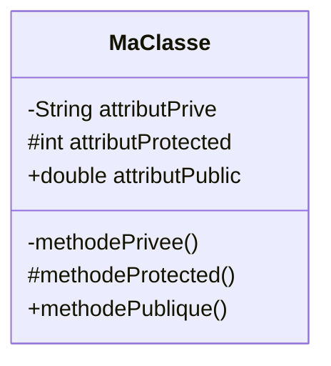

Il s'agit ici d'une classe au sens large; on utilise aussi cet élément pour représenter les interfaces, les records, et autres variations spéciales selon le langage. Il est possible de préciser le type de classe précis (appelé le *Stereotype*) en utilisant le symbole `<< >>`, par exemple :

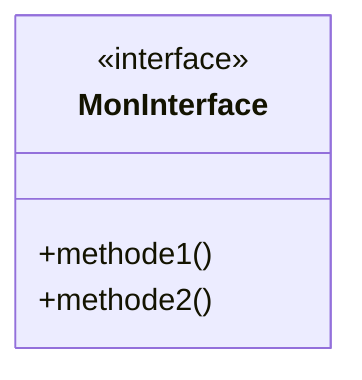

Chaque attribut ou méthode est précédé d'un symbole représentant sa visibilité :

| Symbole | Visibilité | Description |
|---------|------------| ------------------------------------|
| `+`       | public     | Champ à visibilité publique (`public` en Java)|
| `#`       | protégé    | Champ à visibilité protégée (`protected` en Java)|
| `~`       | package    | Champ à visibilité limitée aux entités faisant partie du même *package* ou *namespace* (représenté par l'absence de mot-clé en Java)|
| `-`       | privé      | Champ à visibilité privée (`private` en Java)|

---

## Relations entre classes

### Association

Une association représente un lien structurel durable entre deux classes, indiquant qu'elles sont liées d'une certaine manière. Il existe deux types d'association :
- **Association simple** : C'est le cas le plus courant, où l'on ne précise pas le sens de la relation. En d'autres termes, la relation existe, mais la navigabilité n’est pas spécifiée. Dans ce cas, on utilise un trait sans flèche entre les deux classes.
- **Association directionnelle** : Parfois, on voudra indiquer la direction de l'association (A utilise B, mais B ne connaît pas A). Dans ce cas, on utilisera une flèche simple pointant dans le sens de l'association.

**Association simple**

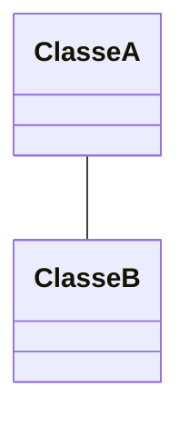
*Ici, ClasseA et ClasseB sont liées l'une à l'autre, sans direction particulière.*

**Association directionnelle**

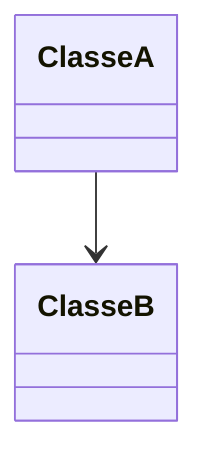
*Ici, ClasseA utilise ClasseB, mais pas l'inverse. On modélise donc la direction.*

---

### Dépendance

Une dépendance représente une relation faible entre deux éléments du modèle : une classe A utilise ou dépend temporairement d’une classe B. Cette relation indique que toute modification apportée à B peut affecter A, sans qu’il s’agisse d’un lien structurel (contrairement à l’association). La dépendance est toujours directionnelle, représentée par une flèche en pointillés.

**Différence avec l'association**

| Relation | Nature | Durée | Référence stockée ? | Notation |
|---------|--------|-------|----------------------|----------|
| **Association** | Structurelle | Permanente | Oui | Trait plein (avec ou sans flèche) |
| **Dépendance** | Fonctionnelle et temporaire | Ponctuelle | Non | Ligne en pointillés |

{: .highlight}
> Une dépendance UML est **toujours directionnelle**. Une association peut être directionnelle ou non.

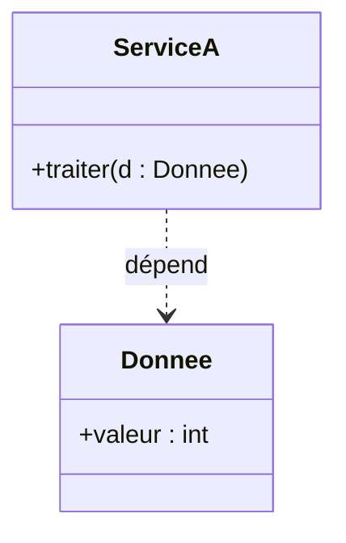
---

### Héritage

L'héritage "classique" où une classe enfant hérite des caractéristiques de la classe de base est représentée par une flèche creuse qui pointe vers la classe de base.

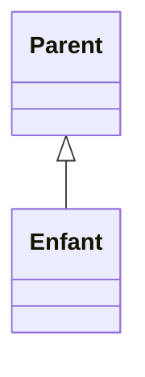

---

### Implémentation
L'implémentation d'une interface, qu'elle soit implicite ou explicite, est représentée par une flèche pointillée creuse qui pointe vers l'interface.

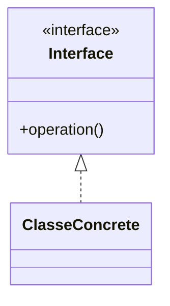

---

### Composition
La composition représente une relation forte, c'est-à-dire une relation où un tout est composé de ses éléments et où les éléments ne peuvent pas exister sans le tout. Autrement dit, si le tout est supprimé, toutes les parties qui le composent le seront également. En UML, on représente cette relation par un lien avec un bout en forme de losange plein qui pointe vers le tout.

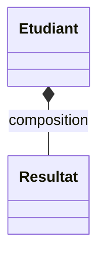
*Dans cet exemple, le profil d'un étudiant est composé (entre autres) de ses résultats. Les résultats ne peuvent pas exister sans l'étudiant.*

---

### Agrégation
L'agrégation est similaire à la composition, mais elle représente une relation faible, c'est-à-dire que les éléments peuvent exister indépendamment. En UML, on représente cette relation par un lien avec un bout en forme de losange vide qui pointe vers le tout.

{: .warning}
> En pratique, l’agrégation est très peu utilisée en UML moderne, car elle n’apporte presque pas de sémantique supplémentaire par rapport à une association classique. On lui préfère généralement une association unidirectionnelle, notamment lorsqu'une classe conserve une référence vers une autre (comme dans le cas d’une injection de dépendance).

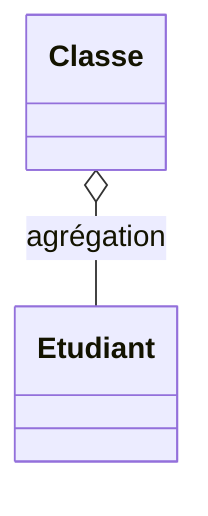
*Dans cet exemple, une classe est l'agrégation d'un certain nombre d'étudiants. Les étudiants peuvent exister sans être dans une salle de classe.*

---

## Cardinalité (multiplicité)
Certaines relations structurelles, principalement les associations, les compositions et les agrégations, peuvent impliquer des relations 1:1, 1:N ou même N:M. On représente ces contraintes par deux nombres sur le lien entre les deux classes (un nombre pour la source et l'autre pour la destination).

| Multiplicité | Signification |
|--------------|---------------|
| 0..1         | Aucun ou un seul élément (optionnel) |
| 1            | Exactement un élément |
| 0..*         | Zéro, un ou plusieurs éléments |
| 1..*         | Un ou plusieurs éléments |
| n            | Exactement *n* éléments (ex. 3) |
| 0..n         | De zéro à *n* éléments |
| 1..n         | D’un à *n* éléments |
| *            | Nombre indéterminé (équivalent à 0..*) |
| n..m         | Entre *n* et *m* éléments inclus |

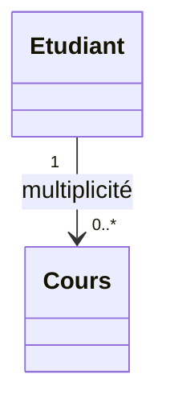
*Dans cet exemple, un étudiant peut suivre entre 0 et plusieurs cours.*

---

## Exemples

### Classes, attributs, méthodes

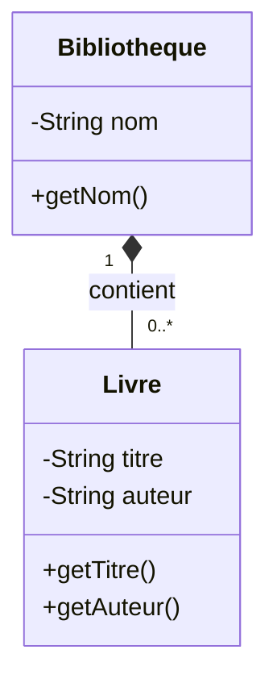

---

### Héritage - Classes concrètes et interfaces

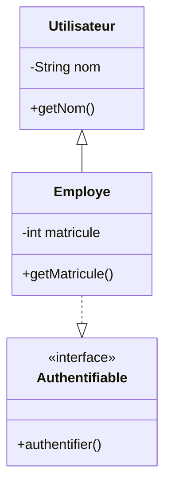

---

### Modèle complet

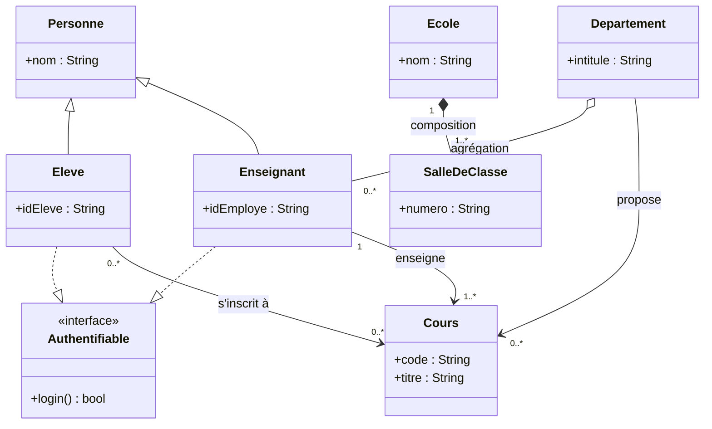

## Liens utiles
- [https://en.wikipedia.org/wiki/Class_diagram](https://en.wikipedia.org/wiki/Class_diagram)
