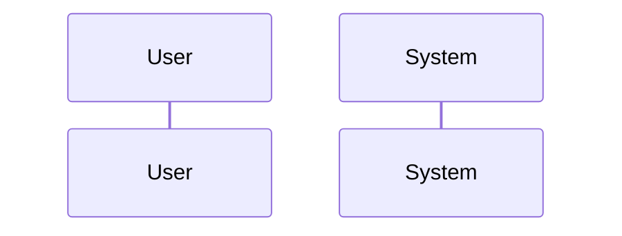
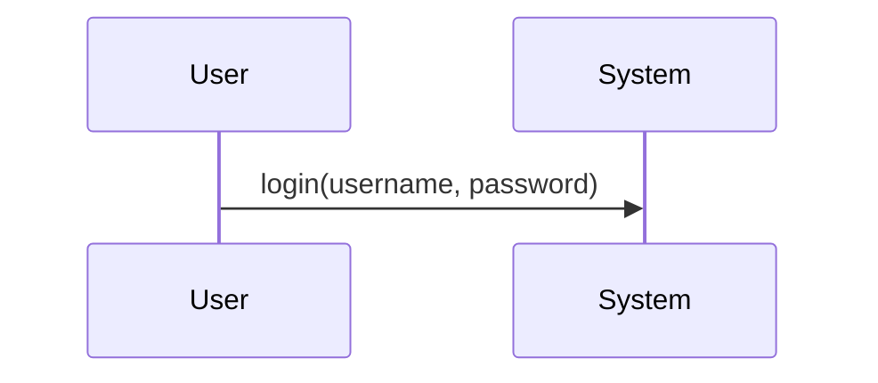
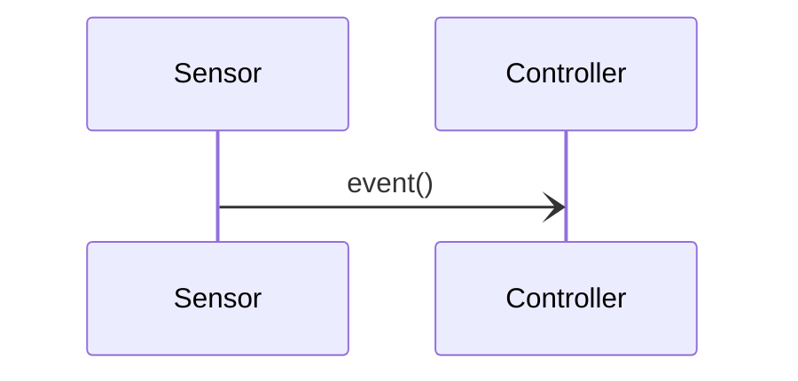
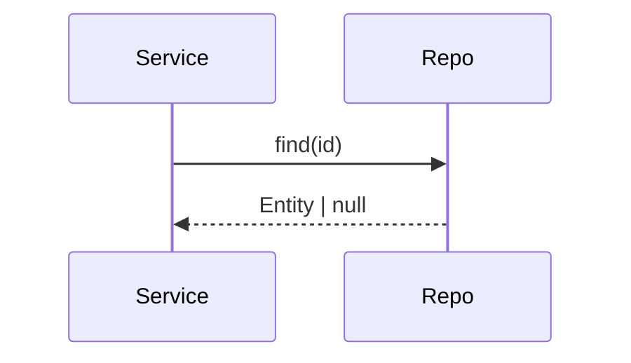
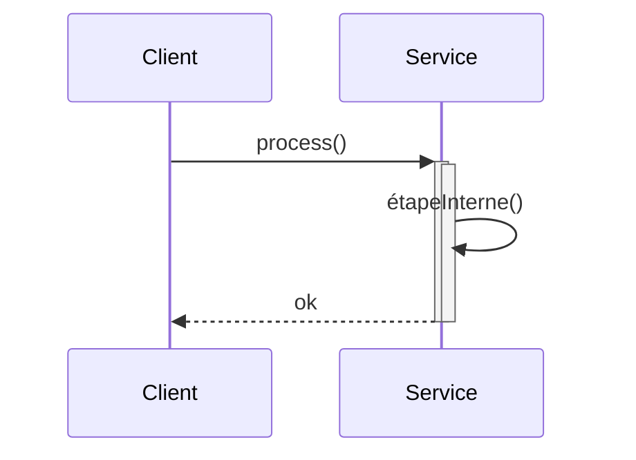
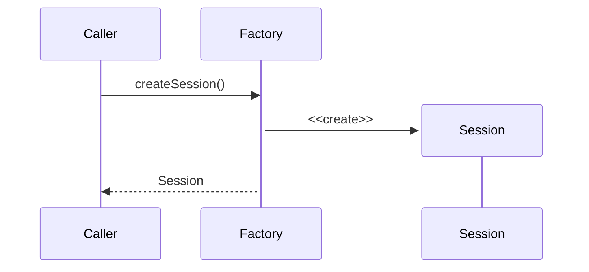
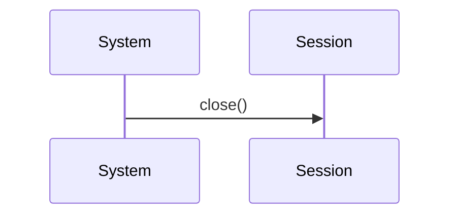
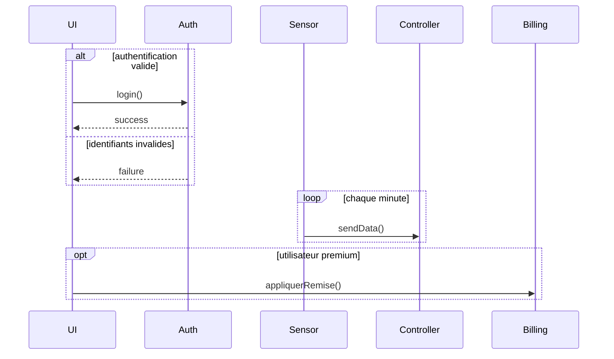
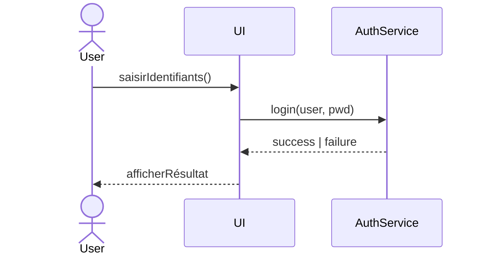
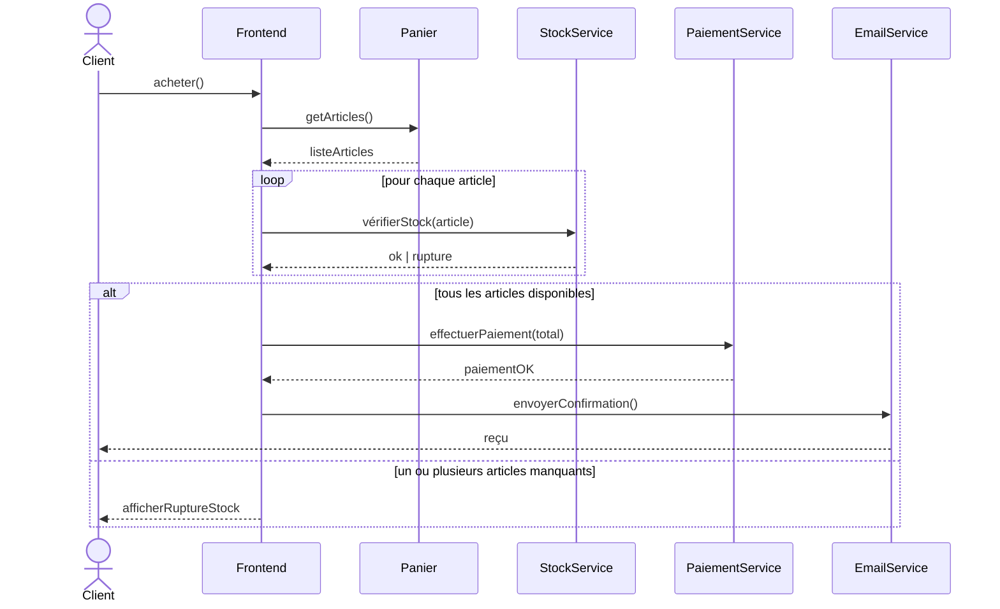

# Diagramme de séquence UML

Le **diagramme de séquence** montre comment les objets interagissent au fil du temps en s’envoyant des **messages**. Il met l’accent sur l’ordre des interactions, pas sur la structure des classes.

## Objectifs d’un diagramme de séquence
- Décrire l’ordre chronologique des interactions entre participants.
- Visualiser les messages, appels, retours, activations et événements de cycle de vie.
- Clarifier les responsabilités de chaque participant dans un scénario.
- Documenter le déroulement d’un cas d’utilisation

## Quand l'utiliser ?
- **Pour les nouveaux projets** : dès la phase de conception détaillée, ce qui permet de définir le **comportement** de l'application sans avoir à écrire le code.
- **Pour les projets existants** : aussitôt que possible, car il servira de documentation pour **le comportement** de l'application.

## Étapes pour créer un diagramme de séquence
1. **Identifier les participants** : acteurs, objets, services.
1. **Définir le scénario** : étapes clés, entrées/sorties attendues.
1. **Lister les messages** : appels synchrones/asynchrones, retours, créations/destructions.
1. **Ordonner dans le temps** : du haut vers le bas, un scénario par diagramme.
1. **Ajouter des fragments** (au besoin) : alternatives (`alt`), boucles (`loop`), options (`opt`).

## Éléments d’un diagramme de séquence

Afin de représenter les différents participants et les interactions entre chacun, le diagramme de séquence définit plusieurs éléments à utiliser. Les principaux éléments sont décrits ci-bas :

### Ligne de vie (*Lifeline*)
La ligne de vie représente un **participant** (acteur, objet, service) présent pendant tout ou partie du scénario. Elle est dessinée verticalement, le **temps s’écoulant du haut vers le bas**. Le nom du participant figure en en‑tête. Plusieurs participants peuvent coexister sans nécessairement interagir à chaque instant.

### Message synchrone (appel bloquant)
Un message **synchrone** modélise un appel de méthode bloquant : l’émetteur attend la fin de l’exécution côté récepteur avant de poursuivre. On l’utilise pour la plupart des invocations de services ou de méthodes dans un code classique. On représente cet appel par une flèche fermée du participant appelant vers le participant appelé.

### Message asynchrone (non bloquant)
Un message **asynchrone** déclenche un traitement sans bloquer l’émetteur. Typique des files de messages, événements, signaux, tâches en arrière‑plan. L’émetteur peut continuer pendant que le récepteur traite l’événement. On représente cet appel par une flèche ouverte du participant appelant vers le participant appelé.

### Retour (*Return message*)
Un **retour** indique la fin d’un traitement côté récepteur et l’acheminement d’une valeur de retour (ou d’un statut). Les retours sont **optionnels** dans les diagrammes : ils améliorent la lisibilité quand le résultat influence la suite du scénario. Si le résultat est trivial ou peu important, on peut l'omettre. On représente le message de retour par une flèche pointillée de l'appelé vers l'appelant.

### Activation (barre d’activation)
Une **activation** (barre verticale épaissie) représente la durée d’exécution d’une opération sur un participant. Elle apparaît généralement pendant un appel synchrone. La barre d'activation est **optionnelle** : on peut activer/désactiver explicitement pour clarifier des traitements plus longs ou imbriqués, mais cela n'est pas obligatoire.

### Création d’objet
La **création** fait apparaître un nouveau participant dans le scénario au moment exact où l’objet naît. Utile pour montrer l'instanciation d’objets, l’ouverture de sessions, ou la mise en place de ressources temporaires.

### Destruction d’objet
La **destruction** indique la fin de vie d’un participant (libération de ressource, fermeture de session, suppression). Elle aide à raisonner sur la durée de vie et à éviter les fuites de ressources.

### Fragments combinés : alternatives (`alt`), boucles (`loop`), options (`opt`)
Les **fragments** structurent le scénario :
- **alt** pour les **branches conditionnelles** (if/else)
- **loop** pour les **répétitions** (itérations avec une condition)
- **opt** pour une **étape optionnelle** exécutée si une condition est vraie

## Exemples

### Exemple simple : Connexion d’un utilisateur
Un utilisateur saisit ses identifiants dans l’UI, qui appelle le service d’authentification. Le service renvoie un succès ou un échec, que l’UI affiche à l’utilisateur. Cet exemple illustre des **messages synchrones** et un **retour** explicite.

### Exemple complet : Achat en ligne (stock, paiement, notification)
Le client lance l’achat. Le Frontend récupère le panier, vérifie le stock **pour chaque article** (`loop`), bifurque selon la disponibilité (`alt`)
- si tout est disponible, il **paie** puis **envoie une confirmation** par courriel ;
- sinon, il informe le client d’une **rupture de stock**. 
On y voit plusieurs **participants**, des **fragments** et un **enchaînement conditionnel** complet.

## Liens utiles
- [https://en.wikipedia.org/wiki/Sequence_diagram](https://en.wikipedia.org/wiki/Sequence_diagram)