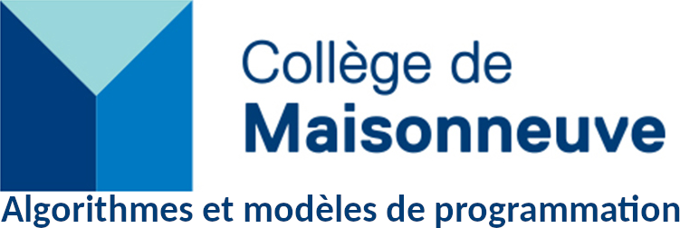

# Session Automne 2025

Bienvenue sur le site du cours Algorithmes et modèles de programmation (420-930-MA) du Collège de Maisonneuve. Vous trouverez sur ce site toutes les notes de cours, l'ordre du jour des différentes séances et le code des différents projets.

Quelques liens importants:

* [Omnivox/Léa](https://cmaisonneuve-lea.omnivox.ca/)
* [GitHub](https://github.com/ophenix-420-930-ma-24636)
* [Télécharger la VM de développement](https://cmaisonneuveqcca-my.sharepoint.com/:u:/g/personal/ophenix_cmaisonneuve_qc_ca/EajKt8QEuIJLrnwv2QK9BHEBgmlQA9D-j21ttWNn_iklXw?e=jltaPz)
