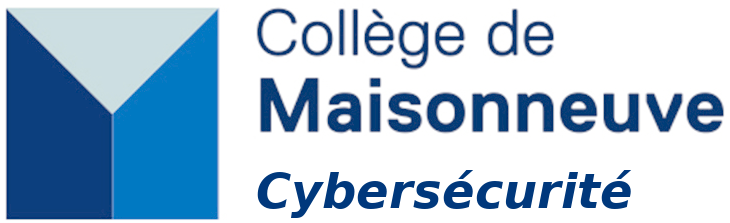

# Session Hiver 2026

Bienvenue sur le site du cours Cybersécurité (420-950-MA) du Collège de Maisonneuve. Vous trouverez sur ce site toutes les notes de cours, l'ordre du jour des différentes séances et le matériel des différents exercices et projets.

Quelques liens importants:

* [Omnivox/Léa](https://cmaisonneuve-lea.omnivox.ca/)
* [GitHub](https://github.com/ophenix-420-950-ma-24636)
* [Environnement applicatif / sécurité défensive](https://cmaisonneuveqcca-my.sharepoint.com/:f:/g/personal/ophenix_cmaisonneuve_qc_ca/IgCWGAmfMbG7QJYllHTnNq7eAZZorr8cML-xZoUQ7ZTgpe4?e=OmtJ8q)
* [Environnement de sécurité offensive / tests d'intrusion]()
